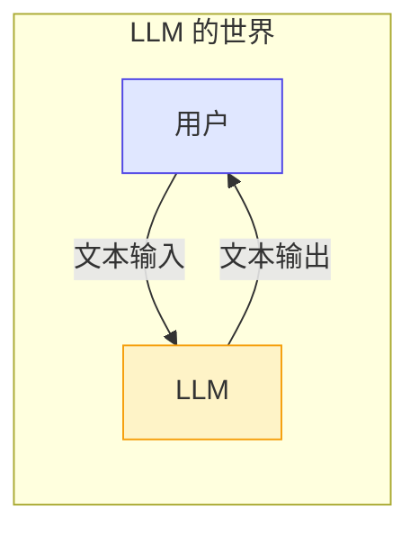
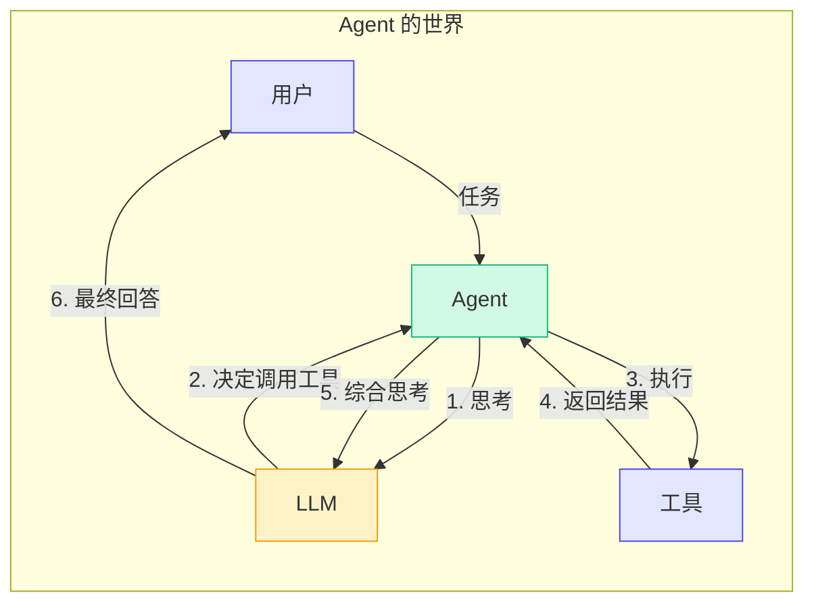
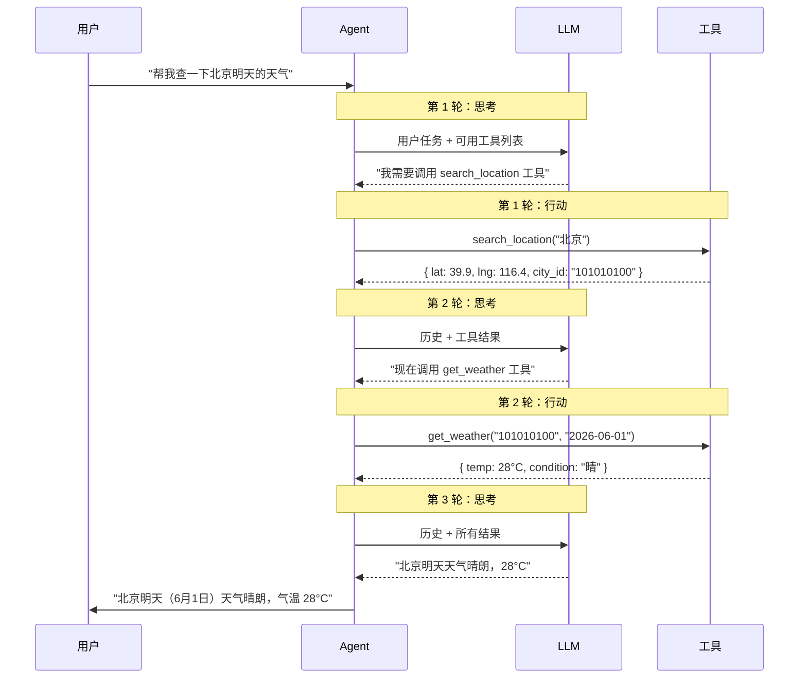
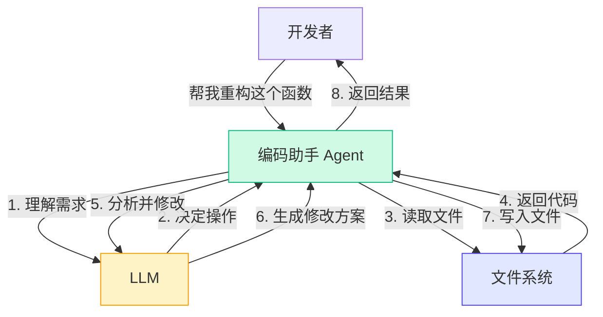
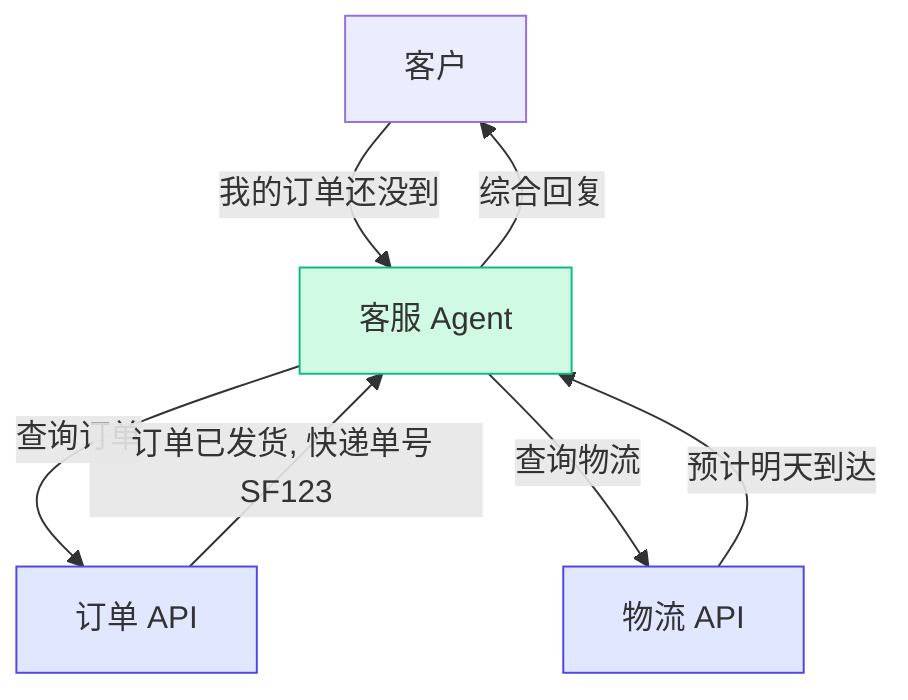

# 1.1 什么是 AI Agent

> 想象一下：你问 ChatGPT "帮我查一下明天的天气"，它说"抱歉，我无法查询实时信息"。但如果它是一个 Agent，它会说"好的，我来查"，然后调用天气 API，把结果带回来给你。

这就是 LLM 和 Agent 最直观的区别：**LLM 只能"说"，Agent 能"做"**。

---

## 从 LLM 到 Agent 的进化

### LLM 的能力边界

大语言模型（LLM）本质上是一个**文本生成器**。你给它一段文本（Prompt），它根据训练数据中的模式，预测并生成下一段文本。它非常擅长：

- 回答问题
- 写文章、代码
- 翻译、总结
- 角色扮演

但 LLM 有一个根本性的局限：**它活在训练数据里，活在对话窗口里，它无法触碰真实世界**。



LLM 做不到的事情：

| 能力 | 说明 | 为什么 LLM 做不到 |
|------|------|-----------------|
| 查询实时数据 | 查天气、查股价 | 训练数据有截止日期 |
| 执行操作 | 发送邮件、创建文件 | 没有操作系统权限 |
| 访问私有数据 | 查你的日历、读数据库 | 数据不在训练集中 |
| 执行计算 | 精确的数学运算 | LLM 本质是概率模型 |
| 运行代码 | 执行 Python 脚本 | 没有代码执行环境 |

> **💡 原理深究**
> 
> LLM 的"智能"来自于对海量文本中模式的统计学习。它不是在"思考"，而是在"续写"。当你问它"1+1=?"，它不是在计算，而是在回忆训练数据中"1+1=2"这个模式出现的频率最高。所以当问题超出训练数据范围时，它就无能为力了。

### Agent 带来的突破

AI Agent 的核心思想很简单：**给 LLM 配上工具**。



这个循环就是 Agent 的核心工作模式：**思考 → 行动 → 观察 → 再思考**。

---

## Agent 的核心公式

学术界和工业界对 Agent 有多种定义，但我们采用一个简洁的公式：

```
Agent = LLM + 工具 + 记忆 + 规划
```

| 组件 | 作用 | 类比人类 |
|------|------|---------|
| **LLM** | 大脑：理解任务、生成决策 | 你的大脑 |
| **工具** | 手脚：执行具体操作 | 你的手、眼睛、手机 |
| **记忆** | 经验：记录上下文和历史 | 你的短期和长期记忆 |
| **规划** | 策略：拆解任务、安排步骤 | 你的执行计划 |

### 用代码理解公式

在 Pi Agent 中，这个公式被实现为非常直观的代码。先看一眼，不要求你现在完全理解：

```typescript
// Agent 的核心定义（简化版）
class Agent {
  constructor(
    private llm: LLM,           // 大脑：LLM 模型
    private tools: Tool[],       // 工具：可调用的外部能力
    private memory: Memory,      // 记忆：对话上下文
    private planner: Planner,    // 规划：任务拆解策略
  ) {}

  async run(task: string) {
    this.memory.add("user", task);          // 记住用户任务
    
    while (!this.isDone) {
      const thought = await this.llm.think( // 思考：让 LLM 决定下一步
        this.memory.getAll(),               // 基于当前记忆
        this.tools.map(t => t.schema)       // 和可用工具
      );
      
      if (thought.toolCall) {
        const result = await thought.toolCall.execute(); // 行动：调用工具
        this.memory.add("tool", result);     // 观察：记录结果
      }
    }
  }
}
```

> **💡 原理深究**
> 
> 注意上面代码中 `while` 循环的条件是 `!this.isDone`。Agent 不是一次调用就结束的——它可能需要多次"思考-行动-观察"才能完成一个任务。比如查询天气：Agent 先调用位置搜索工具找到城市 ID，再用天气查询工具获取天气数据，最后综合信息回答用户。这个循环次数是不确定的，完全取决于任务复杂度。

---

## Agent 的"思考-行动-观察"循环

这是 Agent 最核心的工作模式。让我们深入拆解每一步：



这个序列图展示了 Agent 工作的三个关键特征：

1. **多轮交互**：Agent 可能需要多次调用 LLM 才能完成一个任务
2. **工具结果反馈**：每次工具调用的结果都会被送回 LLM，供其决策
3. **最终综合**：LLM 在拥有所有信息后，生成最终回答

---

## LLM vs Agent：对比表

| 维度 | LLM | Agent |
|------|-----|-------|
| **本质** | 文本生成器 | 任务执行器 |
| **输出** | 文本 | 文本 + 工具调用 |
| **状态** | 无状态（每次独立） | 有状态（维护上下文和记忆） |
| **能力边界** | 训练数据截止日期 | 通过工具可触及实时世界 |
| **执行能力** | 不能执行操作 | 可以调用 API、运行代码 |
| **自主性** | 低（完全依赖用户提示） | 高（可自主规划执行） |
| **错误处理** | 无法自我纠正 | 可通过观察结果自我修正 |
| **典型场景** | 问答、写作、翻译 | 自动化任务、客服、编码助手 |
| **代码量** | 几行 API 调用 | 几百到几千行框架代码 |

> **⚠️ 常见错误**
> 
> **"Agent 就是 LLM + Function Calling"**——这是最常见的误解。Function Calling（工具调用）只是 Agent 的一个组件。真正的 Agent 还需要记忆系统来维护上下文，需要规划能力来拆解复杂任务，需要事件循环来协调多轮交互。把 LLM + Function Calling 称为 Agent，就像把发动机称为汽车一样片面。

---

## 现实世界中的 Agent 例子

### 1. 编码助手（如 Cursor、GitHub Copilot）



### 2. 客服机器人



### 3. 自动化工作流

想象一个"日报自动生成 Agent"：它每天早上读取你的 Git 提交记录、查看日历事件、汇总 Slack 消息，然后生成一份日报草稿。这就是 Agent 在真实工作中的典型应用——把多个数据源的信息整合起来，完成一个需要人工操作的任务。

---

## 小结

1. **LLM 只能"说"，Agent 能"做"**——LLM 是 Agent 的"大脑"，但 Agent 通过工具获得了行动能力
2. **Agent 的核心公式**：`Agent = LLM + 工具 + 记忆 + 规划`
3. **思考-行动-观察循环**是 Agent 工作的基本模式，这是一个多轮迭代过程
4. **Agent 不是魔法**——它只是把 LLM 放到一个循环中，配上工具，让它能反复思考和行动
5. **现实中的 Agent**已经在编码助手、客服、自动化等领域发挥作用

## 小练习

1. **思考题**：如果你要让一个 Agent 帮你"订一张明天从北京到上海的机票"，请画出它的"思考-行动-观察"流程图（至少包含 3 轮交互）
2. **对比题**：举一个你日常生活中遇到的场景，分别用 LLM 和 Agent 的方式去解决，对比它们的差异
3. **拓展题**：Agent 的"规划"能力可以有多强？如果 Agent 可以自己写代码、运行代码、根据结果修改代码，你觉得它能完成什么级别的任务？

---

**准备好了吗？让我们看看为什么 Pi Agent 是学习 Agent 的最佳选择。**

[下一节：1.2 为什么选择 Pi Agent →](./02-why-pi.md)
