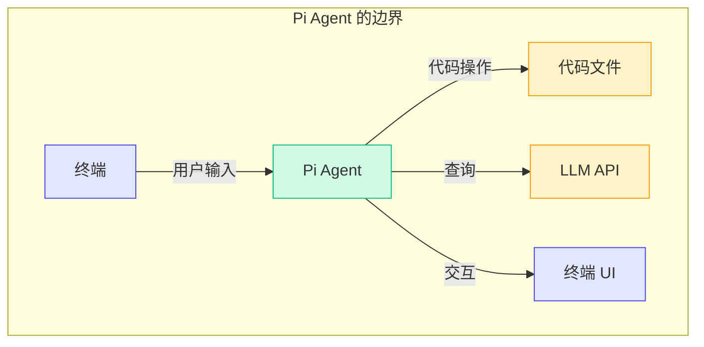
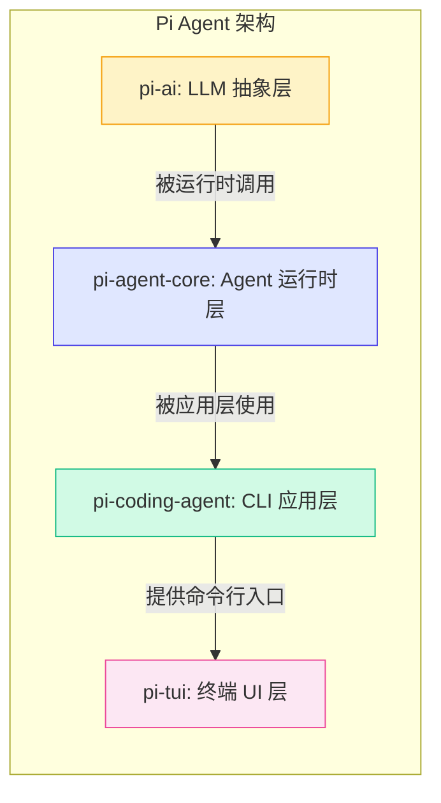
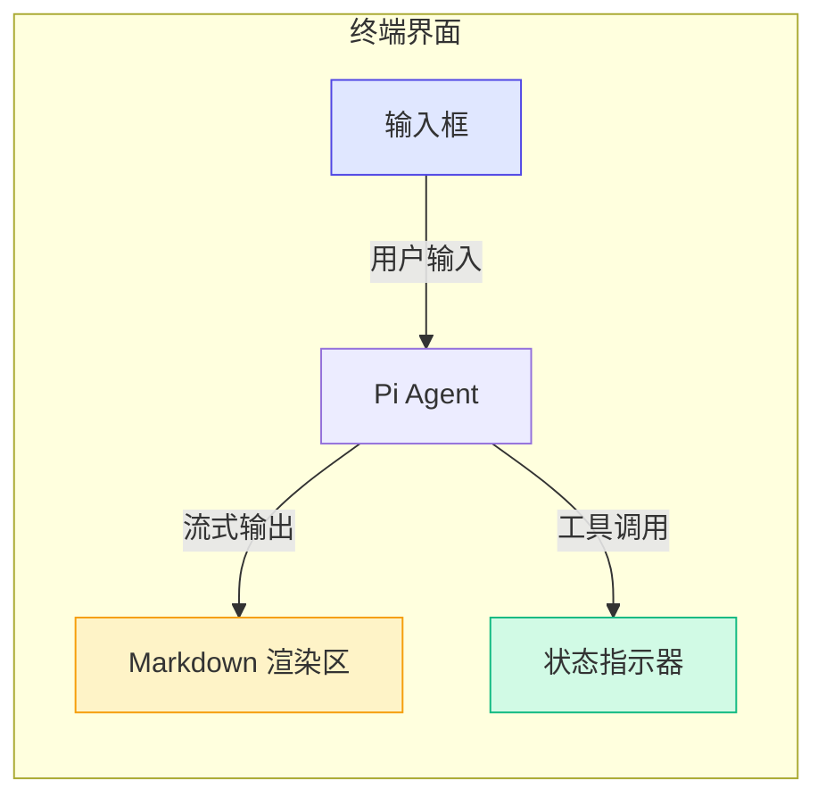
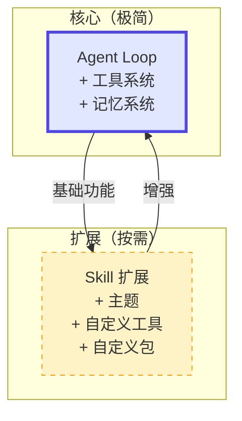
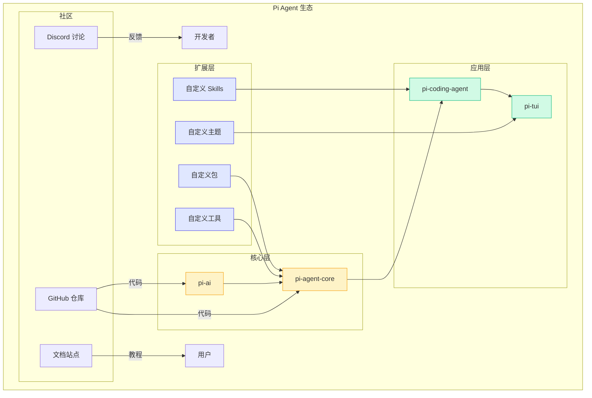

# 1.2 为什么选择 Pi Agent

> 市面上有很多 Agent 框架——LangChain、AutoGPT、Semantic Kernel……为什么我们要用 Pi Agent 来学习？

答案很简单：**Pi Agent 是为"学习"而生的**。

---

## Pi Agent 的定位

Pi Agent 把自己定位为一个 **"极简终端编码工具包"**。它不是想做一个通用的 Agent 框架，而是专注于一个场景：**在终端里，通过 CLI 与 AI Agent 交互，完成编码任务**。



这个定位决定了 Pi Agent 的代码量适中、边界清晰——非常适合作为学习材料。

---

## 四大核心包

Pi Agent 由四个核心包组成，它们从底层到上层构成了一个完整的 Agent 系统：



### 1. pi-ai：LLM 抽象层

**职责**：统一各种 LLM API 的调用接口

```typescript
// pi-ai 的核心：统一的 LLM 接口
interface LLM {
  // 无论底层是 OpenAI、Anthropic 还是本地模型
  // 调用方式都是一样的
  generate(messages: Message[]): Promise<Response>;
}

// 具体实现
class OpenAILLM implements LLM { /* ... */ }
class AnthropicLLM implements LLM { /* ... */ }
class MockLLM implements LLM { /* ... */ }  // 测试用！
```

**关键设计点**：

- 提供统一的 `LLM` 接口，屏蔽不同 API 的差异
- 内置 Mock LLM，**不依赖真实 API Key 也能开发和测试**
- 支持 Streaming（流式输出）

### 2. pi-agent-core：Agent 运行时层

**职责**：实现 Agent 的核心运行机制

这是 Pi Agent 最核心的包，包含了：

- **Agent Loop**：思考-行动-观察循环的实现
- **工具系统**：工具的注册、调用、结果处理
- **记忆系统**：对话历史的维护与管理
- **事件系统**：Agent 运行过程中的事件通知机制

```typescript
// pi-agent-core 的核心流程（概念示意）
class AgentRuntime {
  async step(): Promise<StepResult> {
    // 1. 从记忆中获取上下文
    const context = this.memory.getContext();
    
    // 2. 让 LLM 思考下一步
    const decision = await this.llm.decide(context, this.tools);
    
    if (decision.type === 'tool_call') {
      // 3. 执行工具调用
      const result = await this.executeTool(decision.tool);
      // 4. 记录结果到记忆
      this.memory.add(result);
      // 5. 继续循环
      return this.step();
    } else {
      // 3. 生成最终回答
      return decision.response;
    }
  }
}
```

### 3. pi-coding-agent：CLI 应用层

**职责**：面向编码场景的 CLI 应用

这一层把 Agent 运行时包装成一个具体的命令行工具，提供：

- 文件读写工具
- 代码搜索工具
- Git 操作工具
- 终端命令执行工具

### 4. pi-tui：终端 UI 层

**职责**：提供友好的终端交互界面



> **💡 原理深究**
> 
> 为什么要分成四个包？这是**关注点分离**的设计原则在实践中的体现。pi-ai 只关心"怎么调用 LLM"，pi-agent-core 只关心"Agent 循环怎么跑"，pi-coding-agent 只关心"编码场景需要什么工具"，pi-tui 只关心"界面怎么展示"。每一层各司其职，你可以单独替换或扩展任何一层。这就是 Pi Agent 设计哲学的体现。

---

## Pi 的设计哲学

Pi Agent 的设计哲学可以用一句话概括：**核心极简，按需增强**。



| 设计原则 | 说明 | 体现 |
|---------|------|------|
| **核心极简** | 核心包只做最必要的事 | pi-agent-core 只有 Agent Loop、工具系统、记忆系统 |
| **按需增强** | 不把"可能需要的功能"塞进核心 | 编码工具在 pi-coding-agent，UI 在 pi-tui |
| **约定优于配置** | 有默认行为，减少配置 | 默认使用 Mock LLM，开箱即用 |
| **TypeScript 优先** | 类型安全，代码即文档 | 所有包都用 TypeScript，接口定义清晰 |

> **⚠️ 常见错误**
> 
> **"框架越强大越好"**——这是很多初学者的想法。实际上，像 LangChain 这样的框架虽然功能强大，但它的抽象层级太多，一个简单的 Agent 调用背后可能有十几层包装。当你遇到问题时，很难追踪到根因。Pi Agent 的代码量只有几千行，你可以轻松读完所有核心代码。**对于学习来说，"看得完"比"功能多"重要得多。**

---

## 为什么 Pi Agent 适合学习？

我们用一张表来对比 Pi Agent 和其他主流选择：

| 维度 | Pi Agent | LangChain | AutoGPT | 自己从零写 |
|------|---------|-----------|---------|-----------|
| **代码量** | ~5000 行 | 数十万行 | 数万行 | 取决于你 |
| **学习曲线** | 平缓 | 陡峭 | 中等 | 最陡 |
| **TypeScript** | 是 | 是 | Python | 自选 |
| **设计清晰度** | 高（分层明确） | 中（抽象层级多） | 中 | 取决于你 |
| **可运行 Demo** | 8 个渐进式 Demo | 示例分散 | 单一应用 | 没有 |
| **Mock 支持** | 内置 | 需自行配置 | 无 | 需自行实现 |
| **社区活跃度** | 活跃（Discord） | 非常活跃 | 活跃 | 无 |
| **适合学习** | ★★★★★ | ★★☆☆☆ | ★★★☆☆ | ★★★☆☆ |

具体来说：

1. **代码量适中**——整个项目核心代码约 5000 行，一个下午就能读完。相比之下，LangChain 的核心包就有几十万行代码。

2. **TypeScript 编写**——TypeScript 的类型系统本身就是一种文档。你可以通过接口定义快速理解系统的设计。

3. **设计清晰**——四个包的职责划分非常清楚，每一层都可以独立学习和理解。

4. **内置 Mock**——pi-ai 内置了 MockLLM，这意味着你**不需要任何 API Key 就能运行和测试**。这对学习来说至关重要。

5. **渐进式教程**——本教程配套了 8 个 Demo，从最简单的"调用 LLM API"到"实现完整 Agent Loop"，每一步都有可运行的代码。

6. **活跃的社区**——Pi Agent 有活跃的 Discord 社区，遇到问题可以随时交流。

---

## Pi Agent 生态全景



---

## 小结

1. **Pi Agent 是极简终端编码工具包**——专注于终端编码场景，不做"万能框架"
2. **四大核心包**：pi-ai（LLM 抽象）、pi-agent-core（运行时）、pi-coding-agent（CLI）、pi-tui（终端 UI）
3. **设计哲学**：核心极简，按需增强——不把"可能需要的功能"塞进核心
4. **适合学习**：代码量适中、TypeScript、设计清晰、内置 Mock、有渐进式教程
5. **生态开放**：支持自定义 Skills、主题、包和工具

## 小练习

1. **阅读题**：打开 Pi Agent 的 GitHub 仓库，找到四个核心包的目录，看看每个包的 `src` 目录下有几个文件，感受一下代码量
2. **对比题**：如果你用过 LangChain 或其他 Agent 框架，对比它们的"Hello World"代码量和 Pi Agent 的差异
3. **思考题**："核心极简，按需增强"这个设计哲学在你熟悉的项目中是否也有体现？举例说明

---

**了解了 Pi Agent 的全貌后，让我们预热一下后续会用到的核心概念。**

[下一节：1.3 核心概念预热 →](./03-core-concepts.md)
