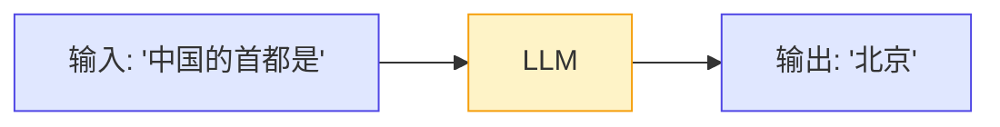
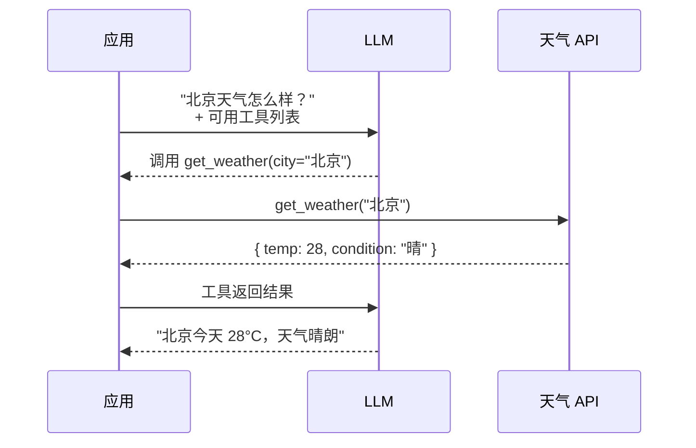
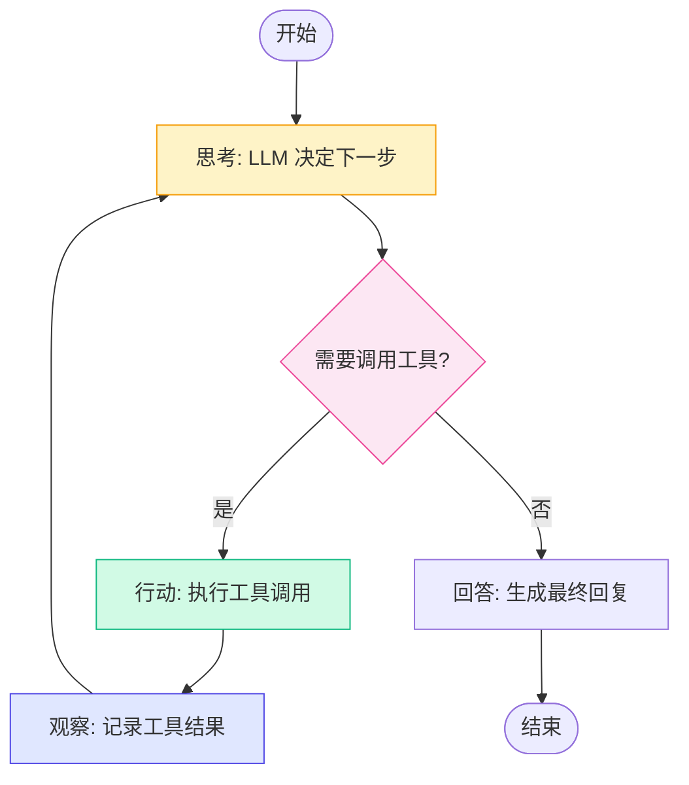
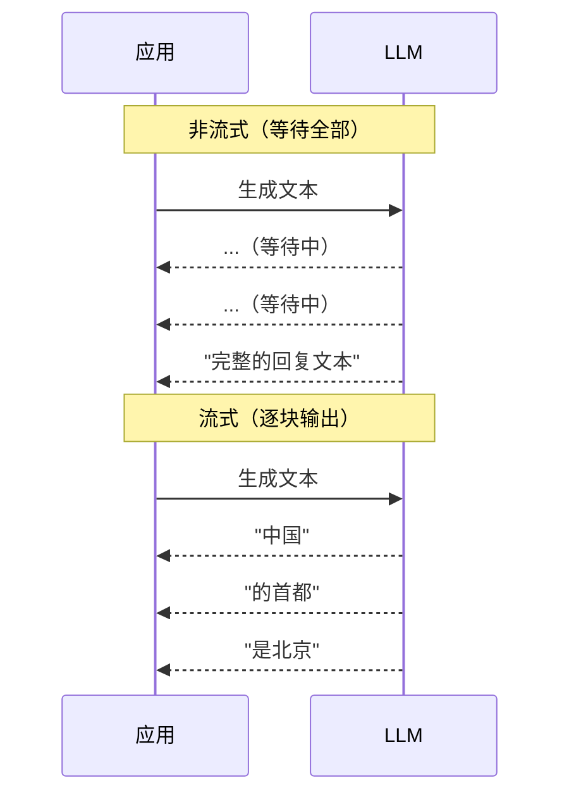
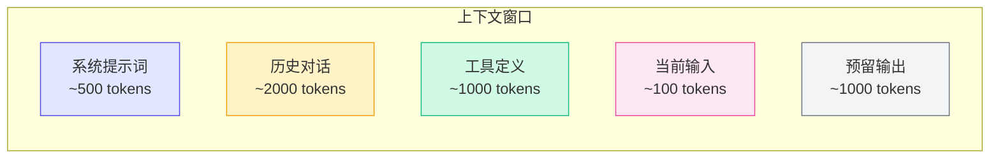
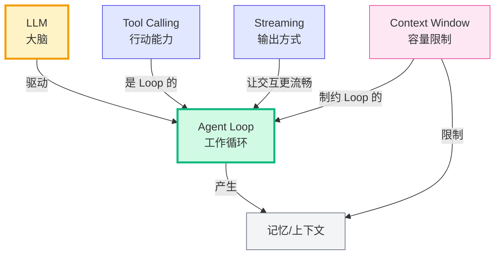

# 1.3 核心概念预热

> 在开始写代码之前，我们需要建立一套共同的语言。这一节会快速介绍后续章节中反复出现的五个核心概念。

如果你已经熟悉这些概念，可以快速浏览或跳过。如果你是新接触 AI Agent 开发，请仔细阅读——**这些概念是理解后续所有代码的基础**。

---

## 概念一览

| 概念 | 一句话定义 | 重要性 |
|------|-----------|--------|
| **LLM** | 大语言模型，Agent 的"大脑" | ★★★★★ |
| **Tool Calling** | LLM 调用外部工具的能力 | ★★★★★ |
| **Agent Loop** | 思考-行动-观察的迭代循环 | ★★★★★ |
| **Streaming** | 逐块输出而非等待全部生成 | ★★★☆☆ |
| **Context Window** | LLM 一次能处理的文本量上限 | ★★★★☆ |

---

## 1. LLM（大语言模型）

### 是什么

LLM（Large Language Model）是经过海量文本训练的深度学习模型。它的核心能力是**根据给定的文本，预测接下来最可能出现的文本**。



### 如何调用

在实际开发中，我们通过 API 调用 LLM。以 OpenAI 为例：

```typescript
// 调用 LLM API 的最简示例
import OpenAI from 'openai';

const client = new OpenAI({
  apiKey: process.env.OPENAI_API_KEY,
});

async function callLLM() {
  const response = await client.chat.completions.create({
    model: 'gpt-4o',                    // 指定模型
    messages: [                          // 对话消息
      { role: 'system', content: '你是一个助手。' },  // 系统提示词
      { role: 'user', content: '中国的首都是？' },     // 用户输入
    ],
    temperature: 0.7,                    // 控制随机性，0~2
  });

  return response.choices[0].message.content;
  // => "中国的首都是北京。"
}
```

> **💡 原理深究**
> 
> `temperature` 参数控制输出的随机性。`temperature=0` 表示每次都选概率最高的词，输出最确定。`temperature=1` 以上表示增加低概率词的选取机会，输出更有"创造性"。对于 Agent 的工具调用场景，通常推荐 `temperature=0` 或接近 0，因为我们需要确定性而非创造性。

### 在 Pi Agent 中的体现

Pi Agent 通过 `pi-ai` 包封装了 LLM 调用，提供了统一的接口。你不需要直接调用 OpenAI/Anthropic 的 SDK，而是通过 Pi 的抽象层：

```typescript
// Pi Agent 中的 LLM 调用方式
import { createLLM } from 'pi-ai';

const llm = createLLM({
  provider: 'openai',     // 可选: openai, anthropic, mock
  model: 'gpt-4o',
});

const response = await llm.generate([
  { role: 'user', content: '中国的首都是？' },
]);
```

---

## 2. Tool Calling（工具调用）

### 是什么

Tool Calling（也叫 Function Calling）是 LLM 的一项关键能力：**LLM 可以输出一个结构化的"工具调用请求"，而不是纯文本**。



### 如何定义工具

工具定义是一个 JSON Schema 格式的描述：

```typescript
// 定义一个天气查询工具
const getWeatherTool = {
  type: 'function',
  function: {
    name: 'get_weather',                    // 工具名称
    description: '查询指定城市的天气',       // 工具描述
    parameters: {                           // 参数定义
      type: 'object',
      properties: {
        city: {
          type: 'string',
          description: '城市名称，如北京、上海',
        },
      },
      required: ['city'],                   // 必填参数
    },
  },
};

// 调用 LLM 时传入工具定义
const response = await client.chat.completions.create({
  model: 'gpt-4o',
  messages: [{ role: 'user', content: '北京天气怎么样？' }],
  tools: [getWeatherTool],  // 告诉 LLM 可用工具
});
```

> **💡 原理深究**
> 
> Tool Calling 的神奇之处在于：LLM 并不是真的"调用"了工具，它只是**输出了一个结构化的 JSON**，告诉应用"我想调用这个函数，参数是这些"。真正执行工具调用的是你的应用代码。LLM 负责"决定调用什么"，应用负责"实际执行调用"。
> 
> 这也是为什么 Tool Calling 有时被称为 Function Calling——它本质上是一个函数调用声明，而不是真正的函数执行。

### 在 Pi Agent 中的体现

在 Pi Agent 中，工具被定义为 `Tool` 接口的实现：

```typescript
// Pi Agent 中的工具定义
import { Tool } from 'pi-agent-core';

class WeatherTool implements Tool {
  name = 'get_weather';
  description = '查询指定城市的天气';
  
  // 参数 schema
  schema = {
    city: { type: 'string', description: '城市名称' },
  };

  // 实际执行逻辑
  async execute(args: { city: string }) {
    const response = await fetch(
      `https://api.weather.com/${args.city}`
    );
    return response.json();
  }
}
```

---

## 3. Agent Loop（Agent 循环）

### 是什么

Agent Loop 是 Agent 的核心工作模式。它是一个循环，不断重复"思考 → 行动 → 观察"这三个步骤，直到任务完成。



### 伪代码实现

```typescript
// Agent Loop 的核心逻辑（简化版）
async function agentLoop(task: string) {
  const messages = [{ role: 'user', content: task }];
  
  while (true) {
    // 思考：让 LLM 基于当前上下文做决策
    const response = await llm.generate(messages, tools);
    
    if (response.toolCall) {
      // 行动：执行工具调用
      const result = await executeTool(response.toolCall);
      
      // 观察：把结果加入对话上下文
      messages.push({
        role: 'tool',
        content: JSON.stringify(result),
      });
      
      // 继续循环
      continue;
    }
    
    // 不需要调用工具，返回最终回答
    return response.content;
  }
}
```

### Agent Loop 的终止条件

Agent Loop 必须有一个明确的终止条件，否则会无限循环下去。常见的终止策略：

| 策略 | 说明 | 风险 |
|------|------|------|
| **LLM 主动结束** | LLM 决定不再调用工具 | LLM 可能永远不结束 |
| **最大轮数限制** | 超过 N 轮强制退出 | 复杂任务可能不够用 |
| **超时限制** | 超过 T 秒强制退出 | 可能中断正在进行的任务 |
| **人工确认** | 每轮都请求用户确认 | 影响自动化程度 |

实际项目中通常**组合使用**多种策略：

```typescript
// 安全的 Agent Loop
async function safeAgentLoop(task: string) {
  const MAX_STEPS = 10;     // 最多 10 轮
  const TIMEOUT_MS = 30000; // 最长 30 秒
  
  for (let step = 0; step < MAX_STEPS; step++) {
    const result = await withTimeout(agentStep(), TIMEOUT_MS);
    
    if (result.isFinal) {
      return result.content;
    }
  }
  
  throw new Error('Agent 超过最大步数限制');
}
```

> **⚠️ 常见错误**
> 
> **没有设置循环上限**——这是开发 Agent 时最容易犯的错误。如果没有最大步数限制，一个 bug 可能导致 Agent 无限循环，不断调用 LLM API，产生巨额费用。**始终设置最大步数限制，就像写递归函数时始终设置基线条件一样。**

---

## 4. Streaming（流式输出）

### 是什么

Streaming 是指 LLM 在生成文本时，**逐块（chunk）输出**，而不是等到全部生成完毕再一次性返回。



### 为什么需要 Streaming

| 场景 | 非流式 | 流式 |
|------|--------|------|
| 用户体验 | 用户需要等待完整响应，延迟感强 | 用户看到逐字输出，感知延迟低 |
| 首字延迟 | 等于完整生成时间 | 通常 < 1 秒 |
| 中断能力 | 不能中断（已发出请求） | 可以随时中断 |
| 实现复杂度 | 简单 | 稍复杂 |

### 代码对比

```typescript
// 非流式调用
async function nonStreaming() {
  const response = await llm.generate({
    messages: [{ role: 'user', content: '讲个故事' }],
  });
  // 等待全部生成完毕
  console.log(response.content); // 一次性输出
}

// 流式调用
async function streaming() {
  const stream = await llm.generateStream({
    messages: [{ role: 'user', content: '讲个故事' }],
  });
  
  for await (const chunk of stream) {
    // 每生成一小块就立即输出
    process.stdout.write(chunk.content);
    // 输出: "在" -> "很久" -> "很久" -> "以前" -> ...
  }
}
```

> **💡 原理深究**
> 
> Streaming 的核心机制是 **Server-Sent Events (SSE)**。LLM API 服务在生成每个 token 后，立即通过 HTTP 长连接推送给客户端。客户端收到后可以立即处理，不需要等待完整响应。这类似于视频流——你不必等整部电影下载完才能看第一帧。

### 在 Pi Agent 中的体现

Pi Agent 的 `pi-ai` 包支持流式输出，并且 `pi-tui` 包实现了逐字渲染效果。在后续的 Demo 中，我们会看到 Streaming 如何让终端交互变得丝滑。

---

## 5. Context Window（上下文窗口）

### 是什么

Context Window 是指 LLM **一次能处理的文本量上限**，通常以 token（词元）为单位。



### 常见模型的上下文窗口

| 模型 | 上下文窗口 | 约合中文字数 |
|------|-----------|-------------|
| GPT-4o | 128K tokens | ~8 万汉字 |
| Claude 3.5 Sonnet | 200K tokens | ~13 万汉字 |
| Gemini 1.5 Pro | 1M tokens | ~70 万汉字 |
| DeepSeek-V2 | 128K tokens | ~8 万汉字 |
| Llama 3 | 8K/128K tokens | ~5 千/8 万汉字 |

### 上下文窗口的挑战

在 Agent 场景中，上下文窗口是最常见的瓶颈之一。因为 Agent 的每次工具调用结果都会被追加到对话中，随着交互轮数增加，上下文会越来越长：

```typescript
// 上下文膨胀问题
let messages = [
  { role: 'system', content: '你是一个编码助手' },  // 500 tokens
  { role: 'user', content: '帮我重构这个文件' },      // 50 tokens
  { role: 'assistant', content: '我先读取文件' },     // 30 tokens
  { role: 'tool', content: '文件内容...' },            // 2000 tokens ← 文件内容
  { role: 'assistant', content: '我开始修改' },        // 20 tokens
  { role: 'tool', content: '修改结果...' },            // 1500 tokens ← 修改结果
  // ... 继续膨胀
];

// 当超过上下文窗口时，需要做截断
if (countTokens(messages) > CONTEXT_LIMIT) {
  messages = truncateMessages(messages);
  // 通常策略：保留系统提示词 + 最近的 N 轮对话
}
```

> **⚠️ 常见错误**
> 
> **忽略 token 计数**——很多初学者在开发 Agent 时，完全不监控 token 消耗。结果是：在测试阶段一切正常（因为对话短），但到实际使用时，随着对话变长，突然遇到"超出上下文窗口"的错误。**在 Agent 的每个循环中都应该检查 token 用量，并在接近上限时做截断或摘要。**

### 常见的上下文管理策略

| 策略 | 做法 | 优缺点 |
|------|------|--------|
| **滑动窗口** | 只保留最近的 N 轮对话 | 简单，但会丢失早期信息 |
| **摘要压缩** | 把早期对话压缩成摘要 | 保留关键信息，但增加一轮 LLM 调用 |
| **RAG** | 把长文本存入向量数据库，按需检索 | 效果好，但架构复杂 |
| **分层记忆** | 短期记忆（精确）+ 长期记忆（摘要） | 平衡好，实现复杂 |

---

## 概念关系图

这五个概念不是孤立的，它们共同构成了 Agent 系统：



**它们的关系是**：

1. **LLM** 是 Agent 的大脑，驱动整个系统
2. **Agent Loop** 是工作模式，LLM 在循环中不断决策
3. **Tool Calling** 让 Agent 能执行实际操作（调用 API、读写文件等）
4. **Streaming** 优化了 LLM 输出的用户体验
5. **Context Window** 是所有 Agent 都必须面对的资源约束

---

## 小结

1. **LLM** 是 Agent 的大脑，通过 API 调用，支持配置模型、temperature 等参数
2. **Tool Calling** 让 LLM 能输出结构化的工具调用请求，应用负责实际执行
3. **Agent Loop** 是"思考-行动-观察"的迭代循环，需要设置终止条件防止无限循环
4. **Streaming** 通过逐块输出来降低用户感知延迟
5. **Context Window** 是 LLM 的容量限制，Agent 需要主动管理上下文
6. 这五个概念共同构成了 Agent 系统的基础，后续所有代码都围绕它们展开

## 小练习

1. **代码题**：用你熟悉的 LLM API（OpenAI / Anthropic / 任意），实现一个最简单的 Tool Calling 示例：定义一个"计算器"工具（支持加减乘除），让 LLM 计算 `(123 + 456) * 2`
2. **思考题**：如果一个 Agent 在循环中不断调用工具，每次调用结果都把上下文撑大，最终超出 Context Window。你会怎么设计上下文管理策略？
3. **对比题**：Streaming 在聊天场景中提升了用户体验，但在 Agent 场景中，Streaming 可能带来什么新的问题？（提示：如果 LLM 先输出了一段文本，然后决定调用工具……）

---

**概念预热完毕！现在你已经掌握了后续章节所需的所有基础知识。接下来，让我们进入第二章，深入 Pi Agent 的核心原理。**

[返回第一章首页 →](./index.md)
