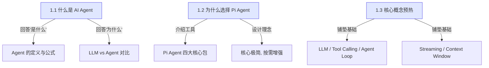

# 第一章：认识 AI Agent

> 在动手写代码之前，我们先在概念层面回答一个问题：**AI Agent 到底是什么？**

欢迎来到 Pi Agent 教程的第一章。这一章没有代码，但它是整本教程最重要的基础。如果你能清晰地理解这一章的内容，后续的 8 个 Demo 和最终项目对你来说会轻松很多。

---

## 本章内容

| 小节 | 内容概要 | 预计阅读时间 |
|------|---------|------------|
| 1.1 什么是 AI Agent | 从 LLM 到 Agent 的进化，Agent = LLM + 工具 + 记忆 + 规划 | 15 分钟 |
| 1.2 为什么选择 Pi Agent | Pi Agent 的定位、设计哲学、为什么适合学习 | 10 分钟 |
| 1.3 核心概念预热 | LLM、Tool Calling、Agent Loop、Streaming、Context Window | 15 分钟 |

## 本章路线图

## 学习目标

完成本章后，你应该能够：

1. 用自己的话解释 AI Agent 是什么，以及它和普通 LLM 的区别
2. 说出 Pi Agent 的四大核心包及其职责
3. 理解 Agent 工作循环的基本原理
4. 知道 LLM 的 Tool Calling、Streaming、Context Window 等核心概念

## 如何阅读本章

- 如果你是**完全的新手**：按顺序从 1.1 读到 1.3，不要跳
- 如果你**已经了解 AI Agent 基础**：可以直接跳到 1.2 了解 Pi Agent
- 如果你**只想快速上手**：至少读完 1.1 和 1.3，然后再跳到第三章开始写代码

---

**准备好了吗？从第一个问题开始：AI Agent 到底是什么？**

[下一章：1.1 什么是 AI Agent →](./01-what-is-agent.md)
