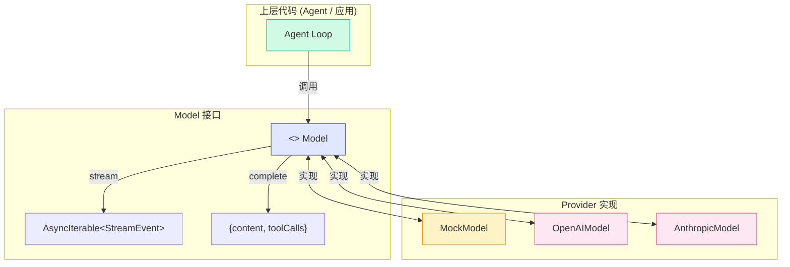
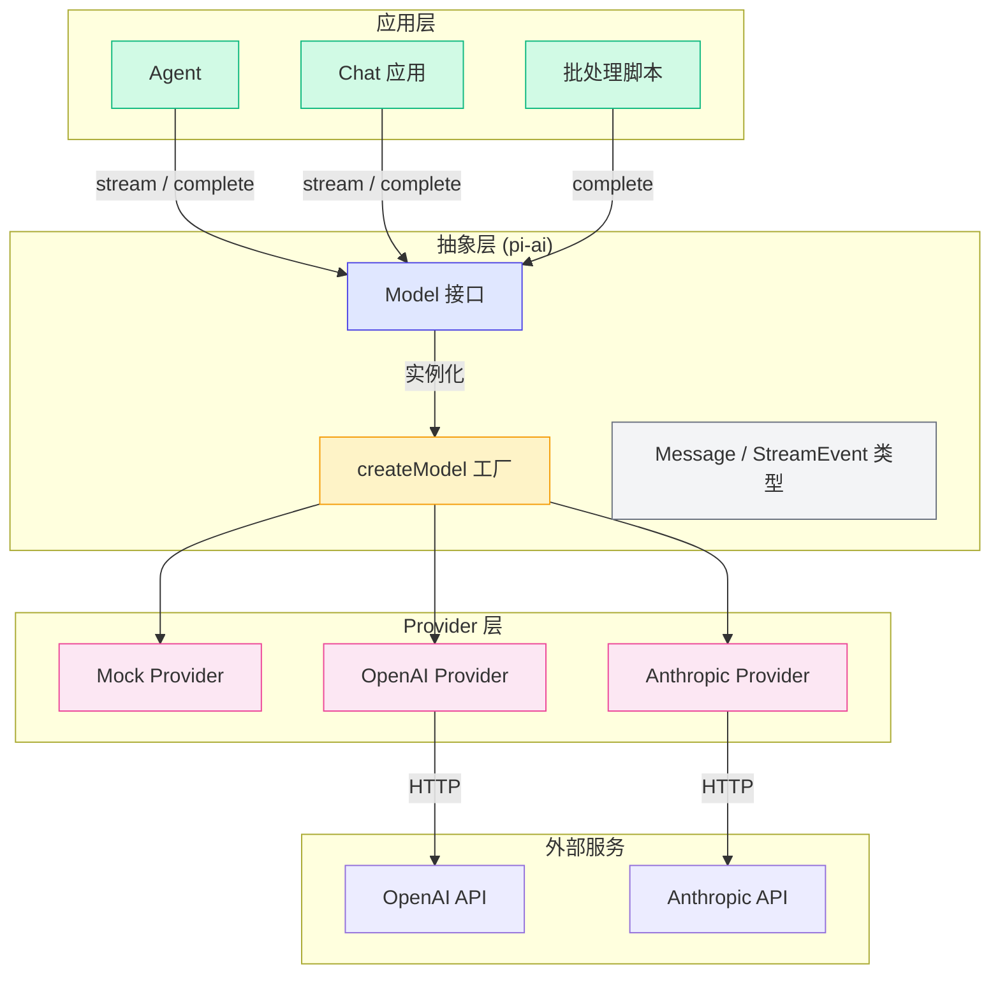

# 2.1 LLM 统一抽象层

> 核心问题：OpenAI、Anthropic、Google 三家 API 长得完全不一样，怎么让上层代码只面对一个统一的接口？

如果你写过两个以上 LLM 提供商的 API，你一定有过这种体验：明明都是"发消息给 AI，让 AI 回复"，但每家 API 的格式、字段名、调用方式都不同。更别提流式输出（Streaming）和工具调用（Tool Calling）的差异了——那简直是噩梦。

Pi Agent 解决这个问题的方式很直接：**定义一个统一的 Model 接口，让所有 Provider 实现这个接口**。上层代码永远只和 Model 打交道，底层切换 Provider 只需改一行配置。

---

## 为什么需要统一抽象？

先看看三家主流 LLM API 到底差了多远。

### 消息格式差异

这是最表面的差异，但已经足够让人头疼了：

| 特性 | OpenAI | Anthropic | Google Gemini |
|------|--------|-----------|---------------|
| 消息角色 | `system` / `user` / `assistant` / `tool` | `system` 单独传参，消息里只有 `user` / `assistant` | `user` / `model` / `function` |
| System 消息 | messages 数组中的 `role: "system"` | `system` 参数单独传 | `system_instruction` 字段 |
| 工具结果回传 | `role: "tool"` + `tool_call_id` | `role: "user"` + `content` 里包 `tool_result` block | `role: "function"` + `name` |

### 工具调用差异

工具调用（Tool Calling / Function Calling）是 Agent 的命脉，但各家实现方式完全不同：

| 特性 | OpenAI | Anthropic | Google Gemini |
|------|--------|-----------|---------------|
| 工具定义字段 | `tools: [{ type: 'function', function: { name, description, parameters } }]` | `tools: [{ name, description, input_schema }]` | `tools: [{ functionDeclarations: [{ name, description, parameters }] }]` |
| 工具调用响应 | `message.tool_calls` 数组 | `content` 中的 `tool_use` block | `functionCall` 对象 |
| 参数 schema 格式 | JSON Schema | JSON Schema | JSON Schema |

> 虽然三家都支持 JSON Schema，但字段名、嵌套层级、响应结构完全不同。你的代码要为每家写一套适配逻辑。

### 流式事件差异

流式输出是 Agent 实现"打字机效果"的关键，但各家的事件流格式差异巨大：

| 特性 | OpenAI | Anthropic | Google Gemini |
|------|--------|-----------|---------------|
| 文本增量 | `choices[0].delta.content` | `content_block_delta` 事件中的 `delta.text` | `candidates[0].content.parts[0].text` |
| 工具调用开始 | `delta.tool_calls[0].function.name` | `content_block_start` 事件 + `tool_use` block | `functionCall` 对象 |
| 流结束标记 | `choices[0].finish_reason: "stop"` | `message_stop` 事件 | `candidates[0].finishReason` |

> 看看这些差异——OpenAI 用 `choices[0].delta`，Anthropic 用 `content_block_delta`，Google 用 `candidates[0].content.parts[0]`。如果上层代码直接依赖这些，换 Provider 就要重写整个 Agent。

### 核心矛盾

> 问题：Agent 的核心逻辑（循环、工具执行、状态管理）应该是 Provider 无关的。但如果 Agent 代码直接调用 OpenAI SDK，换 Anthropic 就得重写 Agent。

**解决方案**：在 Agent 和 LLM Provider 之间加一层抽象。这就是 Pi 的 Model 接口。

---

## Pi 的 Model 接口设计

Pi Agent 的 `pi-ai` 包定义了最核心的抽象——`Model` 接口。它只做两件事：

```typescript
// LLM 统一抽象层 — 核心接口
export interface Model {
  readonly config: ModelConfig

  // 流式调用：逐块返回事件
  stream(
    messages: Message[],
    tools?: Tool[],
    signal?: AbortSignal,
  ): AsyncIterable<StreamEvent>

  // 完整调用：一次性返回结果
  complete(
    messages: Message[],
    tools?: Tool[],
    signal?: AbortSignal,
  ): Promise<{ content: string; toolCalls: ToolCall[] }>
}
```

> 这个接口极其精简——只有两个方法。但就是这两个方法，屏蔽了所有 Provider 的差异。

### 为什么只有两个方法？

你可能觉得"就两个方法？够用吗？" 实际上，**所有 LLM 调用场景都可以归为这两类**：

| 场景 | 使用的方法 | 原因 |
|------|-----------|------|
| Agent 内部循环调用 | `complete()` | Agent 需要快速判断 LLM 是否要调用工具，不需要逐字输出 |
| 面向用户的聊天 | `stream()` | 用户希望看到"打字机效果"，提升体验 |
| 后台批量处理 | `complete()` | 不需要流式输出，节省带宽 |
| 调试和日志 | `stream()` | 可以逐块记录 LLM 的思考过程 |

> 在设计接口时，少就是多。两个方法覆盖了所有场景，而且每个方法都一目了然。

### 消息类型定义

统一的消息格式是所有 Provider 差异的"最大公约数"：

```typescript
export interface Message {
  role: 'user' | 'assistant' | 'system' | 'tool'
  content: string
  toolCallId?: string   // 工具结果回传时使用
  toolName?: string     // 工具结果回传时使用
}

export interface ToolCallMessage extends Message {
  role: 'assistant'
  toolCalls: ToolCall[]
}
```

> 关键设计：`toolCallId` 和 `toolName` 是可选的。普通消息不需要这些字段，只有工具结果回传时才需要。这种设计让 Message 类型既简单又灵活。

### 流式事件类型

流式输出需要一种"增量"的数据结构：

```typescript
export type StreamEvent =
  | { type: 'text_delta'; delta: string }      // 文本增量
  | { type: 'tool_call'; toolCall: ToolCall }   // 工具调用
  | { type: 'done'; content: string; toolCalls: ToolCall[] }  // 完成
  | { type: 'error'; message: string }          // 错误
```

> 这个联合类型（Union Type）是 TypeScript 的 discriminated union——每个事件都有一个 `type` 字段区分类型。上层代码通过 `event.type` 做类型收窄，TypeScript 会自动推导出每个分支的数据结构。

---

## Provider 模式

有了统一的接口，接下来就是为每个 LLM 提供商实现这个接口。这就是 **Provider 模式**。



### 工厂函数

创建 Provider 实例的方式是**工厂函数**——根据配置自动选择实现：

```typescript
export function createModel(config: ModelConfig): Model {
  switch (config.provider) {
    case 'mock':
      return new MockModel(config)
    case 'openai':
      return new OpenAIModel(config)
    case 'anthropic':
      return new AnthropicModel(config)
    default:
      throw new Error(`Unknown provider: ${config.provider}`)
  }
}
```

> 工厂模式的好处是：上层代码不需要知道具体实现类，只需要调用 `createModel()`。新增 Provider 时只需要加一个 case，上层代码完全不用改。

### Provider 对比

| Provider | 适用场景 | 需要 API Key | 流式支持 | 工具调用 |
|----------|---------|-------------|---------|---------|
| Mock | 本地开发、测试、教学 | 不需要 | 完全支持 | 关键词匹配 |
| OpenAI | 生产环境 | 需要 | SSE Stream | Function Calling |
| Anthropic | 生产环境 | 需要 | SSE Stream | Tool Use |

### Mock Provider 的价值

> 不要小看 Mock Provider。在 Pi Agent 的教程中，前 4 个 Demo 全部使用 Mock Provider。这意味着**你不需要任何 API Key 就能跑通整个学习流程**。

Mock Provider 的实现思路很简单：根据用户输入的关键词，判断是否要"调用工具"或"生成回复"。比如用户说"计算 123 + 456"，Mock Provider 会检测到"计算"关键词，然后返回一个 calculator 的工具调用。

这模拟了真实 LLM 的行为——**你的 Agent 代码完全不需要区分它是在和 Mock 还是真实 LLM 对话**。

---

## 各 Provider 的 API 差异详解

### OpenAI Provider

OpenAI 的 `stream()` 实现需要处理流式 chunk 中的 `delta` 字段：

```typescript
// OpenAI 流式处理的核心逻辑（简化）
for await (const chunk of stream) {
  const delta = chunk.choices?.[0]?.delta
  if (!delta) continue

  if (delta.content) {
    // 文本增量
    yield { type: 'text_delta', delta: delta.content }
  }

  if (delta.tool_calls) {
    for (const tc of delta.tool_calls) {
      // 工具调用可能是分块的，需要累积
      if (tc.function?.name) {
        // 开始一个新的工具调用
        toolCalls.push({ id: tc.id, name: tc.function.name, arguments: {} })
      }
      if (tc.function?.arguments) {
        // 累积参数（参数可能是分片到达的）
        existing.arguments = { ...existing.arguments, ...safeJsonParse(tc.function.arguments, {}) }
      }
    }
  }
}
```

> 注意：OpenAI 的流式工具调用中，`arguments` 是逐 chunk 到达的。每个 chunk 可能只包含部分 JSON，所以需要 `safeJsonParse` 来安全解析。

### Anthropic Provider

Anthropic 的 API 设计完全不同——它使用事件流（event stream）而不是 chunk 流：

```typescript
// Anthropic 流式处理的核心逻辑（简化）
for await (const event of stream) {
  if (event.type === 'content_block_delta' && event.delta?.text) {
    yield { type: 'text_delta', delta: event.delta.text }
  }
  if (event.type === 'content_block_start' && event.content_block?.type === 'tool_use') {
    toolCalls.push({
      id: event.content_block.id,
      name: event.content_block.name,
      arguments: event.content_block.input || {},
    })
  }
}
```

Anthropic 还有两个特殊之处：

1. **System 消息单独传**：`system` 角色不在 messages 数组里，而是作为独立参数传入
2. **工具结果用 `tool_result` block**：工具结果不是独立消息，而是嵌套在 `user` 消息的 content 数组里

```typescript
// Anthropic 工具结果回传格式
{
  role: 'user',
  content: [{
    type: 'tool_result',
    tool_use_id: 'toolu_xxx',
    content: '计算结果: 579'
  }]
}
```

### 差异汇总

| 维度 | OpenAI | Anthropic |
|------|--------|-----------|
| 流式格式 | chunk-based (delta) | event-based (content_block) |
| 工具参数 | 分块到达，需累积 | 一次性到达 |
| System 消息 | 在 messages 数组中 | 单独 system 参数 |
| 工具结果格式 | 独立 tool 消息 | 嵌套在 user 消息中 |
| SDK 包名 | `openai` | `@anthropic-ai/sdk` |

---

## 抽象层的完整架构



---

## 小结

1. **LLM 统一抽象层的核心目的是屏蔽 Provider 差异**，让上层代码只面对统一的 Model 接口
2. **Model 接口只有两个方法**：`stream()` 和 `complete()`，覆盖所有 LLM 调用场景
3. **Provider 模式**通过工厂函数 `createModel()` 根据配置自动选择实现
4. **Mock Provider** 让开发和测试不需要 API Key，大幅降低学习门槛
5. **每个 Provider 的内部实现差异很大**（流式格式、工具调用方式、消息结构），但对外暴露的接口完全一致

### 设计决策总结

| 决策 | 选择 | 为什么 |
|------|------|--------|
| 接口方法数量 | 2 个 (stream + complete) | 覆盖所有场景，保持简洁 |
| 流式事件格式 |  discriminated union | TypeScript 类型安全，自动类型收窄 |
| Provider 创建方式 | 工厂函数 | 上层代码无需知道具体实现类 |
| Mock 实现 | 关键词匹配 | 模拟工具调用行为，无需真实 LLM |

---

## 小练习

1. **阅读 Demo 1 代码**：打开 `demo/01-llm-call/src/index.ts`，分别用 `complete()` 和 `stream()` 调用 Mock Provider，观察输出差异。

2. **切换 Provider**：在 Demo 1 中，将 `provider` 从 `'mock'` 改为 `'openai'`（需要配置 `LLM_API_KEY`），观察上层代码是否需要修改。

3. **添加一个 Google Provider**（选做）：如果你有兴趣，可以尝试为 Google Gemini API 实现一个 Provider 类，实现 `Model` 接口。提示：Google 的 SDK 是 `@google/generative-ai`。

4. **思考题**：为什么 `stream()` 返回的是 `AsyncIterable<StreamEvent>` 而不是 Node.js 的 `ReadableStream`？AsyncIterable 有什么优势？

---

[下一节：2.2 Agent Loop →](./02-agent-loop.md)
