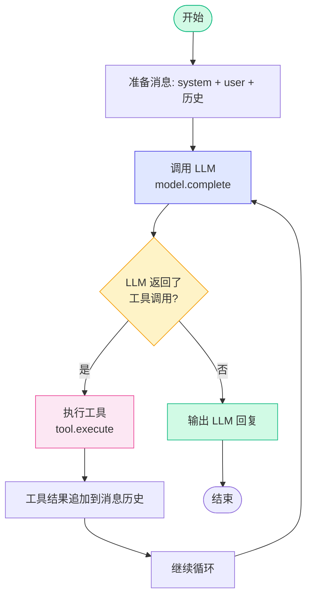
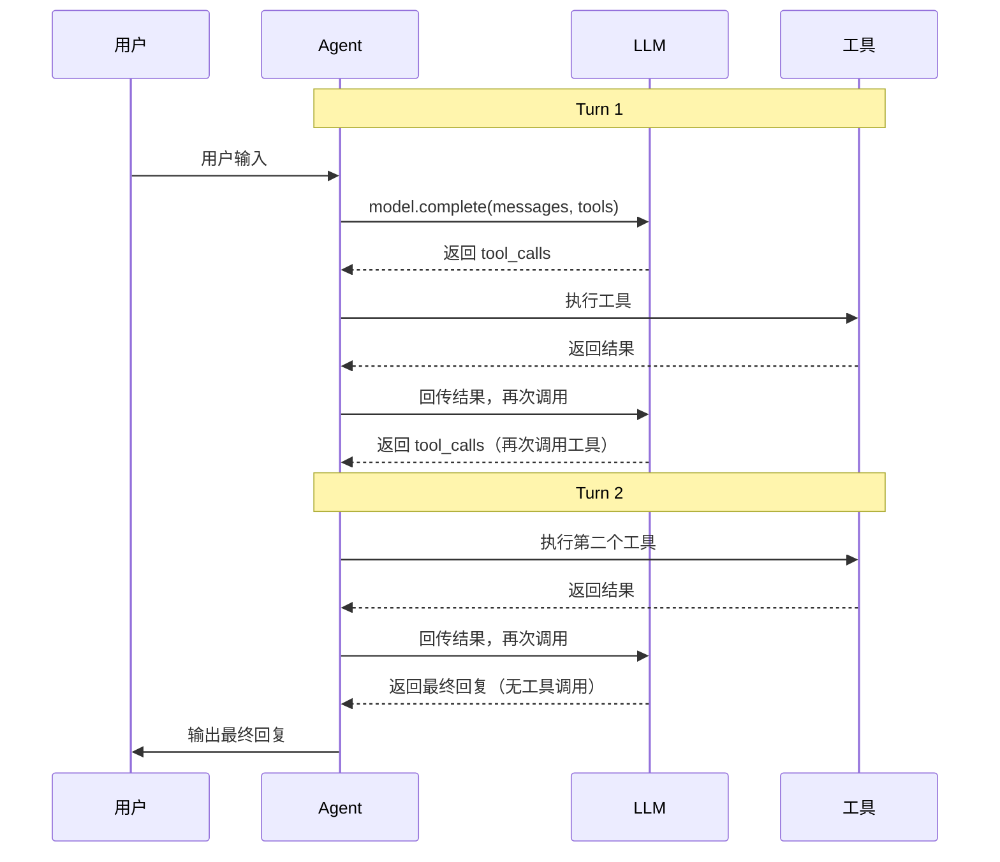
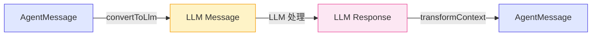
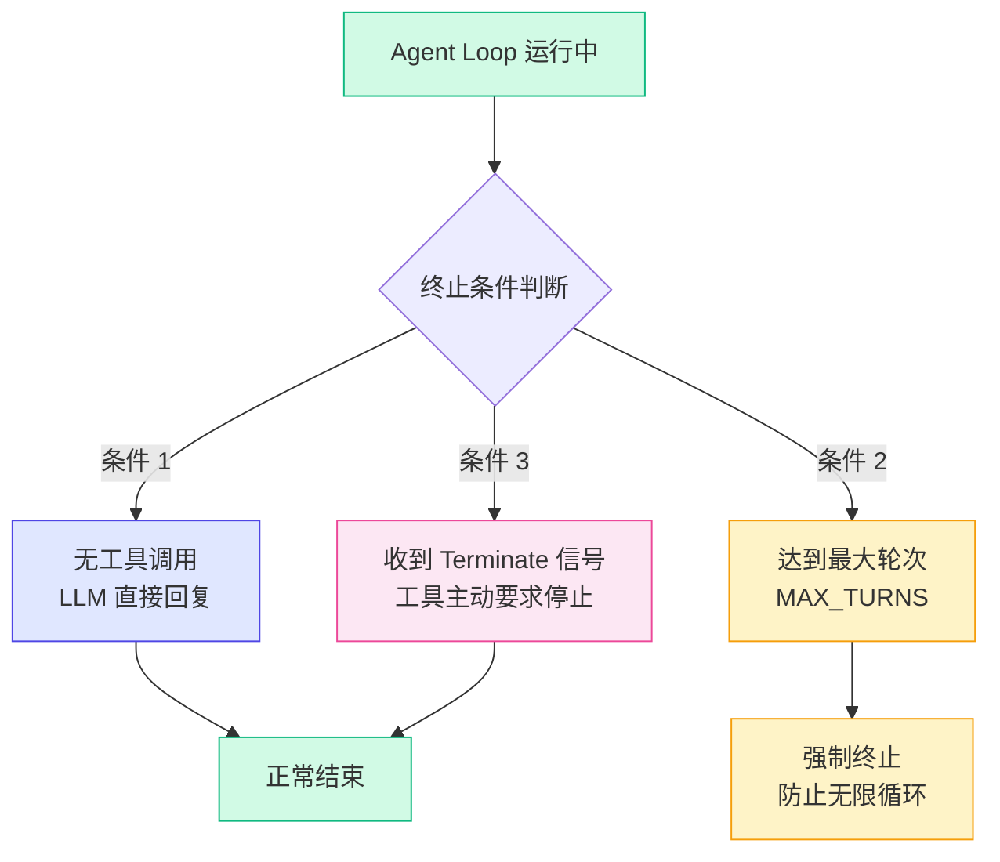

# 2.2 Agent Loop

> 核心问题：Agent 的核心运行机制到底是什么？答案很简单——一个 while 循环。

如果你理解了 LLM 抽象层（上一节），那 Agent Loop 的概念就很好懂了。Agent 的本质就是：

1. 把用户的输入 + 历史消息 + 工具列表发给 LLM
2. LLM 决定：直接回复，还是调用工具
3. 如果调用工具 → 执行工具 → 把结果回传给 LLM → 回到步骤 1
4. 如果直接回复 → 输出结果，结束

**这就是一个 while 循环。**



> 这个图就是 Agent 的全部秘密。如果你能理解这张图，你就理解了 80% 的 AI Agent 原理。

---

## Turn 的概念

Pi Agent 把一次"LLM 调用 + 工具执行"定义为一个 **Turn**。



> 一个 turn = 一次 LLM 调用 + 可能发生的工具执行。上面的例子中，Agent 用了两个 turn 完成了任务。

### 为什么需要多个 Turn？

因为 LLM 一次只能调用一组工具。当 LLM 调用工具后，它需要"看到"工具的执行结果，才能决定下一步做什么。

举个例子：

```
用户: "北京今天天气怎么样？适合出门吗？"

Turn 1:
  LLM 调用 → weather(location="北京")
  工具返回 → "北京：多云，18°C"
  结果回传 LLM

Turn 2:
  LLM 看到天气结果 → 生成回复
  "北京今天多云，18°C，适合出门，建议带件外套。"
```

> 注意：Turn 2 中 LLM 没有再调用工具，而是直接生成了回复。这时循环结束。

---

## 消息流的转换

Agent Loop 中有一个关键的数据转换环节：**把 Agent 内部的消息格式转换成 LLM 能理解的格式**。

Pi Agent 用两个函数来完成这个转换：



### convertToLlm：Agent 消息 → LLM 消息

这个函数负责把 Agent 内部统一的消息格式，转换成特定 Provider 需要的格式。

以 Anthropic 为例，Agent 内部的消息格式是：

```typescript
[
  { role: 'system', content: '你是一个助手。' },
  { role: 'user', content: '北京天气如何？' },
  { role: 'assistant', content: '', toolCalls: [{ id: 'xxx', name: 'weather', arguments: { location: '北京' } }] },
  { role: 'tool', content: '多云，18°C', toolCallId: 'xxx', toolName: 'weather' },
]
```

但 Anthropic API 需要的格式是：

```typescript
{
  system: '你是一个助手。',  // system 单独传
  messages: [
    { role: 'user', content: '北京天气如何？' },
    { role: 'assistant', content: [
      { type: 'tool_use', id: 'xxx', name: 'weather', input: { location: '北京' } }
    ]},
    { role: 'user', content: [
      { type: 'tool_result', tool_use_id: 'xxx', content: '多云，18°C' }
    ]},
  ]
}
```

> convertToLlm 的工作就是把左边的格式转换成右边的格式。每个 Provider 都有自己的 convertToLlm 实现。

### transformContext：LLM 响应 → Agent 消息

这个函数负责把 LLM 的原始响应，转换成 Agent 内部统一的消息格式。

```typescript
// transformContext 的工作（伪代码）
function transformContext(llmResponse: LlmResponse): AgentMessage {
  if (llmResponse.toolCalls.length > 0) {
    return {
      role: 'assistant',
      content: llmResponse.content,
      toolCalls: llmResponse.toolCalls.map(tc => ({
        id: tc.id,
        name: tc.name,
        arguments: tc.arguments,
      })),
    }
  }
  return {
    role: 'assistant',
    content: llmResponse.content,
  }
}
```

> 这两个函数是 Agent Loop 的"翻译官"。它们让 Agent 的核心逻辑（循环、工具执行）与 Provider 的 API 格式解耦。

---

## Agent Loop 的完整实现

这是 Pi Agent 的 Agent Loop 核心代码（简化版）：

```typescript
async function agentLoop(
  userInput: string,
  tools: Tool[],
  model: Model,
): Promise<void> {
  // 1. 初始化消息队列
  const messages: Message[] = [
    { role: 'system', content: '你是一个有帮助的助手。' },
    { role: 'user', content: userInput },
  ]

  let turn = 0
  const MAX_TURNS = 5  // 安全阀：防止无限循环

  // 2. 核心循环
  while (turn < MAX_TURNS) {
    turn++

    // Step A: 调用 LLM
    const { content, toolCalls } = await model.complete(messages, tools)

    // Step B: 检查是否有工具调用
    if (toolCalls.length === 0) {
      // 无工具调用 → 输出回复，结束循环
      console.log(`Agent: ${content}`)
      break
    }

    // Step C: 有工具调用 → 执行工具
    // 先把 LLM 的回复加入消息历史
    messages.push({ role: 'assistant', content, toolCalls } as Message)

    // 逐个执行工具
    for (const toolCall of toolCalls) {
      const tool = tools.find(t => t.name === toolCall.name)
      if (!tool) {
        // 工具不存在 → 返回错误
        messages.push({
          role: 'tool',
          content: `错误：未找到工具 ${toolCall.name}`,
          toolCallId: toolCall.id,
          toolName: toolCall.name,
        })
        continue
      }

      // 执行工具
      const result = await tool.execute(toolCall.arguments)

      // 工具结果回传
      messages.push({
        role: 'tool',
        content: result.content,
        toolCallId: toolCall.id,
        toolName: toolCall.name,
      })
    }

    // Step D: 继续循环
    // LLM 会在下一次调用中看到工具结果
  }

  if (turn >= MAX_TURNS) {
    console.log(`达到最大轮次限制 (${MAX_TURNS})，自动停止`)
  }
}
```

> 这段代码不到 50 行，但它就是 Agent 的核心。所有复杂的 Agent 框架，底层都是这个循环。

---

## 循环终止条件

Agent Loop 不能无限跑下去，必须有明确的终止条件。Pi Agent 支持三种终止方式：



### 条件 1：无工具调用

这是最自然的终止方式。LLM 认为已经获取了足够的信息，可以直接回复用户。

### 条件 2：达到最大轮次

这是安全阀。假设 LLM 陷入无限循环（比如不断调用同一个工具），最大轮次限制可以强制终止。

> Pi Agent 的默认最大轮次是 10。这个值不是随便选的——大多数真实场景下，3-5 个 turn 就能完成任务。10 轮足以覆盖绝大多数情况，同时避免无限循环。

### 条件 3：Terminate 信号

这是一个高级特性。工具执行时，可以返回一个特殊的 `terminate` 信号，告诉 Agent Loop 立即停止。

```typescript
// 工具返回 Terminate 信号
const terminateTool: Tool = {
  name: 'task_complete',
  description: '任务完成，结束对话',
  parameters: Type.Object({
    summary: Type.String({ description: '任务完成总结' }),
  }),
  execute: async (args) => {
    return {
      content: `任务完成：${args.summary}`,
      terminate: true,  // 告诉 Agent 停止循环
    }
  },
}
```

> Terminate 信号让工具拥有了"叫停"的能力。这在需要工具主动结束对话的场景下非常有用，比如"任务完成"或"用户请求被完全处理"。

---

## 关键设计决策

### 为什么用 while 循环而不是递归？

Agent Loop 本质上是一个循环，用 `while` 实现比用递归更自然：

| 方案 | 优势 | 劣势 |
|------|------|------|
| while 循环 | 栈空间固定，易于控制终止条件 | -- |
| 递归 | 代码更"函数式" | 每次调用增加栈深度，有栈溢出风险；难以控制轮次上限 |

> Agent 可能运行几十轮（虽然很少见），用递归会导致栈溢出。while 循环没有这个问题。

### 为什么用 complete() 而不是 stream()？

Agent Loop 内部使用 `complete()` 而不是 `stream()`，原因是：

1. **Agent 内部不需要打字机效果**——它只需要快速判断 LLM 要不要调用工具
2. **complete() 更简单**——返回一个 Promise，不需要处理异步迭代器
3. **性能更好**——不需要逐块处理流式事件

但最终面向用户输出时，会用 `stream()` 来实现打字机效果。这体现了**分层设计**的思想：内部追求效率，外部追求体验。

> 当然，你也可以在 Agent Loop 内部使用 `stream()` 来逐块处理 LLM 的响应。Pi Agent 同时支持两种模式，但 `complete()` 是默认推荐。

---

## 小结

1. **Agent Loop 的本质是一个 while 循环**：LLM 调用 → 检测工具 → 执行工具 → 回传结果 → 继续循环
2. **Turn 是 Agent 的基本工作单元**：一个 turn = 一次 LLM 调用 + 可能的工具执行
3. **消息流通过两个关键函数转换**：`convertToLlm` 把 Agent 消息转成 LLM 格式，`transformContext` 把 LLM 响应转回 Agent 格式
4. **三种终止条件**：无工具调用（正常结束）、达到最大轮次（强制终止）、Terminate 信号（工具主动停止）
5. **Agent Loop 内部使用 complete()**，面向用户输出时使用 stream()，体现了分层设计思想

### 设计决策总结

| 决策 | 选择 | 为什么 |
|------|------|--------|
| 循环结构 | while 循环 | 栈空间固定，易于控制终止 |
| 默认最大轮次 | 10 | 覆盖绝大多数场景，防止无限循环 |
| 内部调用方式 | complete() | 简单高效，不需要打字机效果 |
| 消息转换 | convertToLlm + transformContext | 解耦 Agent 逻辑和 Provider API |

---

## 小练习

1. **阅读 Demo 3 代码**：打开 `demo/03-agent-loop/src/index.ts`，理解 Agent Loop 的实现。尝试修改 `MAX_TURNS` 的值，观察效果。

2. **添加日志**：在 Agent Loop 的每个关键步骤（LLM 调用前、工具执行前、结果回传后）添加 `console.log`，观察完整的循环流程。

3. **测试 Terminate 信号**：尝试实现一个工具，当它被调用时返回 `terminate: true`，观察 Agent Loop 是否会立即停止。

4. **思考题**：如果 LLM 在一次调用中返回了 3 个工具调用，这些工具应该串行执行还是并行执行？为什么？下一节会给出答案。

---

[下一节：2.3 工具系统 →](./03-tool-system.md)
