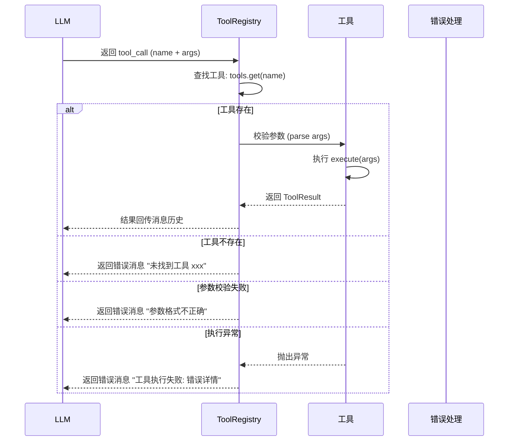
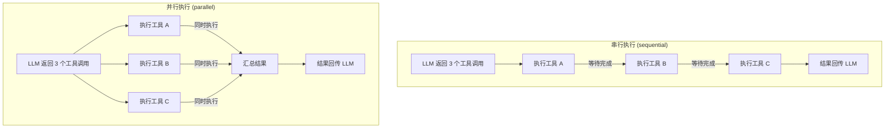
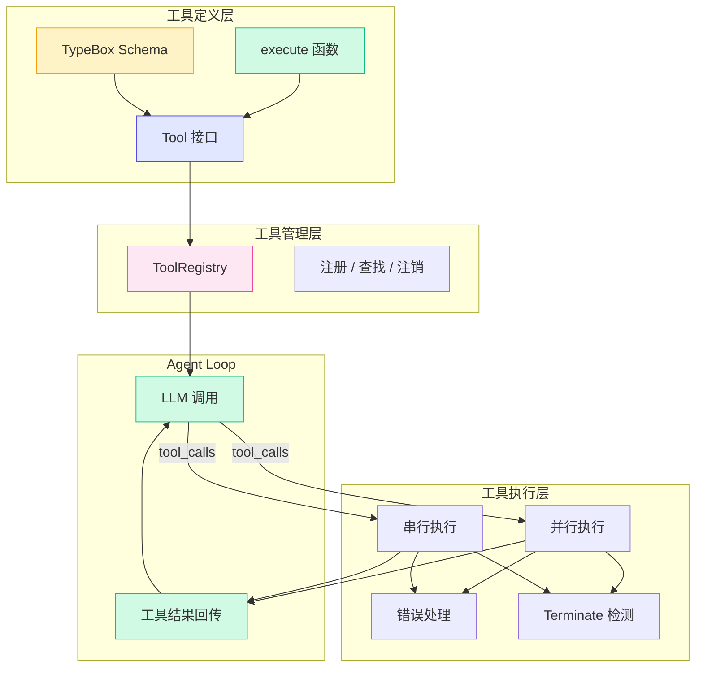

# 2.3 工具系统

> 核心问题：LLM 怎么知道有哪些工具可用？怎么调用工具？工具执行结果怎么处理？

LLM 本身只是一个"文本生成器"。它不能查天气、不能做精确计算、不能访问数据库。但通过工具系统（Tool System），LLM 获得了与外部世界交互的能力。

如果把 LLM 比作大脑，工具就是手脚。Agent 的智能来自于大脑和手脚的配合。

---

## 工具的定义

在 Pi Agent 中，一个工具由四个要素组成：

```typescript
export interface Tool<T extends TSchema = TSchema> {
  /** 工具名称 — LLM 通过此名称选择调用哪个工具 */
  name: string
  /** 工具描述 — LLM 通过描述理解工具的用途 */
  description: string
  /** 参数 schema — 使用 TypeBox 定义，实现运行时校验 */
  parameters: T
  /** 执行函数 — 接收参数并返回结果 */
  execute: (args: Record<string, unknown>) => Promise<ToolResult> | ToolResult
}

export interface ToolResult {
  content: string
  isError?: boolean
}
```

> 四个要素缺一不可。name 和 description 是给 LLM 看的，parameters 是约束参数的，execute 是真正干活的。

### 为什么 LLM 需要 name 和 description？

LLM 本质上是一个"文本模式匹配器"。你给它一堆工具定义，它通过名称和描述来理解每个工具的用途，然后决定调用哪个。

```typescript
// 好的工具定义
const weatherTool: Tool = {
  name: 'get_weather',
  description: '查询指定城市的当前天气信息，包括温度、湿度、风力等',
  parameters: Type.Object({
    location: Type.String({ description: '城市名称，如"北京"、"上海"、"东京"' }),
    unit: Type.Optional(Type.Enum({ celsius: 'celsius', fahrenheit: 'fahrenheit' })),
  }),
  execute: async (args) => {
    // 调用天气 API...
    return { content: '北京：多云，18°C，湿度 60%' }
  },
}
```

> 描述写得越清晰，LLM 越能准确判断何时调用这个工具。比如上面 `description` 中明确写了"包括温度、湿度、风力"，LLM 就知道这个工具能提供这些信息。

### 不好的工具定义

```typescript
// 不好的工具定义
const weatherTool: Tool = {
  name: 'w1',  // 名字太短，无意义
  description: '天气工具',  // 描述太模糊
  parameters: Type.Object({
    q: Type.String(),  // 参数名不清晰
  }),
  // ...
}
```

> LLM 看到 `w1` 和"天气工具"，很难判断这个工具是干什么的，更不知道参数 `q` 是什么意思。结果就是 LLM 不会调用它，或者调用时传错参数。

---

## TypeBox Schema

Pi Agent 使用 [TypeBox](https://github.com/sinclairzx81/typebox) 来定义工具的参数 schema。TypeBox 是一个 TypeScript 优先的运行时校验库。

### 为什么用 TypeBox？

| 方案 | 类型安全 | 运行时校验 | 代码量 | 学习成本 |
|------|---------|-----------|-------|---------|
| TypeBox | 完全 | 完全 | 少 | 低 |
| Zod | 完全 | 完全 | 中 | 低 |
| JSON Schema 手写 | 无 | 完全 | 多 | 中 |
| 纯 TypeScript 类型 | 完全 | 无 | 最少 | 无 |
| 无校验 | 无 | 无 | 最少 | 无 |

TypeBox 的优势在于：

1. **类型安全**：`Type.Object({...})` 会自动推导出 TypeScript 类型
2. **运行时校验**：工具执行前可以校验参数格式
3. **零依赖**：TypeBox 本身非常轻量
4. **JSON Schema 兼容**：TypeBox 生成的 schema 就是标准的 JSON Schema，LLM API 原生支持

```typescript
import { Type } from '@sinclair/typebox'

// TypeBox 定义参数 schema
const calculatorSchema = Type.Object({
  a: Type.Number({ description: '第一个数字' }),
  b: Type.Number({ description: '第二个数字' }),
  operator: Type.String({ description: '运算符: +, -, *, /' }),
})

// TypeScript 自动推导出类型
// type CalculatorArgs = { a: number; b: number; operator: string }
```

> TypeBox 的 `Type.Object()` 既是运行时定义，也是类型定义。你不需要写两次——一次定义，双重保障。

### TypeBox 的常见用法

```typescript
// 基本类型
Type.String({ description: '用户名' })
Type.Number({ description: '年龄', minimum: 0 })
Type.Boolean({ description: '是否启用' })

// 可选字段
Type.Optional(Type.String({ description: '可选的城市名称' }))

// 枚举
Type.Enum({ small: 'small', medium: 'medium', large: 'large' })

// 数组
Type.Array(Type.String({ description: '标签列表' }))

// 复杂对象
Type.Object({
  name: Type.String(),
  age: Type.Number(),
  tags: Type.Optional(Type.Array(Type.String())),
})
```

---

## 注册机制：ToolRegistry

Pi Agent 使用 `ToolRegistry` 来统一管理所有工具。它就像一个工具仓库，Agent 从这里获取工具列表。

```typescript
class ToolRegistry {
  private tools: Map<string, Tool> = new Map()

  // 注册工具
  register(tool: Tool): void {
    this.tools.set(tool.name, tool)
  }

  // 批量注册
  registerAll(tools: Tool[]): void {
    for (const tool of tools) {
      this.register(tool)
    }
  }

  // 获取所有工具（用于传给 LLM）
  getAll(): Tool[] {
    return Array.from(this.tools.values())
  }

  // 按名称获取工具（用于执行）
  get(name: string): Tool | undefined {
    return this.tools.get(name)
  }

  // 取消注册
  unregister(name: string): void {
    this.tools.delete(name)
  }
}
```

> ToolRegistry 的设计很简单，但它解决了一个重要问题：**工具的定义和使用分离**。你可以在程序的不同位置注册工具，Agent 运行时统一获取。

---

## 工具执行流程

当 LLM 返回工具调用后，Agent Loop 会执行以下流程：



> 注意：无论工具执行成功还是失败，结果都会回传给 LLM。LLM 会根据结果决定下一步行动——可能是重试、用其他工具，或者直接回复用户。

---

## 执行模式：并行 vs 串行

当 LLM 在一次调用中返回多个工具调用时，Pi Agent 支持两种执行模式：



### 串行执行

```typescript
// 串行执行：逐个执行，前一个完成后再执行下一个
for (const toolCall of toolCalls) {
  const tool = registry.get(toolCall.name)
  const result = await tool.execute(toolCall.arguments)
  messages.push({ role: 'tool', content: result.content, toolCallId: toolCall.id, toolName: toolCall.name })
}
```

### 并行执行

```typescript
// 并行执行：同时执行所有工具
const results = await Promise.all(
  toolCalls.map(async (toolCall) => {
    const tool = registry.get(toolCall.name)
    const result = await tool.execute(toolCall.arguments)
    return { toolCall, result }
  })
)

// 结果统一回传
for (const { toolCall, result } of results) {
  messages.push({ role: 'tool', content: result.content, toolCallId: toolCall.id, toolName: toolCall.name })
}
```

### 对比

| 特性 | 串行 (sequential) | 并行 (parallel) |
|------|------------------|----------------|
| 执行速度 | 慢（逐个执行） | 快（同时执行） |
| 工具间依赖 | 支持（B 依赖 A 的结果） | 不支持 |
| 错误隔离 | 好（一个失败不影响其他） | 好（Promise.allSettled） |
| 实现复杂度 | 低 | 中 |
| 默认模式 | -- | Pi Agent 默认 |

> Pi Agent 默认使用**并行执行**，因为大多数场景下工具之间没有依赖关系。如果工具之间有依赖（比如 B 需要 A 的结果），你需要使用串行模式。

---

## Terminate 信号

我们在上一节提到了 Terminate 信号。这里详细说明它的实现机制。

某些工具执行后，Agent 应该立即停止，而不是继续循环。比如：

- **任务完成**工具：用户说"帮我写完这篇报告"，工具执行后任务就完成了
- **错误恢复**工具：发生了不可恢复的错误，告诉 Agent 停止
- **用户取消**工具：用户要求停止当前操作

在 Pi 中，Terminate 信号的实现方式是**在工具结果中增加一个标记**：

```typescript
// ToolResult 增加 terminate 字段
export interface ToolResult {
  content: string
  isError?: boolean
  terminate?: boolean  // 是否终止 Agent Loop
}
```

Agent Loop 检测到这个标记后，会立即停止循环：

```typescript
// Agent Loop 中的处理
for (const toolCall of toolCalls) {
  const result = await tool.execute(toolCall.arguments)

  messages.push({
    role: 'tool',
    content: result.content,
    toolCallId: toolCall.id,
    toolName: toolCall.name,
  })

  // 检测 Terminate 信号
  if (result.terminate) {
    console.log('收到 Terminate 信号，停止 Agent Loop')
    return  // 立即退出循环
  }
}
```

> Terminate 信号让工具拥有了"控制权"。它不仅仅是执行一个函数，还可以影响 Agent 的运行流程。

---

## 错误处理

工具执行过程中可能出错。Pi Agent 有两种错误处理策略：

### 策略 1：抛出异常

```typescript
const tool: Tool = {
  name: 'query_database',
  description: '查询数据库',
  parameters: Type.Object({
    sql: Type.String(),
  }),
  execute: async (args) => {
    try {
      const result = await db.query(args.sql)
      return { content: JSON.stringify(result) }
    } catch (error) {
      throw new Error(`数据库查询失败: ${error.message}`)
    }
  },
}
```

> 抛出异常后，Agent Loop 会捕获异常，并将错误信息作为工具结果回传给 LLM。LLM 看到错误后，可能会修正参数后重试。

### 策略 2：返回错误内容

```typescript
const tool: Tool = {
  name: 'calculator',
  description: '执行数学运算',
  parameters: Type.Object({
    a: Type.Number(),
    b: Type.Number(),
    operator: Type.String(),
  }),
  execute: (args) => {
    if (args.operator === '/' && args.b === 0) {
      // 返回错误，但不抛出异常
      return { content: '错误：除数不能为零', isError: true }
    }
    // 正常执行...
    return { content: `${a} ${operator} ${b} = ${result}` }
  },
}
```

> 返回 `isError: true` 时，Agent 仍然正常处理结果。LLM 看到 `isError` 标记后，会理解"工具执行了但出错了"，然后决定如何处理。

### 两种策略的对比

| 策略 | 适用场景 | 对 Agent Loop 的影响 |
|------|---------|-------------------|
| 抛出异常 | 基础设施故障（网络断开、数据库连接失败） | Agent Loop 需要 try-catch 包裹 |
| 返回错误内容 | 业务逻辑错误（参数不合法、除数为零） | Agent Loop 正常处理，LLM 自行判断 |

> 原则：基础设施错误用异常，业务逻辑错误用返回值。异常代表"系统出了问题"，返回值代表"工具正常运行但结果不理想"。

---

## 工具系统的完整架构



---

## 小结

1. **工具的四个要素**：name（LLM 识别）、description（LLM 理解用途）、parameters（参数约束）、execute（实际执行）
2. **TypeBox 提供类型安全和运行时校验**：一次定义，双重保障
3. **ToolRegistry 统一管理工具**：注册和使用的职责分离
4. **并行执行是默认模式**：大多数工具无依赖关系，并行执行更快
5. **Terminate 信号**让工具拥有控制 Agent Loop 的能力
6. **错误处理有两种策略**：基础设施错误抛异常，业务逻辑错误返回 isError

### 设计决策总结

| 决策 | 选择 | 为什么 |
|------|------|--------|
| Schema 库 | TypeBox | 类型安全 + 运行时校验 + JSON Schema 兼容 |
| 工具管理 | ToolRegistry | 统一管理，职责分离 |
| 默认执行模式 | 并行 | 大多数工具无依赖，性能更好 |
| 错误处理 | 双策略 | 区分基础设施错误和业务逻辑错误 |
| Terminate | ToolResult 标记 | 让工具拥有控制循环的能力 |

---

## 小练习

1. **阅读 Demo 2 代码**：打开 `demo/02-tool-def/src/index.ts`，查看工具的定义方式。尝试添加一个新的工具（比如 `translate` 翻译工具）。

2. **修改执行模式**：在 Demo 3 的 Agent Loop 中，尝试把串行执行改为并行执行（使用 `Promise.all`），观察执行时间的变化。

3. **测试错误处理**：在计算器工具中，故意传一个不支持的运算符（比如 `^`），观察 Agent 如何响应。

4. **思考题**：如果一个工具需要调用另一个工具的结果（比如先用 `search` 工具搜索信息，再用 `summarize` 工具总结），应该怎么设计？串行执行是否必须？

---

[下一节：2.4 事件系统 →](./04-event-system.md)
