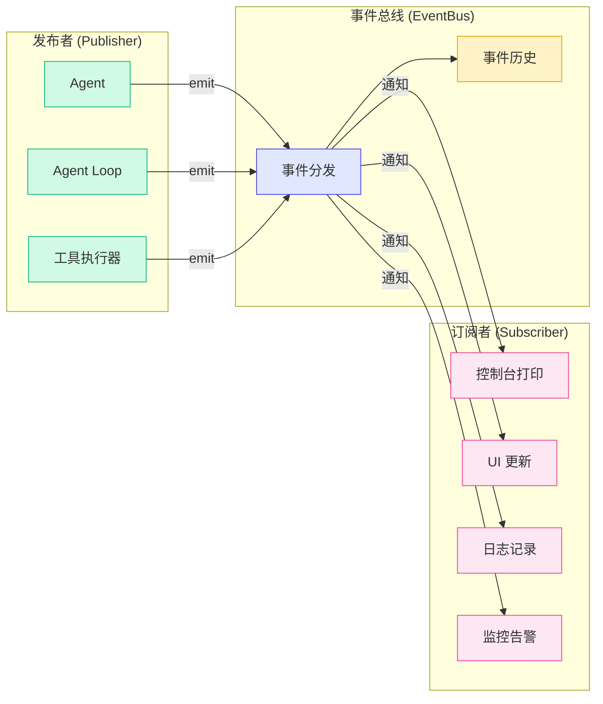
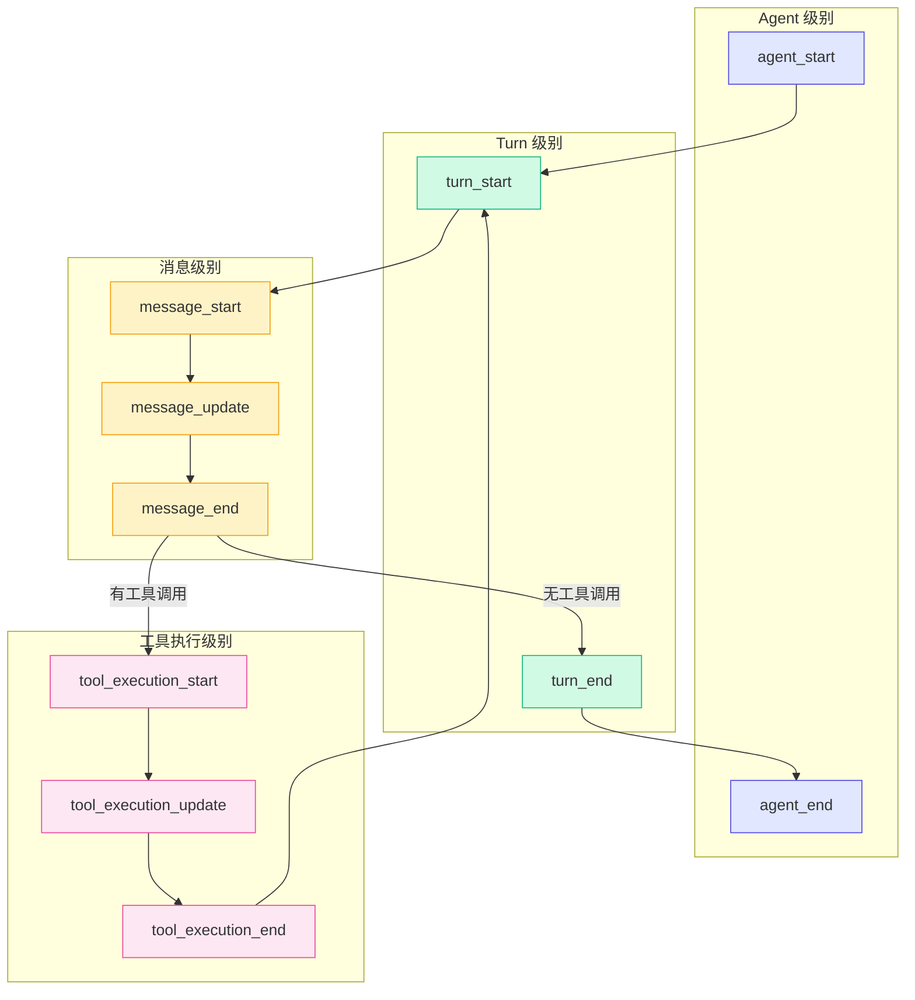
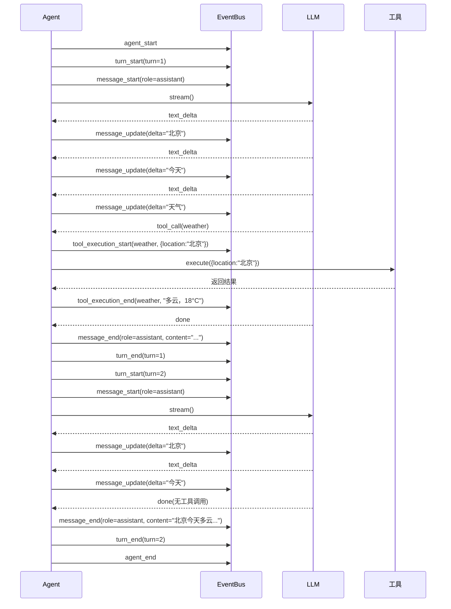

# 2.4 事件系统

> 核心问题：Agent 内部运行的时候，外部怎么知道它正在做什么？

前面三节我们都在讨论 Agent "怎么做事"。但还有一个重要问题：**如果我要观察 Agent 的"思考过程"，怎么办？**

比如：
- 我想在 UI 上实时显示 LLM 正在输出的文字
- 我想记录 Agent 调用了哪些工具、耗时多久
- 我想在 Agent 出错时立刻收到通知
- 我想调试 Agent 的行为，看看它为什么做了某个决策

这些问题都可以通过**事件系统**来解决。

---

## 事件驱动架构

Pi Agent 的事件系统基于**发布-订阅模式**（Pub-Sub）。这是一个非常经典的设计模式：



> 发布-订阅模式的核心思想是：**发布者和订阅者互不知道对方的存在**。Agent 只管"发出事件"，不管谁在听。外部只管"监听事件"，不管 Agent 内部怎么工作。

### 为什么不用回调函数？

你可能会问："直接在 Agent 里加回调函数不行吗？"

| 方案 | 优势 | 劣势 |
|------|------|------|
| 回调函数 | 简单直接 | 多个回调难以管理；回调之间可能互相影响；不支持历史回放 |
| 发布-订阅 | 松耦合；支持多个订阅者；支持事件历史 | 需要额外的事件总线 |

> 回调函数就像"私聊"——Agent 直接对特定对象说话。事件系统就像"广播"——Agent 在公共频道说话，谁想听谁听。在需要多人监听时，广播更灵活。

---

## 事件类型层次

Pi Agent 的事件类型分为四个层级，对应 Agent 运行的不同粒度：



### 类型定义

```typescript
export type AgentEvent =
  // Agent 级别
  | { type: 'agent_start' }
  | { type: 'agent_end' }

  // Turn 级别
  | { type: 'turn_start'; turn: number }
  | { type: 'turn_end'; turn: number }

  // 消息级别
  | { type: 'message_start'; role: string }
  | { type: 'message_update'; delta: string }
  | { type: 'message_end'; role: string; content: string }

  // 工具执行级别
  | { type: 'tool_execution_start'; toolName: string; args: Record<string, unknown> }
  | { type: 'tool_execution_update'; toolName: string; output: string }
  | { type: 'tool_execution_end'; toolName: string; result: string }
```

### 为什么需要四个层级？

每个层级解决不同的问题：

| 层级 | 粒度 | 解决什么问题 |
|------|------|-------------|
| Agent | 最粗 | 知道 Agent 何时开始和结束运行 |
| Turn | 中等 | 知道 Agent 进行了几轮思考-行动循环 |
| Message | 较细 | 知道 LLM 正在输出什么内容 |
| Tool Execution | 最细 | 知道工具调用的完整生命周期 |

> 这种分层设计让订阅者可以按需监听。UI 可能只关心 `message_update` 来显示打字机效果，而日志系统可能关心所有事件。

---

## 事件流的完整序列

一个典型的 Agent 运行过程，事件流是这样的：



> 注意事件流的顺序：agent_start -> turn_start -> message_start -> message_update... -> message_end -> turn_end -> agent_end。每个事件都嵌套在前一个事件的生命周期内。

---

## EventBus 的实现

Pi Agent 的 EventBus 实现非常精简：

```typescript
export class EventBus {
  // 订阅者列表
  private listeners: Set<Listener> = new Set()

  // 事件历史（用于调试和回放）
  private history: AgentEvent[] = []

  // 订阅事件，返回取消订阅函数
  subscribe(listener: Listener): () => void {
    this.listeners.add(listener)
    return () => {
      this.listeners.delete(listener)
    }
  }

  // 发布事件
  emit(event: AgentEvent): void {
    this.history.push(event)  // 记录历史
    for (const listener of this.listeners) {
      listener(event)  // 同步通知所有订阅者
    }
  }

  // 获取事件历史
  getHistory(): AgentEvent[] {
    return [...this.history]
  }

  // 清空历史
  clearHistory(): void {
    this.history = []
  }
}
```

> 这个实现只有 40 行代码，但它完成了事件系统的所有核心功能：订阅、发布、历史记录。

### 关键设计细节

**1. Listener 支持异步**

```typescript
type Listener = (event: AgentEvent) => void | Promise<void>
```

`Listener` 可以是同步函数也可以是异步函数。如果是异步函数，Pi Agent 会 `await` 它。

**2. 订阅者按注册顺序执行**

```typescript
emit(event: AgentEvent): void {
  this.history.push(event)
  for (const listener of this.listeners) {
    listener(event)  // 按注册顺序依次执行
  }
}
```

> 注意：当前实现是"通知后不等待"（fire-and-forget）。如果监听器是异步的，后续监听器不会等待前一个完成。在更复杂的实现中，你可能需要串行执行（按顺序 await）。

**3. subscribe 返回取消函数**

```typescript
const unsubscribe = eventBus.subscribe(myListener)
// ... 一段时间后 ...
unsubscribe()  // 取消订阅
```

> 这种设计很常见（React 的 useEffect 也这么用）。subscribe 返回一个"清理函数"，调用它即可取消订阅。

---

## 订阅者模式实战

让我们看看实际使用中，订阅者是如何工作的。

### 示例 1：控制台打印

```typescript
// 创建一个控制台订阅者
eventBus.subscribe((event) => {
  switch (event.type) {
    case 'agent_start':
      console.log('Agent 开始运行')
      break
    case 'turn_start':
      console.log(`Turn ${event.turn} 开始`)
      break
    case 'message_update':
      process.stdout.write(event.delta)  // 逐字输出
      break
    case 'tool_execution_start':
      console.log(`调用工具: ${event.toolName}`)
      break
  }
})
```

### 示例 2：UI 更新

```typescript
// 创建一个 UI 更新订阅者
eventBus.subscribe((event) => {
  if (event.type === 'message_update') {
    // 更新聊天界面
    updateChatUI(event.delta)
  }
  if (event.type === 'tool_execution_start') {
    // 显示工具调用状态
    showToolStatus(event.toolName, 'running')
  }
  if (event.type === 'tool_execution_end') {
    // 更新工具调用状态
    showToolStatus(event.toolName, 'completed', event.result)
  }
})
```

### 示例 3：日志记录

```typescript
// 创建一个日志记录订阅者
eventBus.subscribe((event) => {
  logger.info({
    eventType: event.type,
    timestamp: Date.now(),
    data: event,
  })
})
```

> 多个订阅者可以同时存在，互不干扰。这就是发布-订阅模式的核心优势——**一对多通信**。

---

## 事件历史：调试和回放

EventBus 的 `history` 数组记录了所有事件。这个功能有两个重要用途：

### 调试

当 Agent 的行为不符合预期时，你可以查看事件历史来定位问题：

```typescript
// 查看事件历史
const history = eventBus.getHistory()
for (const event of history) {
  console.log(`[${event.type}]`, JSON.stringify(event))
}
```

输出可能像这样：

```
[agent_start] {}
[turn_start] {"turn":1}
[message_start] {"role":"assistant"}
[message_update] {"delta":"我"}
[message_update] {"delta":"需要"}
[message_update] {"delta":"查"}
[tool_execution_start] {"toolName":"weather","args":{"location":"北京"}}
[tool_execution_end] {"toolName":"weather","result":"多云，18°C"}
[message_end] {"role":"assistant","content":"我需要查询天气..."}
[turn_end] {"turn":1}
[turn_start] {"turn":2}
[message_start] {"role":"assistant"}
[message_update] {"delta":"北京"}
[message_end] {"role":"assistant","content":"北京今天多云，18°C"}
[turn_end] {"turn":2}
[agent_end] {}
```

> 通过事件历史，你可以精确复现 Agent 的每一步决策过程。这在调试时极其有用。

### 回放

理论上，你可以保存事件历史，然后"回放"它，重现 Agent 的完整运行过程。这对于：

- **用户支持**：用户说"Agent 回答错了"，你可以回放事件历史，看看哪里出了问题
- **测试**：用固定的事件历史做回归测试
- **演示**：回放一个复杂的 Agent 交互过程

---

## 在 Agent Loop 中集成事件

把事件系统集成到 Agent Loop 中，只需在每个关键步骤调用 `eventBus.emit()`：

```typescript
async function agentLoopWithEvents(
  userInput: string,
  tools: Tool[],
  model: Model,
  eventBus: EventBus,
): Promise<void> {
  const messages: Message[] = [
    { role: 'system', content: '你是一个有帮助的助手。' },
    { role: 'user', content: userInput },
  ]

  eventBus.emit({ type: 'agent_start' })

  let turn = 0
  const MAX_TURNS = 5

  while (turn < MAX_TURNS) {
    turn++
    eventBus.emit({ type: 'turn_start', turn })

    // 使用 stream() 实现流式输出
    const stream = model.stream(messages, tools)
    eventBus.emit({ type: 'message_start', role: 'assistant' })

    let fullContent = ''
    for await (const event of stream) {
      if (event.type === 'text_delta') {
        fullContent += event.delta
        eventBus.emit({ type: 'message_update', delta: event.delta })
      }

      if (event.type === 'tool_call') {
        eventBus.emit({
          type: 'tool_execution_start',
          toolName: event.toolCall.name,
          args: event.toolCall.arguments,
        })

        // 执行工具
        const tool = tools.find(t => t.name === event.toolCall.name)
        if (tool) {
          const result = await tool.execute(event.toolCall.arguments)
          eventBus.emit({
            type: 'tool_execution_end',
            toolName: event.toolCall.name,
            result: result.content,
          })
          messages.push({
            role: 'tool',
            content: result.content,
            toolCallId: event.toolCall.id,
            toolName: event.toolCall.name,
          })
        }
      }

      if (event.type === 'done') {
        eventBus.emit({
          type: 'message_end',
          role: 'assistant',
          content: fullContent,
        })
      }
    }

    eventBus.emit({ type: 'turn_end', turn })

    // 检查是否需要继续循环
    const hasToolCalls = messages.some(m => m.role === 'tool')
    if (!hasToolCalls) break
  }

  eventBus.emit({ type: 'agent_end' })
}
```

> 注意：这段代码在 Agent Loop 内部使用了 `stream()` 而不是 `complete()`。这是因为事件系统需要流式事件（`message_update`）来实现打字机效果。使用 `complete()` 的话，你只能拿到最终结果，无法输出中间过程。

---

## 小结

1. **事件系统基于发布-订阅模式**：Agent 发布事件，外部订阅事件，双方完全解耦
2. **事件分为四个层级**：Agent 级别、Turn 级别、消息级别、工具执行级别，粒度从粗到细
3. **事件流有固定的顺序**：agent_start -> turn_start -> message_start -> message_update -> message_end -> turn_end -> agent_end
4. **EventBus 的实现非常精简**：subscribe / emit / getHistory / clearHistory，四个方法覆盖所有功能
5. **事件历史用于调试和回放**：可以精确复现 Agent 的每一步决策
6. **集成事件系统只需在每个关键步骤 emit**：对 Agent Loop 的侵入性很小

### 设计决策总结

| 决策 | 选择 | 为什么 |
|------|------|--------|
| 通信模式 | 发布-订阅 | 发布者和订阅者完全解耦 |
| 事件层级 | 4 层 | 不同粒度的监听需求 |
| 历史记录 | 内存数组 | 简单高效，满足调试需求 |
| 订阅取消 | 返回取消函数 | 符合函数式编程习惯，易于管理 |
| 异步支持 | Listener 支持 Promise | 不阻塞事件循环 |

---

## 小练习

1. **阅读 Demo 4 代码**：打开 `demo/04-stream/src/index.ts`，理解事件系统在 Agent Loop 中的集成方式。尝试添加一个新的订阅者，把事件同时打印到控制台和写入文件。

2. **实现自定义订阅者**：创建一个订阅者，统计 Agent 运行的总耗时、工具调用次数、总消息长度。

3. **查看事件历史**：在 Demo 4 中，运行后调用 `eventBus.getHistory()`，打印所有事件，观察事件的顺序和结构。

4. **思考题**：当前 EventBus 的 `emit()` 是同步通知所有订阅者的。如果改为异步（await 每个 listener），会有什么影响？什么场景下需要异步通知？

---

[下一节：2.5 整体架构总览 →](./05-architecture.md)
