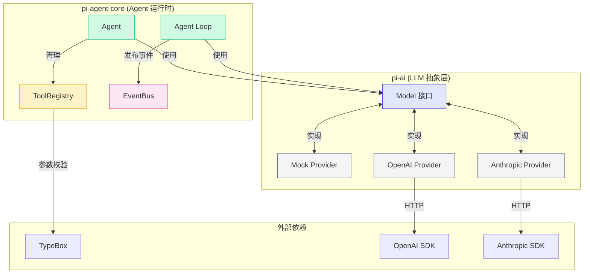
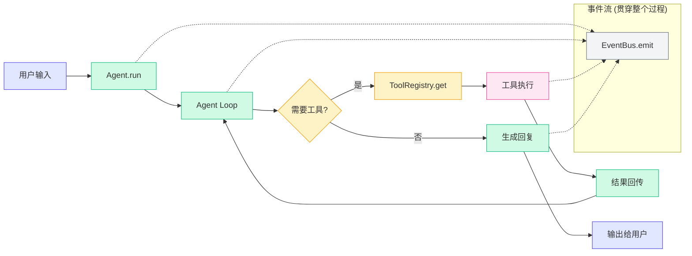
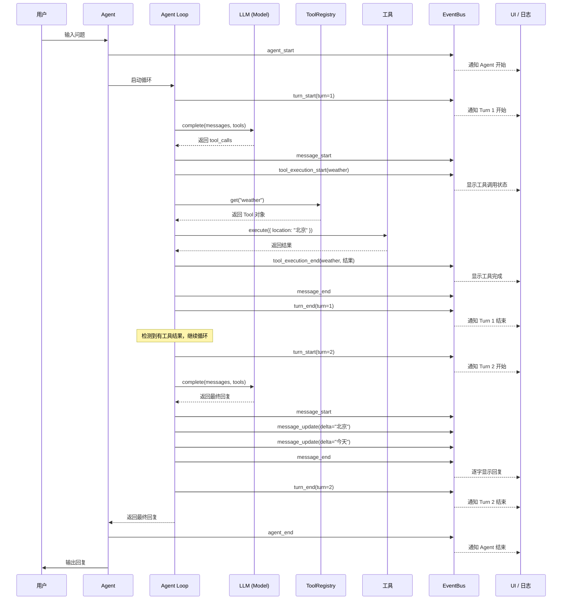
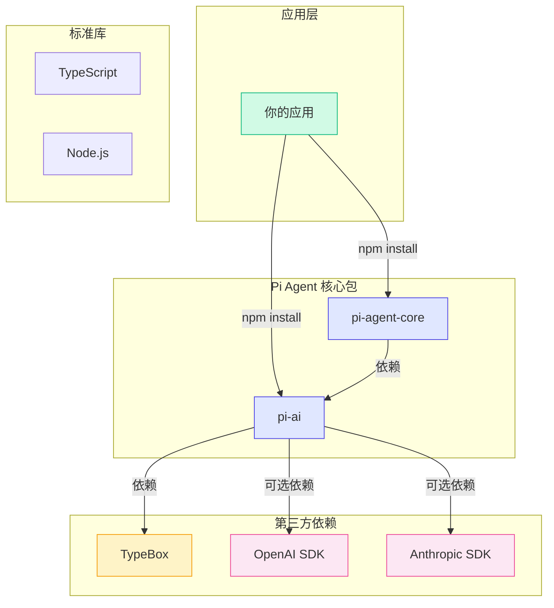
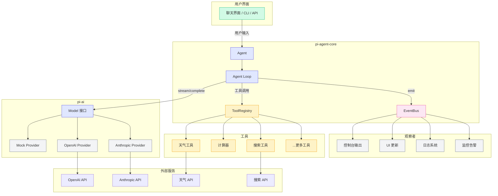

# 2.5 整体架构总览

> 把四个核心机制拼在一起，看看 Pi Agent 的完整面貌。

前面四节我们分别拆解了 Pi Agent 的四个核心机制。现在，让我们把它们组合起来，从全局视角理解 Pi Agent 的整体架构。

这一节是第二章的收尾，也是进入第三章 Demo 实战前的"路线图"。

---

## 模块关系图

Pi Agent 由两个核心包组成：

| 包名 | 职责 | 核心类型 |
|------|------|---------|
| `pi-ai` | LLM 抽象层 | Model, Message, StreamEvent |
| `pi-agent-core` | Agent 核心运行时 | Agent, Tool, ToolRegistry, EventBus |



> 注意依赖关系：`pi-agent-core` 依赖 `pi-ai`，但 `pi-ai` 完全不依赖 `pi-agent-core`。这种单向依赖保证了 LLM 抽象层可以被独立使用——即使你不用 Agent，也可以直接用 pi-ai 调用 LLM。

---

## 完整数据流

从用户输入到最终回复，数据经历了哪些环节？



### 数据流详解

```
用户输入 "北京天气怎么样？适合出门吗？"

Step 1: Agent.run("北京天气怎么样？适合出门吗？")
  → 创建消息队列：[system, user]
  → 启动 Agent Loop

Step 2: Agent Loop (Turn 1)
  → model.complete(messages, tools)
  → LLM 返回: tool_call(weather, { location: "北京" })
  → 检测到工具调用

Step 3: 工具执行
  → registry.get("weather") → 找到 weather 工具
  → tool.execute({ location: "北京" })
  → 返回 "北京：多云，18°C，湿度 60%"
  → 结果追加到消息队列

Step 4: Agent Loop (Turn 2)
  → model.complete(messages, tools)
  → LLM 看到天气结果
  → LLM 返回: "北京今天多云，18°C，适合出门，建议带件外套。"
  → 无工具调用，循环结束

Step 5: 输出回复
  → "北京今天多云，18°C，适合出门，建议带件外套。"
```

> 整个过程，事件系统一直在工作：每一步都通过 EventBus 发布事件，外部订阅者可以实时观察。

---

## 启动时序图

从用户输入到最终回复的完整链路：



> 这张时序图展示了 Pi Agent 的完整运行过程。注意看 EventBus 在每一步都参与了通信——它是 Agent 和外部世界之间的"桥梁"。

---

## 包依赖关系

Pi Agent 的包依赖关系非常清晰：



### 依赖关系要点

1. **`pi-agent-core` 依赖 `pi-ai`**：Agent 运行时需要 LLM 抽象层来调用模型
2. **`pi-ai` 不依赖 `pi-agent-core`**：pi-ai 可以独立使用，比如只用来调用 LLM 不做 Agent
3. **OpenAI 和 Anthropic SDK 是可选依赖**：如果你只用 Mock Provider，不需要安装任何 SDK
4. **TypeBox 是核心依赖**：工具系统的参数定义依赖它

> 这种依赖设计体现了"核心极简，按需增强"的理念。最小安装只需要 pi-agent-core + pi-ai + TypeBox，不需要任何 LLM SDK。

---

## 关键设计决策总结

Pi Agent 的每个设计决策背后都有明确的理由。让我们回顾一下：

### 1. 为什么用统一抽象层？

| 问题 | 决策 | 效果 |
|------|------|------|
| 多家 LLM API 格式不同 | Model 接口 + Provider 模式 | 切换 Provider 只需改一行配置 |
| 流式事件格式不同 | 统一的 StreamEvent 联合类型 | 上层代码统一处理流式事件 |
| 需要本地开发 | Mock Provider | 无需 API Key 即可开发和测试 |

### 2. 为什么 Agent Loop 是 while 循环？

| 问题 | 决策 | 效果 |
|------|------|------|
| Agent 需要循环思考-行动 | while 循环 | 栈空间固定，易于控制终止 |
| 需要防止无限循环 | MAX_TURNS 上限 | 安全阀，默认 10 轮 |
| 需要让工具控制循环 | Terminate 信号 | 工具可以主动叫停 |

### 3. 为什么工具系统这样设计？

| 问题 | 决策 | 效果 |
|------|------|------|
| 需要类型安全的参数定义 | TypeBox | 一次定义，TypeScript 类型 + 运行时校验 |
| 需要统一管理工具 | ToolRegistry | 注册和使用职责分离 |
| 多个工具调用 | 默认并行执行 | 大多数工具无依赖，性能更好 |

### 4. 为什么用事件系统？

| 问题 | 决策 | 效果 |
|------|------|------|
| 需要观察 Agent 内部状态 | 发布-订阅模式 | Agent 和观察者完全解耦 |
| 需要不同粒度的观察 | 4 层事件类型 | 按需监听，粒度可控 |
| 需要调试能力 | 事件历史 | 精确复现每一步决策 |

---

## 核心设计哲学

Pi Agent 的设计哲学可以总结为三句话：

### 1. 核心极简，按需增强

> Model 接口只有两个方法，Agent Loop 的核心只有 50 行代码，EventBus 只有 40 行。但通过 Provider 模式、工具系统、事件系统，你可以构建出非常复杂的 Agent。

### 2. 关注点分离

> LLM 调用（pi-ai）和 Agent 逻辑（pi-agent-core）完全分离。工具的定义和执行分离。事件的发布和订阅分离。

### 3. 约定优于配置

> 默认并行执行工具、默认最大 10 轮、默认使用 complete()——这些默认值覆盖了 90% 的场景。需要自定义时，通过配置修改。

---

## 架构全景图

最后，让我们用一张完整的架构图来结束这一章：



---

## 小结

1. **Pi Agent 由两个核心包组成**：`pi-ai`（LLM 抽象层）和 `pi-agent-core`（Agent 运行时），依赖关系是单向的
2. **完整数据流**：用户输入 -> Agent.run -> Agent Loop -> LLM 调用 -> 工具执行 -> 结果回传 -> 输出回复
3. **事件流贯穿整个过程**：每一步都通过 EventBus 发布事件，外部订阅者可以实时观察
4. **设计哲学**：核心极简、按需增强；关注点分离；约定优于配置
5. **四大核心机制**：LLM 抽象层解决"怎么调用 AI"、Agent Loop 解决"怎么循环思考"、工具系统解决"怎么与外界交互"、事件系统解决"怎么观察内部状态"

### 下一站：Demo 实战

从第三章开始，我们将进入实战环节。你会亲手运行 8 个 Demo，从调用 LLM API 开始，一步步实现一个完整的 Agent。

| 章节 | 内容 | 对应核心机制 |
|------|------|-------------|
| 3.1 项目初始化 | 搭建开发环境 | -- |
| 3.2 Demo 1: 调用 LLM API | 使用 Model 接口 | LLM 抽象层 |
| 3.3 Demo 2: 定义和调用工具 | 创建和使用工具 | 工具系统 |
| 3.4 Demo 3: 最简单的 Agent Loop | 实现核心循环 | Agent Loop |
| 3.5 Demo 4: 流式输出与事件分发 | 集成事件系统 | 事件系统 |

---

[下一章：第三章 基础 Demo →](../03-demo-basics/index.md)
