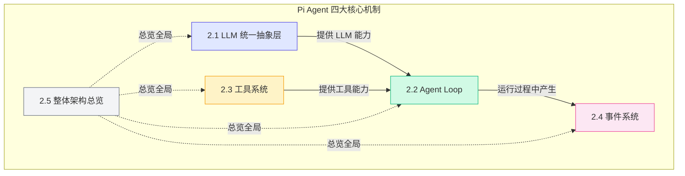

# 第二章：Pi Agent 核心原理

> 理解 Pi Agent 的四大核心机制，你就掌握了构建 AI Agent 所需的所有工程知识。

第一章我们从概念层面认识了 AI Agent。现在让我们走进 Pi Agent 的内部，看看它到底是怎么工作的。

Pi Agent 的代码量不大，但设计非常精巧。它把"Agent 是什么"这个抽象问题，转化成了四个具体的工程问题：

1. **如何统一调用不同的 LLM？** -- LLM 统一抽象层
2. **如何让 LLM 循环思考 + 行动？** -- Agent Loop
3. **如何让 LLM 使用外部工具？** -- 工具系统
4. **如何观察 Agent 的内部状态？** -- 事件系统

本章会逐一拆解这四个问题。每一篇都围绕一个核心机制展开，配合代码片段、架构图和对比表格。

---

## 本章内容

| 小节 | 核心问题 | 预计阅读时间 |
|------|---------|------------|
| 2.1 LLM 统一抽象层 | 如何屏蔽 OpenAI / Anthropic / Google 的 API 差异？ | 20 分钟 |
| 2.2 Agent Loop | Agent 为什么是一个 while 循环？ | 20 分钟 |
| 2.3 工具系统 | LLM 如何发现、选择、调用工具？ | 20 分钟 |
| 2.4 事件系统 | 如何实时观察 Agent 的内部运行状态？ | 15 分钟 |
| 2.5 整体架构总览 | 四个机制如何组合成一个完整的 Agent？ | 10 分钟 |

## 本章路线图

## 学习目标

完成本章后，你应该能够：

1. 理解为什么需要 LLM 抽象层，以及 Pi 的 Model 接口如何设计
2. 用自己的话描述 Agent Loop 的完整流程（LLM -> 工具 -> LLM 的循环）
3. 知道工具的定义方式，以及 TypeBox 在其中的作用
4. 理解事件驱动架构在 Agent 中的应用
5. 在宏观层面把握 Pi Agent 的整体架构和数据流

## 如何阅读本章

- **按顺序阅读**：四个机制有依赖关系，建议按 2.1 -> 2.2 -> 2.3 -> 2.4 -> 2.5 的顺序阅读
- **配合 Demo 代码**：每篇都对应一个 Demo，强烈建议打开对应代码对照阅读
- **动手做小练习**：每篇末尾都有小练习，花 5 分钟做一下，理解会深很多

| 章节 | 对应 Demo |
|------|-----------|
| 2.1 LLM 抽象层 | Demo 1: 调用 LLM API |
| 2.2 Agent Loop | Demo 3: 最简单的 Agent Loop |
| 2.3 工具系统 | Demo 2: 定义和调用工具 |
| 2.4 事件系统 | Demo 4: 流式输出与事件分发 |

---

准备好了吗？从第一个问题开始：**为什么需要 LLM 统一抽象层？**

[下一节：2.1 LLM 统一抽象层 →](./01-llm-abstraction.md)
