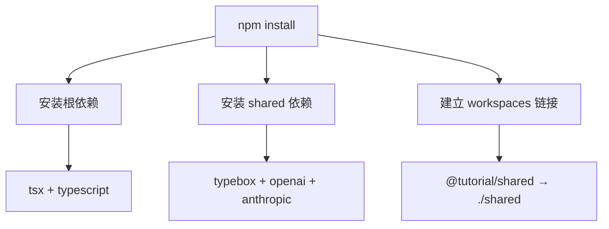

# 项目初始化

> 工欲善其事，必先利其器。在运行第一个 Demo 之前，我们先搭建好开发环境。

本章所有的 Demo 都在 `demo/` 目录下，采用 Monorepo（单体仓库）结构管理。这样做的好处是：所有 Demo 共享一套基础代码（`shared` 包），避免重复编写。

## 目录结构

先来看看整个 `demo/` 目录的布局：

```
demo/
├── package.json              # 工作区根配置，定义 workspaces 和运行脚本
├── tsconfig.json             # TypeScript 公共配置
├── shared/                   # 共享包 — 所有 Demo 的公共依赖
│   ├── package.json
│   ├── tsconfig.json
│   └── src/
│       ├── index.ts          # 统一导出入口
│       ├── llm.ts            # LLM 统一抽象层（Model 接口 + Provider 实现）
│       ├── tool.ts           # 工具类型定义（Tool, ToolCall, ToolResult）
│       └── event-bus.ts      # 事件总线（EventBus 发布-订阅实现）
├── 01-llm-call/              # Demo 1: 调用 LLM API
│   ├── package.json
│   └── src/index.ts
├── 02-tool-def/              # Demo 2: 定义和调用工具
│   ├── package.json
│   └── src/index.ts
├── 03-agent-loop/            # Demo 3: 最简单的 Agent Loop
│   ├── package.json
│   └── src/index.ts
├── 04-stream/                # Demo 4: 流式输出与事件分发
│   ├── package.json
│   └── src/index.ts
├── 05-multi-tool/            # Demo 5: 多工具协作
├── 06-state-mgmt/            # Demo 6: 有状态 Agent
├── 07-error-handling/        # Demo 7: 错误处理
└── 08-context/               # Demo 8: 上下文管理
```

> **Insight**：这种按功能拆分为独立包的结构，正是 Pi Agent 本身的设计哲学——「核心极简，按需增强」。每个 Demo 只依赖它需要的东西，互不干扰。

## 根 package.json 的 workspaces 配置

`demo/package.json` 是整个 Monorepo 的枢纽：

```json
{
  "name": "tutorial-demos",
  "private": true,
  "type": "module",
  "workspaces": [
    "shared",
    "01-llm-call",
    "02-tool-def",
    "03-agent-loop",
    "04-stream",
    "05-multi-tool",
    "06-state-mgmt",
    "07-error-handling",
    "08-context"
  ],
  "scripts": {
    "demo:1": "tsx 01-llm-call/src/index.ts",
    "demo:2": "tsx 02-tool-def/src/index.ts",
    "demo:3": "tsx 03-agent-loop/src/index.ts",
    "demo:4": "tsx 04-stream/src/index.ts",
    "demo:5": "tsx 05-multi-tool/src/index.ts",
    "demo:6": "tsx 06-state-mgmt/src/index.ts",
    "demo:7": "tsx 07-error-handling/src/index.ts",
    "demo:8": "tsx 08-context/src/index.ts"
  },
  "devDependencies": {
    "tsx": "^4.19.0",
    "typescript": "^5.7.0"
  }
}
```

关键点解析：

| 配置项 | 作用 |
|--------|------|
| `workspaces` | 声明所有子包的路径，npm 会自动将它们链接 |
| `type: "module"` | 启用 ESM 模块系统，支持 `import/export` 语法 |
| `tsx` | TypeScript 执行器，可以直接运行 `.ts` 文件，无需编译 |
| `demo:1` ~ `demo:8` | 预定义的运行脚本，`npm run demo:1` 即可运行对应 Demo |

## shared 包：所有 Demo 的基石

`demo/shared/` 是整章教程最重要的包。它包含了三个核心模块：

```
shared/src/
├── index.ts          # 导出所有公共类型和函数
├── llm.ts            # Model 接口 + Mock/OpenAI/Anthropic 三种 Provider 实现
├── tool.ts           # Tool、ToolCall、ToolResult 类型定义
└── event-bus.ts      # EventBus 发布-订阅模式实现
```

每个 Demo 通过 `@tutorial/shared` 引用这些模块。比如在 `01-llm-call/package.json` 中：

```json
{
  "name": "@tutorial/demo-llm-call",
  "private": true,
  "type": "module",
  "dependencies": {
    "@tutorial/shared": "*"
  }
}
```

`"@tutorial/shared": "*"` 中的 `*` 表示"使用工作区中的最新版本"——npm 会通过 workspaces 机制自动解析到 `shared/` 目录。

> **Common Error**：如果你在运行 Demo 时遇到 `ERR_MODULE_NOT_FOUND` 错误，很可能是因为没有执行 `npm install`。Workspaces 需要先安装才能建立正确的链接关系。

## 安装依赖

```bash
# 进入 demo 目录
cd demo

# 安装所有依赖（包括 shared 和所有子包）
npm install
```

这条命令会做三件事：

1. 安装根目录的 `devDependencies`（tsx、typescript）
2. 安装 `shared/` 的依赖（typebox、openai、anthropic）
3. 在所有子包之间建立符号链接，让 `@tutorial/shared` 指向 `shared/`



## 运行 Demo

安装完成后，运行第一个 Demo 验证环境：

```bash
# 在 demo/ 目录下
npm run demo:1
```

如果一切正常，你会看到类似这样的输出：

```
==================================================
Demo 1: 调用 LLM API
==================================================

📋 配置信息:
   Provider: mock
   Model:    gpt-4o-mini
   API Key:  ✗ 未配置（使用 Mock）

--- complete() 调用 ---
完整响应: 你好！我是 Pi Agent 的教学版 Demo。我可以帮你回答问题、执行计算、查询天气等。请问有什么可以帮你的？

--- stream() 调用 ---
你说的是：「用一句话说明什么是 AI Agent。」

这是一个 Mock 回复。如果需要真实 LLM 响应，请配置 API Key 并切换到 OpenAI 或 Anthropic Provider。

--- 流式输出完成 ---
```

> **Insight**：默认使用 Mock Provider，这意味着你**不需要任何 API Key** 就能运行所有 Demo。Mock Provider 模拟了 LLM 的行为模式（包括流式输出和工具调用），让你可以在本地完整地体验 Agent 的工作流程。

## 使用真实 LLM

如果你想体验真实的 LLM 响应，可以通过环境变量切换到 OpenAI 或 Anthropic：

```bash
# 使用 OpenAI
LLM_PROVIDER=openai LLM_API_KEY=sk-your-key npm run demo:1

# 使用 Anthropic
LLM_PROVIDER=anthropic LLM_API_KEY=sk-ant-your-key npm run demo:1
```

> **Common Error**：如果你切换到真实 Provider 但没有配置 API Key，程序会在调用 LLM API 时抛出认证错误。Mock 模式下则不需要任何 Key，这也是我们默认使用 Mock 的原因。

## 小结

- 整个教程的 Demo 采用 **Monorepo** 结构，共享 `shared/` 包
- `demo/package.json` 的 `workspaces` 配置管理所有子包
- `shared/` 包含三个核心模块：`llm.ts`、`tool.ts`、`event-bus.ts`
- 使用 `tsx` 直接运行 TypeScript 文件，无需编译步骤
- 默认使用 **Mock Provider**，无需 API Key 即可运行
- 通过环境变量可以切换到 OpenAI 或 Anthropic

## 小练习

1. 查看 `demo/shared/src/llm.ts` 中的 `MockModel` 类，理解它是如何模拟 LLM 行为的
2. 尝试运行 `npm run demo:2`，看看工具定义的 Demo 输出什么
3. 如果你有 OpenAI API Key，尝试用真实 Provider 运行 Demo 1，对比输出差异

环境准备好了吗？让我们正式开始第一个 Demo。

[下一节：Demo 1 — 调用 LLM API →](./02-demo-llm-call.md)
