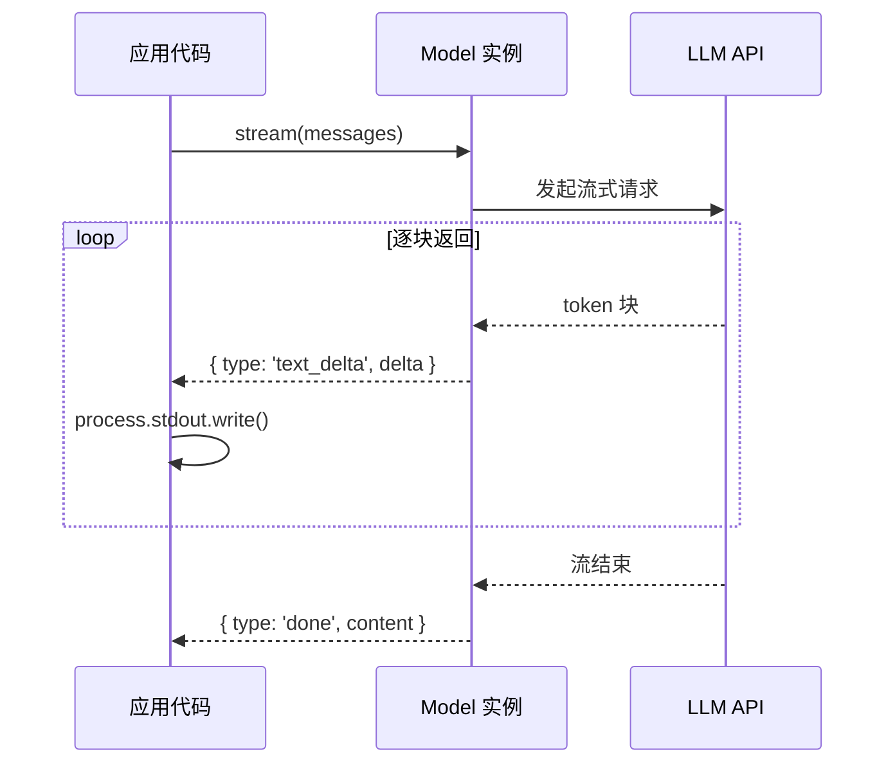
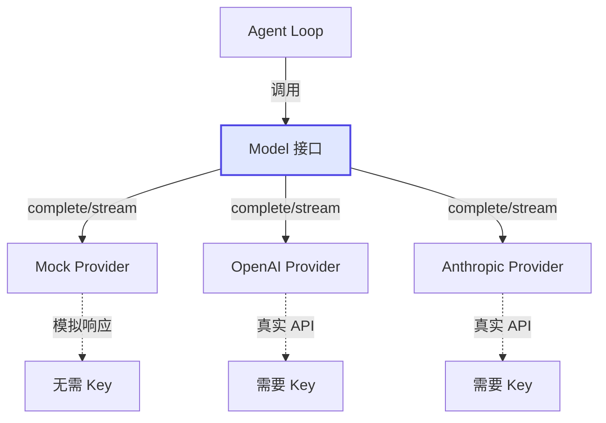

# Demo 1: 调用 LLM API

> 目标：学会如何通过统一的 Model 接口调用不同的 LLM Provider。

这是整个教程的第一个 Demo，也是最简单的一个。它的核心价值在于：**让你看到 LLM 调用在代码层面是什么样的**。

## 运行结果

```bash
$ npm run demo:1

==================================================
Demo 1: 调用 LLM API
==================================================

📋 配置信息:
   Provider: mock
   Model:    gpt-4o-mini
   API Key:  ✗ 未配置（使用 Mock）

--- complete() 调用 ---
完整响应: 你好！我是 Pi Agent 的教学版 Demo。我可以帮你回答问题、执行计算、查询天气等。请问有什么可以帮你的？

--- stream() 调用 ---
用一句话说明什么是 AI Agent。

AI Agent 是一个能够自主感知环境、做出决策并执行行动的智能系统，它结合了 LLM 的语言理解能力和工具调用的执行能力。

--- 流式输出完成 ---
```

> **注意**：上面的 `stream()` 输出是使用真实 LLM 时的效果。Mock 模式下会输出预设的模拟文本，但流式输出的行为（逐字打印）是完全一致的。

## 核心代码讲解

完整代码在 `demo/01-llm-call/src/index.ts`，我们逐段分析。

### 1. 创建 Model 实例

```typescript
import { createModel } from '@tutorial/shared'

const provider = process.env.LLM_PROVIDER || 'mock'
const apiKey = process.env.LLM_API_KEY || ''
const modelId = process.env.LLM_MODEL_ID || 'gpt-4o-mini'

const model = createModel({
  provider: provider as 'mock' | 'openai' | 'anthropic',
  modelId,
  apiKey,
})
```

这里的关键是 `createModel()` 工厂函数。它根据 `provider` 参数选择不同的实现：

- `'mock'` → 内置的 MockModel，无需 API Key
- `'openai'` → 调用 OpenAI 的 Chat Completions API
- `'anthropic'` → 调用 Anthropic 的 Messages API

> **Insight**：这就是**策略模式**的典型应用。调用方不需要关心底层是哪个 Provider，只需要调用统一的接口。Pi Agent 的 `pi-ai` 包正是基于同样的设计思想。

### 2. complete() — 一次性获取完整响应

```typescript
const response = await model.complete([
  { role: 'system', content: '你是一个有帮助的助手。' },
  { role: 'user', content: '你好！请简单介绍一下你自己。' },
])
console.log(`完整响应: ${response.content}`)
```

`complete()` 是最简单的调用方式：传入消息数组，等待完整的响应返回。它的返回结构是：

```typescript
interface CompleteResult {
  content: string      // 文本回复
  toolCalls: ToolCall[] // 工具调用请求（如果有）
}
```

### 3. stream() — 流式逐块获取响应

```typescript
let fullText = ''
for await (const event of model.stream([
  { role: 'system', content: '你是一个有帮助的助手。' },
  { role: 'user', content: '用一句话说明什么是 AI Agent。' },
])) {
  if (event.type === 'text_delta') {
    fullText += event.delta
    process.stdout.write(event.delta) // 逐字输出
  }
  if (event.type === 'done') {
    console.log('\n--- 流式输出完成 ---')
  }
}
```

`stream()` 返回一个 `AsyncIterable<StreamEvent>`，你可以用 `for await...of` 逐块消费。事件类型包括：

| 事件类型 | 含义 | 触发时机 |
|---------|------|---------|
| `text_delta` | 文本增量 | LLM 生成每个 token 时 |
| `tool_call` | 工具调用请求 | LLM 决定调用工具时 |
| `done` | 流结束 | 所有内容生成完毕 |
| `error` | 错误 | 调用过程中发生错误 |



## 为什么这么设计？

你可能会有疑问：为什么不直接调用 OpenAI SDK，而要包一层 `Model` 接口？

原因有三：

1. **Provider 切换透明**：今天用 OpenAI，明天想换 Anthropic，只需要改一行配置，调用代码完全不变
2. **测试友好**：Mock Provider 让你在本地开发和 CI 中无需真实 API 调用
3. **接口统一**：不同 Provider 的消息格式、工具调用格式各不相同，Model 接口抹平了这些差异

| 场景 | 直接调用 OpenAI SDK | 通过 Model 接口 |
|------|-------------------|----------------|
| 切换 Provider | 重写所有调用代码 | 改一行配置 |
| 本地测试 | 需要 API Key | Mock 模式零配置 |
| 流式处理 | OpenAI 的 stream 格式 | 统一 StreamEvent |
| 工具调用 | OpenAI 的 tool_calls 格式 | 统一 ToolCall 类型 |

## 运行验证

```bash
# 进入 demo 目录
cd demo

# 运行 Demo 1（Mock 模式）
npm run demo:1

# 用真实 OpenAI（如果有 Key）
LLM_PROVIDER=openai LLM_API_KEY=sk-xxx npm run demo:1

# 用真实 Anthropic（如果有 Key）
LLM_PROVIDER=anthropic LLM_API_KEY=sk-ant-xxx npm run demo:1
```

验证要点：
- Mock 模式下是否正常输出预设回复
- `stream()` 是否逐字打印（而不是一次性输出）
- 切换到真实 Provider 后，响应内容是否更丰富

## 原理总结

这个 Demo 虽然简单，但它揭示了一个重要原则：

**LLM 调用是 Agent 系统的"心脏跳动"。** 无论 Agent 多么复杂，最终都要回归到对 LLM 的调用。Pi Agent 通过 `pi-ai` 包（对应这里的 `shared/llm.ts`）提供了统一的 Model 抽象，让上层代码专注于 Agent 逻辑，而非 LLM 的 API 细节。



## 小结

- `createModel()` 工厂函数根据 `provider` 参数创建对应的 Model 实例
- `complete()` 一次性返回完整响应，适合简单问答
- `stream()` 逐块返回流式事件，适合实时展示
- Model 接口屏蔽了不同 Provider 的差异，切换 Provider 只需改配置
- Mock Provider 无需 API Key，方便本地开发和测试

## 小练习

1. 修改 `modelId` 参数（比如改成 `gpt-4`），观察 Mock 模式下是否有变化（提示：Mock 模式忽略 modelId）
2. 查看 `demo/shared/src/llm.ts` 中的 `MockModel.generateResponse()` 方法，试着添加新的触发关键词和回复
3. 如果你有 OpenAI Key，对比 `complete()` 和 `stream()` 在真实模型下的输出差异
4. 尝试给 `stream()` 传入一个 `AbortSignal`，体验中断流式请求的效果

[下一节：Demo 2 — 定义和调用工具 →](./03-demo-tool-def.md)
