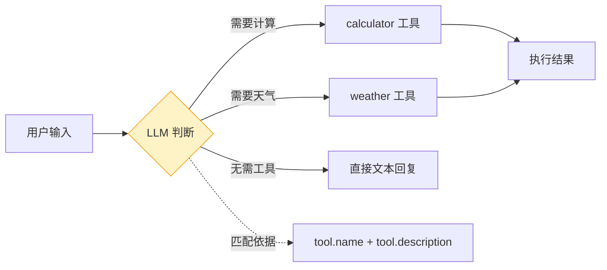
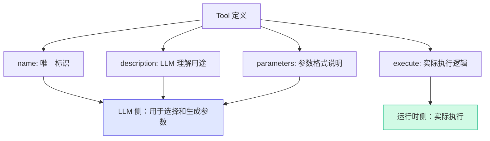

# Demo 2: 定义和调用工具

> 目标：学会如何定义工具、注册工具、并手动调用工具。

LLM 本身只能"说话"，不能"做事"。工具（Tool）就是让 LLM 获得执行能力的关键桥梁。这个 Demo 会带你了解工具系统的完整定义。

## 运行结果

```bash
$ npm run demo:2

==================================================
Demo 2: 定义和调用工具
==================================================

📋 已注册的工具:
   • calculator: 执行数学运算（加、减、乘、除）
   • weather: 查询指定城市的当前天气

----------------------------------------
👤 用户: 请计算 123 + 456 等于多少？
🤖 LLM: 选择调用工具 "calculator"
   参数: {"a":123,"b":456,"operator":"+"}
✅ 工具执行结果: 123 + 456 = 579

----------------------------------------
👤 用户: 北京今天天气怎么样？
🤖 LLM: 选择调用工具 "weather"
   参数: {"location":"北京"}
✅ 工具执行结果: 北京天气：晴朗，22°C

----------------------------------------
👤 用户: 你好，今天有什么新闻？
🤖 LLM: 无需调用工具，直接回复
```

## 核心代码讲解

完整代码在 `demo/02-tool-def/src/index.ts`。

### 1. 工具的类型定义

首先看 `demo/shared/src/tool.ts` 中的核心类型：

```typescript
export interface Tool<T extends TSchema = TSchema> {
  /** 工具名称，LLM 通过此名称选择调用哪个工具 */
  name: string
  /** 工具描述，LLM 通过描述理解工具的用途 */
  description: string
  /** 参数 schema，使用 TypeBox 定义，实现运行时校验 */
  parameters: T
  /** 执行函数，接收参数并返回结果 */
  execute: (args: Record<string, unknown>) => Promise<ToolResult> | ToolResult
}

export interface ToolResult {
  content: string
  isError?: boolean
}

export interface ToolCall {
  id: string
  name: string
  arguments: Record<string, unknown>
}
```

> **Insight**：注意 `execute` 的返回类型是 `Promise<ToolResult> | ToolResult`——这意味着工具既可以是同步的（如计算器），也可以是异步的（如查询天气）。LLM 不关心工具内部是同步还是异步，它只关心结果。

### 2. 定义计算器工具

```typescript
import { Type } from '@sinclair/typebox'
import type { Tool } from '@tutorial/shared'

const calculatorTool: Tool = {
  name: 'calculator',
  description: '执行数学运算（加、减、乘、除）',
  parameters: Type.Object({
    a: Type.Number({ description: '第一个数字' }),
    b: Type.Number({ description: '第二个数字' }),
    operator: Type.String({ description: '运算符: +, -, *, /' }),
  }),
  execute: (args) => {
    const { a, b, operator } = args as { a: number; b: number; operator: string }
    let result: number
    switch (operator) {
      case '+': result = a + b; break
      case '-': result = a - b; break
      case '*': result = a * b; break
      case '/':
        if (b === 0) return { content: '错误：除数不能为零', isError: true }
        result = a / b; break
      default:
        return { content: `错误：不支持的运算符 ${operator}`, isError: true }
    }
    return { content: `${a} ${operator} ${b} = ${result}` }
  },
}
```

这里使用 **TypeBox** 来定义参数 schema。TypeBox 是 Pi Agent 官方使用的 schema 库，它有两个好处：

1. **类型安全**：TypeScript 类型可以从 schema 推导
2. **LLM 可读**：schema 可以被序列化为 JSON Schema，LLM 通过它理解参数格式

### 3. 定义天气查询工具

```typescript
const weatherTool: Tool = {
  name: 'weather',
  description: '查询指定城市的当前天气',
  parameters: Type.Object({
    location: Type.String({ description: '城市名称，如：北京、上海' }),
  }),
  execute: async (args) => {
    const { location } = args as { location: string }
    await new Promise(r => setTimeout(r, 500))  // 模拟网络延迟
    const conditions = ['晴朗', '多云', '小雨', '阴天']
    const temp = Math.floor(Math.random() * 30) + 5
    return {
      content: `${location}天气：${conditions[Math.floor(Math.random() * conditions.length)]}，${temp}°C`,
    }
  },
}
```

对比两个工具，可以看到工具定义的核心要素：

| 要素 | 计算器 | 天气查询 |
|------|--------|---------|
| `name` | 唯一的标识符，LLM 用来引用 | 同上 |
| `description` | 告诉 LLM 这个工具能做什么 | 同上 |
| `parameters` | 三个参数：a, b, operator | 一个参数：location |
| `execute` | 同步执行，纯计算 | 异步执行，模拟网络请求 |

### 4. 工具注册表

```typescript
class ToolRegistry {
  private tools: Map<string, Tool> = new Map()

  register(tool: Tool): void {
    this.tools.set(tool.name, tool)
  }

  get(name: string): Tool | undefined {
    return this.tools.get(name)
  }

  list(): Tool[] {
    return Array.from(this.tools.values())
  }
}
```

`ToolRegistry` 是一个简单的 Map 封装，提供了注册、查找、列表三个基本操作。在 Pi Agent 中，对应的概念是 `ToolSet`，功能更丰富（支持 schema 转换、参数校验等）。

### 5. 模拟 LLM 选择工具

```typescript
function simulateLLMToolSelection(
  userInput: string,
  tools: ToolRegistry,
): { toolName: string; args: Record<string, unknown> } | null {
  const input = userInput.toLowerCase()

  if (/计算|\d+\s*[+\-*/]\s*\d+/.test(input)) {
    const match = userInput.match(/(\d+)\s*([+\-*/])\s*(\d+)/)
    if (match) {
      return {
        toolName: 'calculator',
        args: { a: Number(match[1]), b: Number(match[3]), operator: match[2] },
      }
    }
  }

  if (/天气|气温/.test(input)) {
    const cityMatch = userInput.match(/(北京|上海|广州|深圳|杭州)/)
    return {
      toolName: 'weather',
      args: { location: cityMatch?.[1] || '北京' },
    }
  }

  return null
}
```

> **Common Error**：初学者常犯的错误是认为 LLM 会"自动"选择工具。实际上，LLM 是通过分析用户输入的语义，匹配工具的 `name` 和 `description`，来决定调用哪个工具的。这里的 `simulateLLMToolSelection` 只是模拟了这个过程——在后面的 Demo 中，我们会让真实的 LLM 来做这个选择。



## 为什么这么设计？

工具系统的设计遵循一个核心原则：**工具对 LLM 来说是"黑盒"**。

LLM 只需要知道三件事：
1. 工具叫什么（`name`）
2. 工具能做什么（`description`）
3. 需要什么参数（`parameters`）

至于工具内部怎么实现的、是同步还是异步、调用了什么外部 API——LLM 完全不需要知道。这种设计使得工具系统具有很好的**可扩展性**：你可以随时添加新工具，只要遵循这个接口规范。

## 运行验证

```bash
cd demo
npm run demo:2
```

验证要点：
- 三个测试用例是否覆盖了"调用工具"和"不调用工具"两种情况
- 计算器是否能正确处理加减乘除
- 天气工具返回的城市名是否正确
- 尝试修改 `userInputs` 数组，添加新的测试用例

## 原理总结

这个 Demo 揭示了 Agent 工具系统的本质：



工具的"接口"（name + description + parameters）是给 LLM 看的，而"实现"（execute）是给运行时执行的。这种关注点分离是工具系统能够灵活扩展的关键。

## 小结

- 工具由四个要素组成：`name`、`description`、`parameters`、`execute`
- TypeBox 提供了类型安全的参数 schema 定义
- `ToolRegistry` 管理工具的注册和查找
- LLM 通过工具的 `name` 和 `description` 选择调用哪个工具
- 工具执行结果通过 `ToolResult` 返回，支持 `isError` 标记
- 同步和异步工具都可以通过统一的 `execute` 接口调用

## 小练习

1. 在 `demo/02-tool-def/src/index.ts` 中添加一个新的工具（比如单位换算或汇率查询），注册并测试
2. 思考：如果工具的 `description` 写得很模糊，LLM 会怎么选择？试着改一下 `weatherTool` 的描述看看
3. 查看 `demo/shared/src/tool.ts` 中的 `ToolCall` 类型，思考 `id` 字段的作用是什么
4. 对比 `ToolResult` 的 `isError` 和 JavaScript 的 `throw` 在错误处理上的区别

[下一节：Demo 3 — 最简单的 Agent Loop →](./04-demo-agent-loop.md)
