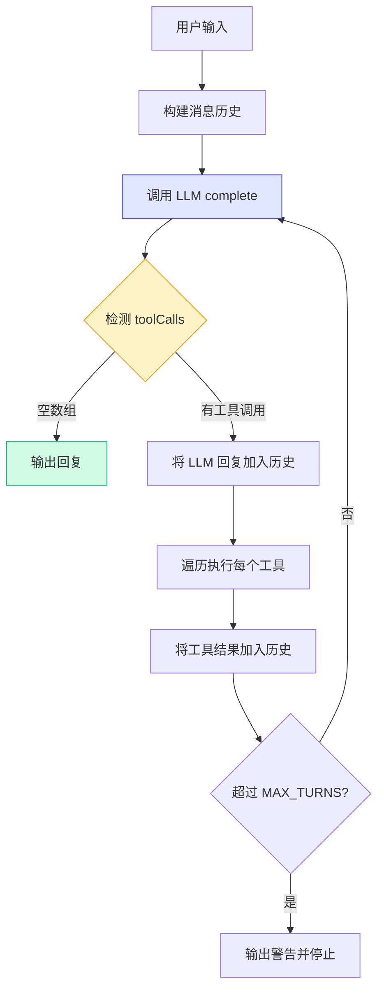
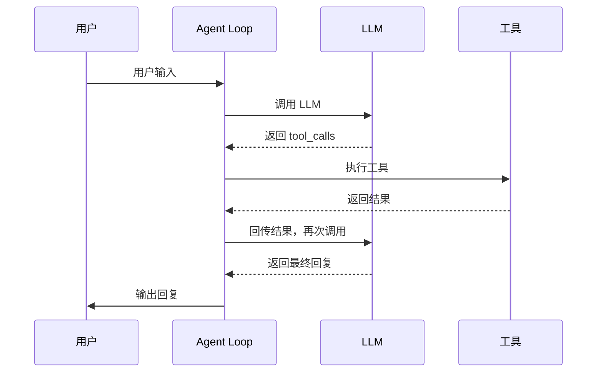

# Demo 3: 最简单的 Agent Loop

> 目标：实现最核心的 Agent 循环——「思考 → 行动 → 观察」的往复。

这是整本教程**最重要的一个 Demo**。Agent Loop 是所有 AI Agent 系统的核心机制。如果你能彻底理解这个 Demo，后续所有内容都会变得很自然。

## 运行结果

```bash
$ npm run demo:3

==================================================
Demo 3: 最简单的 Agent Loop
==================================================

👤 用户: 你好！

🔄 Turn 1: 调用 LLM...
🤖 Agent: 你好！我是 Pi Agent 的教学版 Demo。我可以帮你回答问题、执行计算、查询天气等。请问有什么可以帮你的？

========================================

👤 用户: 请计算 123 + 456 等于多少？

🔄 Turn 1: 调用 LLM...
🔧 LLM 请求调用工具: calculator
   ▶ 执行 calculator({"a":123,"b":456,"operator":"+"})
   ✅ 结果: 123 + 456 = 579
   ↻ 将结果回传 LLM，继续下一轮...

🔄 Turn 2: 调用 LLM...
🤖 Agent: 根据工具执行结果：

[calculator]: 123 + 456 = 579

我已经完成了上述操作。

========================================

👤 用户: 北京今天天气怎么样？

🔄 Turn 1: 调用 LLM...
🔧 LLM 请求调用工具: weather
   ▶ 执行 weather({"location":"北京"})
   ✅ 结果: 北京：晴朗，22°C
   ↻ 将结果回传 LLM，继续下一轮...

🔄 Turn 2: 调用 LLM...
🤖 Agent: 根据工具执行结果：

[weather]: 北京：晴朗，22°C

我已经完成了上述操作。

========================================
```

> **Insight**：注意"计算"这个用例走了两轮（Turn 1 调用工具，Turn 2 输出结果），而"你好"只走了一轮（直接回复）。这就是 Agent Loop 的核心特征：**需要工具就多走几轮，不需要就直接回复**。

## 核心代码讲解

完整代码在 `demo/03-agent-loop/src/index.ts`。这是最重要的代码段，请仔细阅读。

### 1. Agent Loop 函数

```typescript
async function agentLoop(
  userInput: string,
  tools: Tool[],
  model: ReturnType<typeof createModel>,
): Promise<void> {
  // 初始化消息历史
  const messages: Message[] = [
    { role: 'system', content: '你是一个有帮助的助手。你可以使用工具来回答用户的问题。' },
    { role: 'user', content: userInput },
  ]

  let turn = 0
  const MAX_TURNS = 5  // 防止无限循环

  console.log(`\n👤 用户: ${userInput}`)

  while (turn < MAX_TURNS) {
    turn++
    console.log(`\n🔄 Turn ${turn}: 调用 LLM...`)

    // Step 1: 调用 LLM
    const { content, toolCalls } = await model.complete(messages, tools)

    // Step 2: 检测是否有工具调用
    if (toolCalls.length === 0) {
      // 无工具调用 → 输出回复，结束循环
      console.log(`🤖 Agent: ${content}`)
      break
    }

    // Step 3: 有工具调用 → 逐个执行
    console.log(`🔧 LLM 请求调用工具: ${toolCalls.map(t => t.name).join(', ')}`)

    // 将 LLM 的回复加入消息历史
    messages.push({
      role: 'assistant',
      content,
      toolCalls: toolCalls as any,
    } as Message)

    // 执行每个工具
    for (const toolCall of toolCalls) {
      const tool = tools.find(t => t.name === toolCall.name)
      if (!tool) {
        console.log(`❌ 未找到工具: ${toolCall.name}`)
        messages.push({
          role: 'tool',
          content: `错误：未找到工具 ${toolCall.name}`,
          toolCallId: toolCall.id,
          toolName: toolCall.name,
        })
        continue
      }

      console.log(`   ▶ 执行 ${toolCall.name}(${JSON.stringify(toolCall.arguments)})`)
      const result = await tool.execute(toolCall.arguments)
      console.log(`   ✅ 结果: ${result.content}`)

      // Step 4: 将工具结果回传给消息历史
      messages.push({
        role: 'tool',
        content: result.content,
        toolCallId: toolCall.id,
        toolName: toolCall.name,
      })
    }

    // 继续循环 — LLM 会看到工具结果并决定下一步
    console.log(`   ↻ 将结果回传 LLM，继续下一轮...`)
  }

  if (turn >= MAX_TURNS) {
    console.log(`\n⚠️ 达到最大轮次限制 (${MAX_TURNS})，自动停止`)
  }
}
```

### 2. Agent Loop 的完整流程



### 3. 消息历史的结构

理解消息历史是理解 Agent Loop 的关键。以"计算 123 + 456"为例，消息历史的变化如下：

**初始状态**（2 条消息）：
```
[system] 你是一个有帮助的助手...
[user]   请计算 123 + 456 等于多少？
```

**Turn 1 完成后**（4 条消息）：
```
[system]   你是一个有帮助的助手...
[user]     请计算 123 + 456 等于多少？
[assistant] 我需要使用 calculator 工具。
[tool]      123 + 456 = 579
```

**Turn 2 完成后**（5 条消息）：
```
[system]   你是一个有帮助的助手...
[user]     请计算 123 + 456 等于多少？
[assistant] 我需要使用 calculator 工具。
[tool]      123 + 456 = 579
[assistant] 根据工具执行结果：123 + 456 = 579。我已经完成了计算。
```

> **Common Error**：很多初学者会忘记将 LLM 的 tool_calls 回复加入消息历史。如果不加，LLM 在下一轮就不知道"我刚才是不是调用了工具"，导致 Agent 行为异常。**每次 LLM 回复都要入历史，这是 Agent Loop 的铁律。**

### 4. 为什么需要 MAX_TURNS

```typescript
const MAX_TURNS = 5
```

这是一个安全机制。如果没有这个限制，以下场景会导致无限循环：

1. LLM 反复调用同一个工具（比如天气查询，每次返回不同结果）
2. LLM 陷入"调用工具 → 看到结果 → 再调用工具"的死循环
3. 工具返回错误，LLM 不断重试

> **Insight**：Pi Agent 中也存在类似的 `maxSteps` 配置。这不仅是工程上的安全措施，也是设计上的约束——迫使 Agent 在有限步骤内完成任务。

## 为什么这么设计？

Agent Loop 的设计源于一个观察：**LLM 本质上是一个"单步推理器"**。

给定当前的上下文（消息历史），LLM 只能决定"下一步做什么"。它不能像人类一样规划未来 10 步的行动。所以我们需要循环：

1. LLM 决定下一步（思考）
2. 执行这个决定（行动）
3. 把结果告诉 LLM（观察）
4. 回到步骤 1

这就是 ReAct（Reasoning + Acting）模式的简化版。



## 运行验证

```bash
cd demo
npm run demo:3
```

验证要点：
- 简单的问候（"你好"）应该只走 1 轮就结束
- 需要工具的问题（计算、天气）应该走 2 轮
- 观察控制台输出，确认消息历史正确累积
- 尝试连续问多个问题，确认每次对话独立

## 原理总结

这个 Demo 的核心可以用一句话概括：

**Agent Loop = 循环调用 LLM + 工具结果回传 + 终止条件判断**

| 阶段 | 对应代码 | 说明 |
|------|---------|------|
| 思考 | `model.complete(messages, tools)` | LLM 决定下一步 |
| 行动 | `tool.execute(toolCall.arguments)` | 执行工具 |
| 观察 | `messages.push({ role: 'tool', ... })` | 结果回传 |
| 循环 | `while (turn < MAX_TURNS)` | 重复直到满足条件 |
| 终止 | `toolCalls.length === 0` 或 `turn >= MAX_TURNS` | 停止条件 |

## 小结

- Agent Loop 是 AI Agent 最核心的机制，本质是"思考 → 行动 → 观察"的循环
- LLM 每次调用都基于完整的消息历史，包括之前的工具调用和结果
- 工具结果通过 `role: 'tool'` 的消息回传给 LLM
- `MAX_TURNS` 防止无限循环，是必备的安全机制
- 消息历史的正确管理是 Agent Loop 正确运行的关键

## 小练习

1. 修改 `MAX_TURNS` 为 1，观察 Agent 在需要工具时是否能正确回复
2. 添加一个日志输出，在每次循环时打印当前消息历史的条数和内容
3. 尝试让 Agent 连续调用两个工具（比如"先查北京天气，再计算 25 * 4"），观察它是否能正确处理
4. 查看 `demo/shared/src/llm.ts` 中的 `MockModel.shouldCallTool()` 方法，理解 Mock Provider 是如何决定是否调用工具的

[下一节：Demo 4 — 流式输出与事件分发 →](./05-demo-stream.md)
