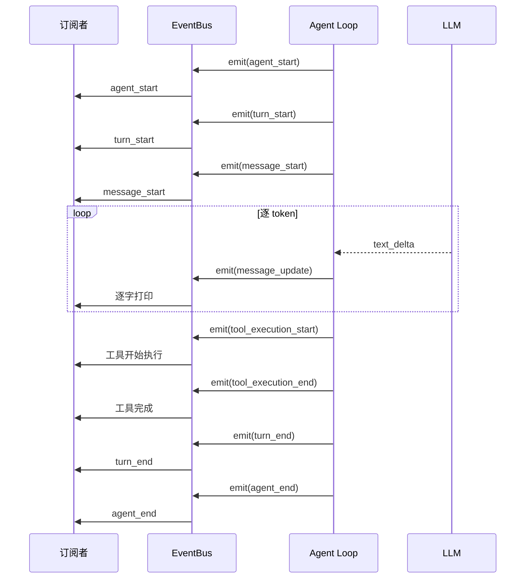
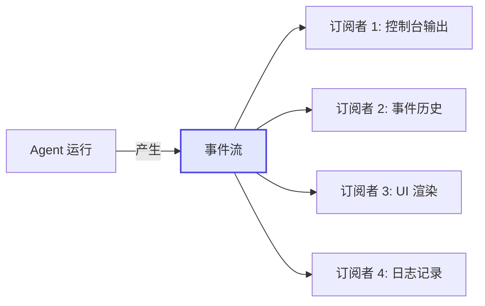

# Demo 4: 流式输出与事件分发

> 目标：在 Agent Loop 的基础上增加事件系统，实现流式事件分发。

Demo 3 的 Agent Loop 是一个"黑盒"——你只能看到输入和输出，中间发生了什么无从得知。Demo 4 通过 EventBus 事件系统，把 Agent 的每一个运行阶段都变成可见的事件流。

## 运行结果

```bash
$ npm run demo:4

==================================================
Demo 4: 流式输出与事件分发
==================================================

🏁 Agent 开始运行

🔄 Turn 1 开始
💬 消息开始
我需要使用 calculator 工具来回答这个问题。
💬 消息完成

🔧 工具开始: calculator({"a":123,"b":456,"operator":"+"})
   执行中...
✅ 工具完成: 123 + 456 = 579

🔄 Turn 1 结束

🔄 Turn 2 开始
💬 消息开始
根据工具执行结果：

[calculator]: 123 + 456 = 579

我已经完成了上述操作。
💬 消息完成
🔄 Turn 2 结束

🏁 Agent 运行结束

📋 事件历史记录:
   [agent_start]
   [turn_start]
   [message_start]
   [message_update]
   [message_update]
   ...
   [message_end]
   [tool_execution_start]
   [tool_execution_update]
   [tool_execution_end]
   [turn_end]
   [turn_start]
   [message_start]
   [message_update]
   ...
   [message_end]
   [turn_end]
   [agent_end]
```

## 核心代码讲解

完整代码在 `demo/04-stream/src/index.ts`。

### 1. EventBus 的实现

先看 `demo/shared/src/event-bus.ts` 中的核心实现：

```typescript
export type AgentEvent =
  | { type: 'agent_start' }
  | { type: 'agent_end' }
  | { type: 'turn_start'; turn: number }
  | { type: 'turn_end'; turn: number }
  | { type: 'message_start'; role: string }
  | { type: 'message_update'; delta: string }
  | { type: 'message_end'; role: string; content: string }
  | { type: 'tool_execution_start'; toolName: string; args: Record<string, unknown> }
  | { type: 'tool_execution_update'; toolName: string; output: string }
  | { type: 'tool_execution_end'; toolName: string; result: string }

export class EventBus {
  private listeners: Set<Listener> = new Set()
  private history: AgentEvent[] = []

  subscribe(listener: Listener): () => void {
    this.listeners.add(listener)
    return () => {
      this.listeners.delete(listener)
    }
  }

  emit(event: AgentEvent): void {
    this.history.push(event)
    for (const listener of this.listeners) {
      listener(event)
    }
  }

  getHistory(): AgentEvent[] {
    return [...this.history]
  }
}
```

> **Insight**：EventBus 是典型的**发布-订阅模式**。Agent 作为事件发布者，不需要知道谁在监听；外部代码作为订阅者，不需要修改 Agent 内部逻辑。这种解耦是构建可观测 Agent 的基础。

### 2. 带事件的 Agent Loop

```typescript
async function agentLoopWithEvents(
  userInput: string,
  tools: Tool[],
  model: ReturnType<typeof createModel>,
  eventBus: EventBus,
): Promise<void> {
  const messages: Message[] = [
    { role: 'system', content: '你是一个有帮助的助手。' },
    { role: 'user', content: userInput },
  ]

  eventBus.emit({ type: 'agent_start' })
  eventBus.emit({ type: 'turn_start', turn: 1 })

  // 使用 stream() 实现流式输出
  let fullContent = ''
  const stream = model.stream(messages, tools)

  eventBus.emit({ type: 'message_start', role: 'assistant' })

  for await (const event of stream) {
    if (event.type === 'text_delta') {
      fullContent += event.delta
      eventBus.emit({ type: 'message_update', delta: event.delta })  // 逐字事件
    }

    if (event.type === 'tool_call') {
      eventBus.emit({
        type: 'tool_execution_start',
        toolName: event.toolCall.name,
        args: event.toolCall.arguments,
      })

      const tool = tools.find(t => t.name === event.toolCall.name)
      if (tool) {
        const result = await tool.execute(event.toolCall.arguments)
        eventBus.emit({
          type: 'tool_execution_end',
          toolName: event.toolCall.name,
          result: result.content,
        })
        // 将工具结果加入消息历史
        messages.push({
          role: 'tool',
          content: result.content,
          toolCallId: event.toolCall.id,
          toolName: event.toolCall.name,
        })
      }
    }

    if (event.type === 'done') {
      eventBus.emit({ type: 'message_end', role: 'assistant', content: fullContent })
      eventBus.emit({ type: 'turn_end', turn: 1 })
    }
  }

  // 如果有工具调用，继续下一轮
  const hasToolCalls = messages.some(m => m.role === 'tool')
  if (hasToolCalls) {
    eventBus.emit({ type: 'turn_start', turn: 2 })
    const stream2 = model.stream(messages, tools)
    // ... 第二轮流式输出
  }

  eventBus.emit({ type: 'agent_end' })
}
```

### 3. 事件订阅者

```typescript
function createConsoleSubscriber() {
  return (event: AgentEvent) => {
    switch (event.type) {
      case 'agent_start':
        console.log('\n🏁 Agent 开始运行')
        break
      case 'agent_end':
        console.log('🏁 Agent 运行结束\n')
        break
      case 'turn_start':
        console.log(`\n🔄 Turn ${event.turn} 开始`)
        break
      case 'message_update':
        process.stdout.write(event.delta)  // 实时逐字输出
        break
      case 'tool_execution_start':
        console.log(`🔧 工具开始: ${event.toolName}(${JSON.stringify(event.args)})`)
        break
      case 'tool_execution_end':
        console.log(`✅ 工具完成: ${event.result}`)
        break
      // ... 其他事件处理
    }
  }
}
```

### 4. 事件流的完整生命周期



## 为什么这么设计？

对比 Demo 3 和 Demo 4，核心区别在于**可观测性**。

| 维度 | Demo 3（无事件） | Demo 4（有事件） |
|------|-----------------|-----------------|
| 输出方式 | 一次性 console.log | 逐 token 流式输出 |
| Agent 状态 | 黑盒，只能看最终结果 | 全透明，每步都可观测 |
| 扩展性 | 修改 Agent 代码才能加功能 | 只需新增订阅者 |
| 调试能力 | 困难，只能加 log | 事件历史可回放 |
| UI 集成 | 无法 | 事件可驱动前端渲染 |

事件系统的引入，使得 Agent 从"不可观测的函数"变成了"可观测的事件流"。这是构建生产级 Agent 的关键一步。

> **Common Error**：不要把事件系统想得太复杂。它的本质就是**在关键节点调用 `eventBus.emit()`**。你不需要在每一步都发布事件，只需要在你有兴趣观察的地方发布。过度发布事件会影响性能，发布太少又不够透明。

## 运行验证

```bash
cd demo
npm run demo:4
```

验证要点：
- 观察 `message_update` 事件是否逐字输出（而不是一次性打印）
- 事件历史记录是否完整包含了所有事件类型
- 取消订阅后，Agent 是否还能正常运行（只是没有事件输出了）
- 尝试添加一个新的订阅者，比如统计事件数量或记录到文件

## 原理总结

Demo 4 的核心设计模式是**事件驱动架构**：



- **发布者**（Agent Loop）只负责产生事件，不关心谁在消费
- **订阅者**（Console/UI/Logger）只负责消费事件，不关心事件怎么产生
- **EventBus** 作为中间人，解耦了发布者和订阅者
- **事件历史**提供了调试和回放能力

Pi Agent 的事件系统基于同样的设计，但更完善：支持事件优先级、异步监听器、事件过滤等高级特性。

## 小结

- EventBus 实现了发布-订阅模式，解耦了 Agent 逻辑和外部展示
- Agent 运行过程中的每个阶段都可以发布事件
- `stream()` 调用天然支持逐 token 的流式输出
- 事件历史可用于调试、回放和监控
- 订阅者可以随时添加或移除，不影响 Agent 核心逻辑
- 事件系统是 Agent 可观测性的基础

## 小练习

1. 添加一个新的订阅者，统计 `message_update` 事件的总次数（即 LLM 生成的 token 数）
2. 修改 `createConsoleSubscriber`，让 `tool_execution_start` 事件输出更详细的信息
3. 尝试在 Agent Loop 中加入 `tool_execution_update` 事件的发布，模拟长时间运行的工具的进度通知
4. 查看 `demo/shared/src/event-bus.ts` 中的 `AgentEvent` 类型，思考如果要加入 `error` 事件，应该如何扩展

---

**第三章完。** 你已经完成了 4 个基础 Demo，掌握了 Agent 系统的四大核心要素：LLM 调用、工具定义、Agent Loop、事件系统。接下来进入第四章，学习更高级的 Agent 模式。

[下一章：第四章 — 进阶 Demo 教程 →](../04-demo-advanced/index.md)
