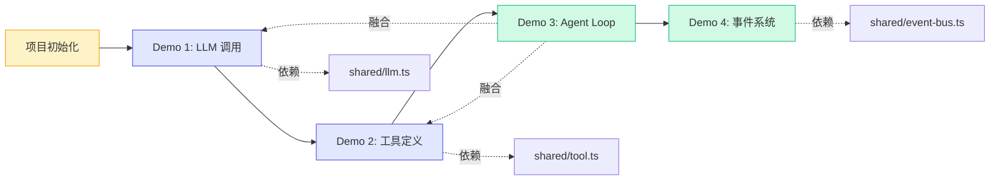

# 第三章：基础 Demo 教程

> 纸上得来终觉浅，绝知此事要躬行。这一章我们开始写代码。

第二章我们学习了 AI Agent 的核心原理，现在是时候动手了。本章包含 4 个基础 Demo，带你从零开始搭建一个可以运行的 Agent 系统。

## 本章内容概览

| Demo | 核心主题 | 关键文件 | 难度 |
|------|---------|---------|------|
| Demo 1: 调用 LLM API | Model 接口、Provider 切换、流式/完整输出 | `demo/01-llm-call/src/index.ts` | ⭐ |
| Demo 2: 定义和调用工具 | 工具定义、TypeBox Schema、工具注册 | `demo/02-tool-def/src/index.ts` | ⭐ |
| Demo 3: 最简单的 Agent Loop | 思考-行动-观察循环、消息历史 | `demo/03-agent-loop/src/index.ts` | ⭐⭐ |
| Demo 4: 流式输出与事件分发 | EventBus、事件驱动、发布-订阅模式 | `demo/04-stream/src/index.ts` | ⭐⭐ |

## 前置准备

在开始之前，请确保你已完成 [01-project-setup](./01-project-setup.md) 中的环境配置。

## 学习路径

## 四个 Demo 的关系

这四个 Demo 是层层递进的关系：

1. **Demo 1** 教会你如何和 LLM 对话 — 这是 Agent 的"大脑"
2. **Demo 2** 教会你如何定义工具 — 这是 Agent 的"手脚"
3. **Demo 3** 把大脑和手脚连起来，形成完整的 Agent Loop — 这是 Agent 的"神经系统"
4. **Demo 4** 加入事件系统，让 Agent 的运作过程变得透明可控 — 这是 Agent 的"感官"

> **核心观点**：Agent 不是什么神秘的黑科技。它本质上就是「LLM + 工具 + 循环」这三个要素的组合。本章的四个 Demo 恰好对应这三个要素 + 一个增强机制。

## 阅读建议

- **按顺序阅读**：每个 Demo 都建立在前一个的基础上
- **边读边跑**：每个 Demo 都可以直接运行，建议你打开终端跟着跑
- **动手修改**：读完代码后试着改一些参数，看看效果有什么变化
- **遇到问题先看 shared 包**：很多底层实现在 `demo/shared/src/` 下

准备好了吗？让我们从项目初始化开始。

[开始：项目初始化 →](./01-project-setup.md)
