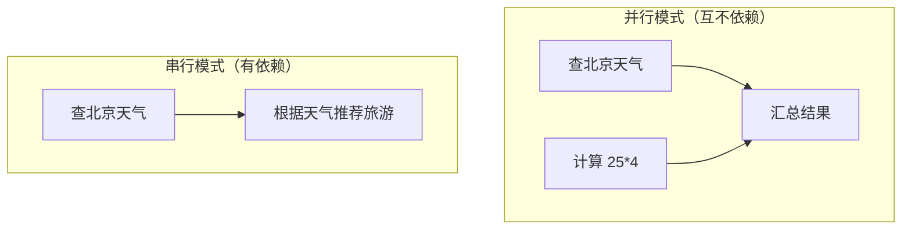
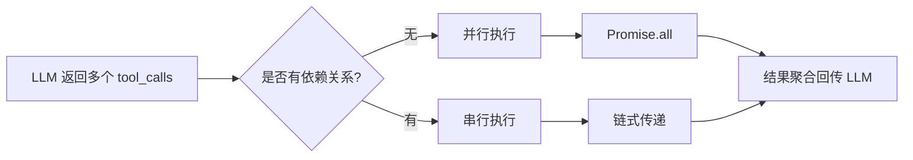

# Demo 5: 多工具协作

> 目标：展示 Agent 在一次交互中调用多个工具的协作模式。

真实场景中，用户的问题往往需要多个工具协同才能回答。比如"北京今天天气怎么样？顺便计算 25 * 4 等于多少？"——这需要同时调用天气查询和计算器两个工具。

## 运行结果

```bash
$ npm run demo:5

==================================================
Demo 5: 多工具协作
==================================================

🔧 本轮调用 2 个工具: weather, calculator
   ▶ weather({"location":"北京"})
   ▶ calculator({"a":25,"b":4,"operator":"*"})
   ✅ 结果: 北京：多云，22°C...
   ✅ 结果: 25 * 4 = 100...

🤖 Agent: 根据工具执行结果：

[weather]: 北京：多云，22°C
[calculator]: 25 * 4 = 100

我已经完成了上述操作。

--- 工具链演示（串行执行）---
   ▶ weather({"location":"北京"})
   ✅ 北京：多云，22°C
   ▶ search({"query":"北京：多云 旅游推荐"})
   ✅ 关于"北京：多云 旅游推荐"的搜索结果：
      1. 北京：多云 旅游推荐的相关介绍
      2. 北京：多云 旅游推荐的最新动态
      3. 北京：多云 旅游推荐的深度分析
```

## 核心代码讲解

完整代码在 `demo/05-multi-tool/src/index.ts`。

### 1. 并行执行多个工具

```typescript
async function executeToolsParallel(
  toolCalls: ToolCall[],
  tools: Tool[],
  eventBus: EventBus,
): Promise<Message[]> {
  // 所有工具同时启动
  const promises = toolCalls.map(async (tc) => {
    const tool = tools.find(t => t.name === tc.name)
    if (!tool) {
      return { role: 'tool' as const, content: `未找到工具: ${tc.name}`, toolCallId: tc.id, toolName: tc.name }
    }

    eventBus.emit({ type: 'tool_execution_start', toolName: tc.name, args: tc.arguments })
    const result = await tool.execute(tc.arguments)
    eventBus.emit({ type: 'tool_execution_end', toolName: tc.name, result: result.content })

    return { role: 'tool' as const, content: result.content, toolCallId: tc.id, toolName: tc.name }
  })

  // 等待所有工具完成
  return Promise.all(promises)
}
```

关键点：`Promise.all()` 让所有工具同时执行。如果天气查询需要 800ms，计算器需要 100ms，并行执行的总耗时是 800ms（取最慢的），而不是 900ms（串行累加）。

```mermaid
gantt
    title 并行 vs 串行执行对比
    dateFormat  X
    axisFormat %s
    
    section 并行执行
    weather : 0, 800
    calculator : 0, 100
    
    section 串行执行
    weather_serial : 0, 800
    calculator_serial : 800, 900
```



### 2. 串行执行（工具链）

```typescript
async function executeToolChain(
  chain: Array<{
    toolName: string
    argsBuilder: (prevResult: string) => Record<string, unknown>
  }>,
  tools: Tool[],
  eventBus: EventBus,
): Promise<string[]> {
  const results: string[] = []
  let prevResult = ''

  for (const step of chain) {
    const tool = tools.find(t => t.name === step.toolName)
    if (!tool) throw new Error(`未找到工具: ${step.toolName}`)

    // 前一个工具的结果作为参数传入
    const args = step.argsBuilder(prevResult)
    eventBus.emit({ type: 'tool_execution_start', toolName: step.toolName, args })

    const result = await tool.execute(args)
    results.push(result.content)
    prevResult = result.content  // 更新，供下一步使用

    eventBus.emit({ type: 'tool_execution_end', toolName: step.toolName, result: result.content })
  }

  return results
}
```

工具链的典型场景：先查天气，再根据天气结果搜索旅游推荐。

```typescript
// 使用示例
await executeToolChain([
  { toolName: 'weather', argsBuilder: () => ({ location: '北京' }) },
  { toolName: 'search', argsBuilder: (prev) => ({ query: `${prev.slice(0, 10)} 旅游推荐` }) },
], tools, chainEventBus)
```

> **Insight**：`argsBuilder` 的设计非常灵活。它接收前一个工具的结果，返回当前工具的参数字典。这比硬编码参数传递更通用——不同的工具链可能有不同的"前一个结果 → 当前参数"的转换逻辑。

### 3. 多工具 Agent Loop

```typescript
async function agentLoopMultiTool(
  userInput: string,
  tools: Tool[],
  model: ReturnType<typeof createModel>,
  eventBus: EventBus,
): Promise<void> {
  const messages: Message[] = [
    { role: 'system', content: '你是一个有帮助的助手，可以使用多个工具来回答复杂问题。' },
    { role: 'user', content: userInput },
  ]

  let turn = 0
  const MAX_TURNS = 5

  while (turn < MAX_TURNS) {
    turn++
    const { content, toolCalls } = await model.complete(messages, tools)

    if (toolCalls.length === 0) {
      console.log(`\n🤖 Agent: ${content}`)
      break
    }

    console.log(`\n🔧 本轮调用 ${toolCalls.length} 个工具: ${toolCalls.map(t => t.name).join(', ')}`)

    messages.push({
      role: 'assistant',
      content,
      toolCalls: toolCalls as any,
    } as Message)

    // 核心差异：并行执行所有工具
    const toolResults = await executeToolsParallel(toolCalls, tools, eventBus)
    messages.push(...toolResults)
  }
}
```

与 Demo 3 的关键差异：

| 特性 | Demo 3 (单工具) | Demo 5 (多工具) |
|------|----------------|-----------------|
| 工具调用 | 逐个串行执行 | `Promise.all()` 并行执行 |
| 执行策略 | 固定的 for 循环 | 可选的并行/串行策略 |
| LLM 返回 | 通常 1 个 tool_call | 可能多个 tool_calls |
| 结果聚合 | 逐个 push 到消息历史 | 批量 push |

## 为什么这么设计？

并行 vs 串行的选择取决于工具之间的依赖关系：



| 场景 | 执行模式 | 原因 |
|------|---------|------|
| 天气 + 计算 | 并行 | 两个工具互不依赖 |
| 天气 → 旅游推荐 | 串行 | 推荐需要天气结果 |
| 搜索 → 翻译 | 串行 | 翻译需要搜索内容 |
| 多个独立查询 | 并行 | 没有依赖关系 |

> **Common Error**：不要盲目使用并行执行。如果工具 A 的输出是工具 B 的输入，并行执行会导致 B 拿不到正确的参数。Pi Agent 的 `ToolSet` 支持配置 `parallel` 和 `sequential` 两种执行模式，让开发者根据场景选择。

## 运行验证

```bash
cd demo
npm run demo:5
```

验证要点：
- 观察两个工具是否"同时"开始执行（注意时间戳）
- 检查并行执行的总耗时是否约等于最慢工具的执行时间
- 观察工具链的执行顺序是否正确（先天气，后搜索）
- 尝试修改 `userInput`，让 LLM 返回三个或更多工具调用

## 原理总结

多工具协作的核心是**执行策略的选择**：



- **并行执行**：`Promise.all()` 同时启动所有工具，适合独立工具
- **串行执行**：前一个结果传递给后一个，适合有依赖的工具链
- **混合模式**：先并行执行独立工具组，再串行执行依赖链

Pi Agent 的 `ToolSet` 支持更复杂的执行策略，包括并行组内的串行链、条件执行等。

## 小结

- 复杂问题通常需要多个工具协作完成
- 并行执行（`Promise.all`）提高效率，适合互不依赖的工具
- 串行执行（工具链）处理有依赖关系的工具调用
- `argsBuilder` 模式让工具链的参数传递变得灵活
- 并行 vs 串行的选择取决于工具间的依赖关系
- Pi Agent 支持 `parallel` 和 `sequential` 两种执行模式

## 小练习

1. 修改 `executeToolsParallel`，添加一个超时机制：某个工具执行超过 2 秒就超时取消
2. 设计一个三步骤的工具链：搜索 → 翻译 → 汇总
3. 尝试让 LLM 返回三个工具调用（比如天气 + 计算 + 搜索），观察并行执行效果
4. 思考：如果工具链中某个步骤失败了，应该怎么处理？继续执行还是中断？

[下一节：Demo 6 — 有状态 Agent →](./02-demo-state-mgmt.md)
