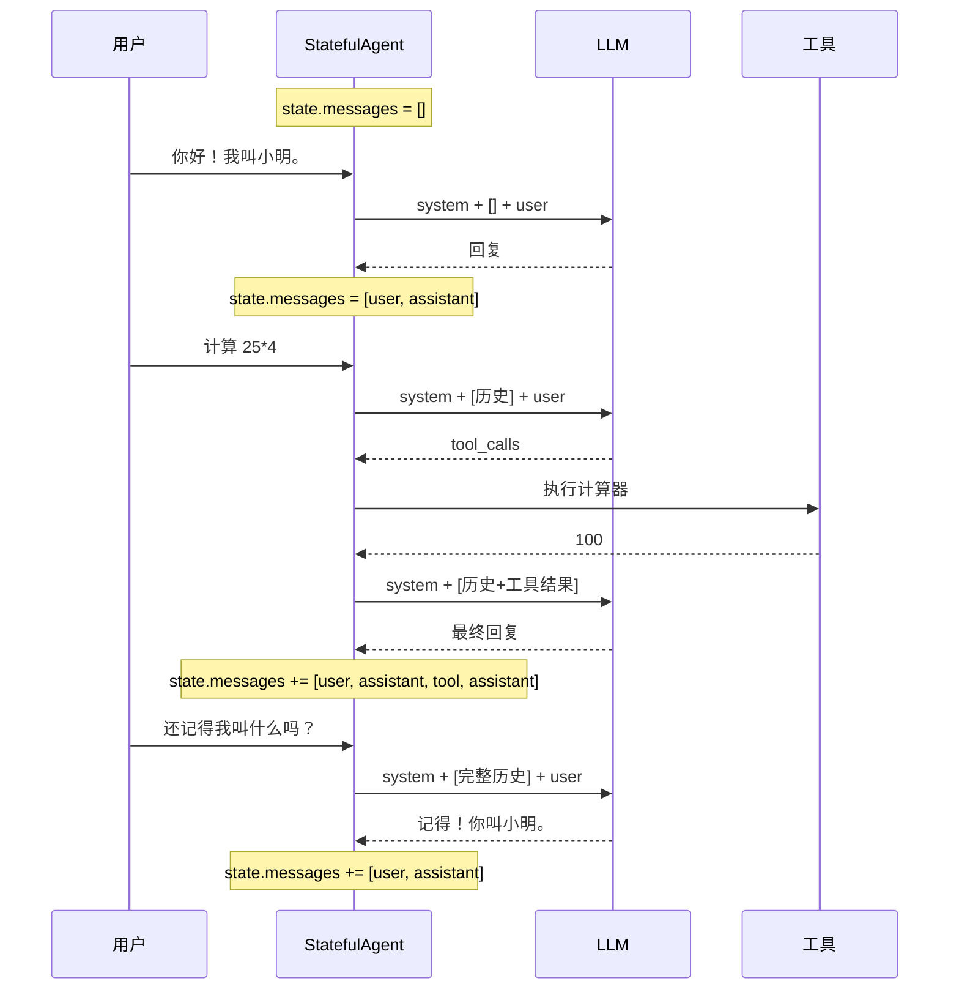

# Demo 6: 有状态 Agent 与对话管理

> 目标：展示 Agent 如何维护对话状态，实现多轮对话。

前几个 Demo 中，每次用户输入都是独立的——Agent 不会记得上一轮说了什么。但在真实场景中，用户期望 Agent 能记住上下文。这个 Demo 将展示如何让 Agent 从"单次问答"升级为"持续对话"。

## 运行结果

```bash
$ npm run demo:6

==================================================
Demo 6: 有状态 Agent 与对话管理
==================================================

👤 用户: 你好！我叫小明。
📊 当前历史长度: 0 字符
🤖 Agent: 你好！我是 Pi Agent 的教学版 Demo。我可以帮你回答问题、执行计算、查询天气等。请问有什么可以帮你的？

👤 用户: 你好，帮我计算 25 * 4 等于多少？
📊 当前历史长度: 15 字符
🤖 Agent: 我需要使用 calculator 工具。

根据工具执行结果：

[calculator]: 25 * 4 = 100

我已经完成了上述操作。

👤 用户: 还记得我叫什么名字吗？
📊 当前历史长度: 84 字符
🤖 Agent: 你说的是：「还记得我叫什么名字吗？」

这是一个 Mock 回复。如果需要真实 LLM 响应，请配置 API Key 并切换到 OpenAI 或 Anthropic Provider。

👤 用户: 再帮我计算刚才的结果加上 100 是多少？
📊 当前历史长度: 149 字符
🤖 Agent: 我需要使用 calculator 工具。

根据工具执行结果：

[calculator]: 200 + 100 = 300

我已经完成了上述操作。

----------------------------------------
📋 会话统计:
   总轮次: 4
   消息数: 8
   总字符: 278
   消息历史:
     [user] 你好！我叫小明。
     [assistant] 你好！我是 Pi Agent 的教学版...
     [user] 你好，帮我计算 25 * 4 等于多少？
     [assistant] 我需要使用 calculator 工具。
     [tool] 25 * 4 = 100
     [assistant] 根据工具执行结果：...
     [user] 还记得我叫什么名字吗？
     [assistant] 你说的是：「还记得我叫什么...
```

> **Insight**：注意"历史长度"在逐轮增长。从 0 → 15 → 84 → 149 字符。这就是有状态 Agent 的核心特征：**消息历史在不断累积**。

## 核心代码讲解

完整代码在 `demo/06-state-mgmt/src/index.ts`。

### 1. Agent 状态定义

```typescript
interface AgentState {
  systemPrompt: string          // 系统提示词
  model: { provider: string; modelId: string }  // 模型配置
  messages: Message[]           // 消息历史（核心！）
  tools: Tool[]                 // 工具列表
  isStreaming: boolean          // 运行时状态标记
  turnCount: number             // 对话轮次计数
}
```

> **Insight**：注意 `messages` 是数组——它存储了从对话开始到当前的所有消息。每次 LLM 调用时，都会基于完整的消息历史（而不是仅最新的消息）来生成回复。这就是 Agent 能"记住"上下文的原因。

### 2. StatefulAgent 类

```typescript
class StatefulAgent {
  private state: AgentState
  private model: ReturnType<typeof createModel>

  constructor(config: {
    systemPrompt: string
    provider: string
    modelId: string
    apiKey?: string
    tools: Tool[]
  }) {
    this.state = {
      systemPrompt: config.systemPrompt,
      model: { provider: config.provider, modelId: config.modelId },
      messages: [],       // 初始为空，随对话增长
      tools: config.tools,
      isStreaming: false,
      turnCount: 0,
    }
    this.model = createModel({...})
  }

  /** 处理用户输入 */
  async chat(userInput: string): Promise<string> {
    // 构建消息列表：系统提示 + 历史 + 新输入
    const messages: Message[] = [
      { role: 'system', content: this.state.systemPrompt },
      ...this.state.messages,  // 历史消息
      { role: 'user', content: userInput },  // 新输入
    ]

    this.state.turnCount++

    // 调用 LLM
    const { content, toolCalls } = await this.model.complete(messages, this.state.tools)

    // 处理工具调用（如果有）
    if (toolCalls.length > 0) {
      this.state.messages.push({ role: 'user', content: userInput })
      this.state.messages.push({ role: 'assistant', content, toolCalls } as Message)

      for (const tc of toolCalls) {
        const tool = this.state.tools.find(t => t.name === tc.name)
        if (tool) {
          const result = await tool.execute(tc.arguments)
          this.state.messages.push({
            role: 'tool',
            content: result.content,
            toolCallId: tc.id,
            toolName: tc.name,
          })
        }
      }

      // 工具结果回传生成最终回复
      const finalMessages = [
        { role: 'system', content: this.state.systemPrompt },
        ...this.state.messages,
      ]
      const final = await this.model.complete(finalMessages, this.state.tools)
      this.state.messages.push({ role: 'assistant', content: final.content })
      return `${content}\n\n${final.content}`
    }

    // 无工具调用，直接回复
    this.state.messages.push({ role: 'user', content: userInput })
    this.state.messages.push({ role: 'assistant', content })
    return content
  }
}
```

### 3. 消息历史的演变过程

以四轮对话为例，消息历史的变化：

**第 1 轮后**：
```
[user]      你好！我叫小明。
[assistant] 你好！我是...
```

**第 2 轮后**（调用了计算器）：
```
[user]      你好！我叫小明。
[assistant] 你好！我是...
[user]      帮我计算 25 * 4 等于多少？
[assistant] 我需要使用 calculator 工具。
[tool]      25 * 4 = 100
[assistant] 根据工具执行结果：...我已经完成了。
```

**第 3 轮后**：
```
[user]      你好！我叫小明。
[assistant] 你好！我是...
[user]      帮我计算 25 * 4 等于多少？
[assistant] 我需要使用 calculator 工具。
[tool]      25 * 4 = 100
[assistant] 根据工具执行结果：...我已经完成了。
[user]      还记得我叫什么名字吗？
[assistant] 当然记得！你叫小明。
```



## 为什么这么设计？

有状态 Agent 的核心设计决策是：**状态是可变的（mutable）**。

```typescript
// 支持运行时修改状态
setTools(tools: Tool[]): void { ... }       // 动态更换工具
appendSystemPrompt(extra: string): void { ... }  // 动态追加提示
reset(): void { ... }                       // 重置对话
```

这与函数式编程的"不可变"理念不同。Pi Agent 的设计者认为：Agent 是一个"活"的实体，它的状态应该在运行时可以被修改。比如：

- 用户切换话题时，可以追加新的系统提示
- Agent 发现缺少某个工具时，可以动态注册
- 对话过长时，可以裁剪历史消息

| 特性 | 无状态（Demo 3） | 有状态（Demo 6） |
|------|-----------------|-----------------|
| 消息历史 | 每次重新构建 | 持续累积 |
| 上下文记忆 | 无 | 记住之前的对话 |
| 运行时修改 | 不支持 | 支持动态修改 |
| 重置 | 不需要 | 支持 reset() |
| 并发安全 | 天然安全 | 需要 isStreaming 锁 |

> **Common Error**：有状态 Agent 的一个常见 bug 是**消息重复**。比如在 `chat()` 方法中，既在方法内部 push 了消息，又在方法外部 push 了一次。每次调试时先检查 `state.messages` 的长度，确保没有重复。

## 运行验证

```bash
cd demo
npm run demo:6
```

验证要点：
- 第三轮问"还记得我叫什么名字吗？"，Mock 模式下虽然不能真正记住，但可以看到历史消息在累积
- 观察 `📊 当前历史长度` 是否逐轮增长
- 查看最终的消息历史统计，确认消息数量和角色分布
- 尝试在对话中先问"计算 10 + 20"，再问"加上 30 呢"，观察 Agent 是否能理解"加上"指的是在之前的结果上加

> **注意**：Mock 模式下 Agent 的"记忆"是模拟的。切换到真实 LLM（OpenAI 或 Anthropic），Agent 才能真正理解上下文并做出连贯的回复。

## 原理总结

```mermaid
graph TD
    A[用户输入] --> B{StatefulAgent.chat()}
    B --> C[构建消息: system + history + user]
    C --> D[调用 LLM]
    D --> E{有 tool_calls?}
    E -->|是| F[执行工具]
    F --> G[工具结果加入 history]
    G --> H[再次调用 LLM]
    H --> I[最终回复加入 history]
    E -->|否| J[直接回复加入 history]
    I --> K[返回回复]
    J --> K
    
    style B fill:#e0e7ff,stroke:#4f46e5
    style C fill:#fef3c7,stroke:#f59e0b
```

有状态 Agent 的核心机制：

1. **消息累积**：每次对话的结果都追加到 `state.messages`
2. **完整上下文**：每次 LLM 调用都基于 `system + 全部历史 + 新输入`
3. **状态封装**：`StatefulAgent` 类封装了状态的管理逻辑
4. **可变设计**：支持运行时修改状态（换工具、追加提示、重置）

Pi Agent 的 `MutableAgentState` 采用同样的设计思想，但更完善：支持 `store` 持久化、`context` 管理、`lifecycle` 钩子等。

## 小结

- 有状态 Agent 维护完整的消息历史，实现多轮对话的上下文连贯
- 每次 `chat()` 都基于 `system + history + user_input` 构建消息
- 工具调用结果也存入历史，供后续对话引用
- 状态是可变对象，支持运行时修改（换工具、追加提示、重置）
- `isStreaming` 标记防止并发调用
- 切换到真实 LLM 才能体验真正的上下文记忆能力

## 小练习

1. 给 `StatefulAgent` 添加一个 `maxHistoryLength` 配置，当历史超过一定长度时自动裁剪最早的消息
2. 实现一个 `getConversationSummary()` 方法，返回对话的简要摘要
3. 思考：如果两个用户同时调用同一个 Agent 实例的 `chat()` 方法，会发生什么？如何解决？
4. 查看 Pi Agent 的 `MutableAgentState` 类型定义，对比这里的 `AgentState` 接口，看看多了哪些字段

[下一节：Demo 7 — 错误处理 →](./03-demo-error-handling.md)
