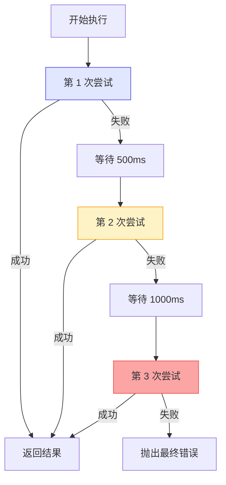
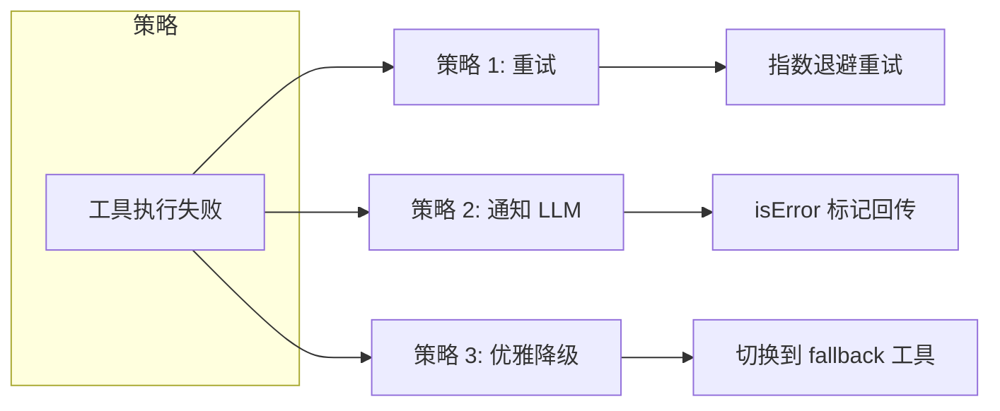
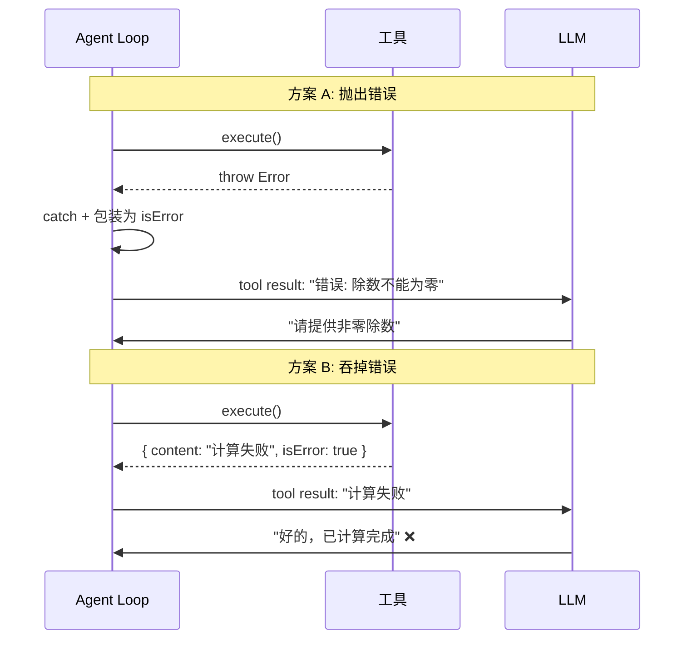
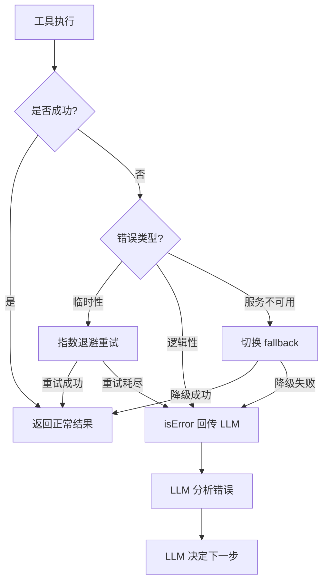

# Demo 7: 错误处理与重试机制

> 目标：展示 Agent 在面对错误时的处理策略。

真实环境中，工具调用可能失败：网络超时、API 限流、除零错误……一个健壮的 Agent 必须能优雅地处理这些异常。这个 Demo 展示了三种错误处理策略。

## 运行结果

```bash
$ npm run demo:7

==================================================
Demo 7: 错误处理与重试机制
==================================================

--- 测试 1: 除零错误 ---

🔄 Turn 1
🔧 尝试调用: calculator
   ▶ 执行 calculator...
   ❌ 失败: 除数不能为零

🔄 Turn 2
🤖 Agent: 根据工具执行结果：

[calculator]: 错误: 除数不能为零

我无法执行这个计算，因为除数不能为零。请提供一个非零的除数。

--- 测试 2: 服务偶发失败 + 重试恢复 ---

🔄 Turn 1
🔧 尝试调用: weather
   ▶ 执行 weather...
   ⚠️ 第 1 次尝试失败: 天气服务暂时不可用，请稍后重试
   ⏳ 等待 500ms 后重试...
   ⚠️ 第 2 次尝试失败: 天气服务暂时不可用，请稍后重试
   ⏳ 等待 1000ms 后重试...
   ✅ 成功: 北京：晴朗，22°C

🔄 Turn 2
🤖 Agent: 根据工具执行结果：

[weather]: 北京：晴朗，22°C

我已经完成了上述操作。
```

## 核心代码讲解

完整代码在 `demo/07-error-handling/src/index.ts`。

### 1. 可能出错的工具

```typescript
// 模拟偶发失败（前两次调用故意失败）
let weatherFailCount = 0

const tools: Tool[] = [
  {
    name: 'calculator',
    description: '执行数学运算',
    execute: (args) => {
      const { a, b, operator } = args as any
      if (operator === '/' && b === 0) {
        // Pi Agent 的设计：工具失败时抛出错误，而非返回错误信息
        throw new Error('除数不能为零')
      }
      // ...正常计算
    },
  },
  {
    name: 'weather',
    description: '查询天气',
    execute: async (args) => {
      weatherFailCount++
      if (weatherFailCount <= 2) {
        throw new Error('天气服务暂时不可用，请稍后重试')  // 模拟偶发故障
      }
      // ...正常查询
    },
  },
  {
    name: 'fallback_weather',
    description: '备选天气查询（当 weather 不可用时使用）',
    execute: async (args) => {
      return { content: `${location}：天气数据来自备选源，多云，20°C` }
    },
  },
]
```

> **Insight**：注意 Pi Agent 的设计原则——**工具失败时抛出错误（throw）**，而不是返回 `{ isError: true }` 的错误结果。这样做的原因是：
> 1. 错误可以被上层统一捕获和处理
> 2. 不会污染正常的 ToolResult 类型
> 3. 支持重试机制（重试需要 try-catch）

### 2. 指数退避重试

```typescript
async function retryWithBackoff<T>(
  fn: () => Promise<T>,
  maxRetries: number = 3,
  baseDelay: number = 1000,
): Promise<T> {
  let lastError: Error | null = null

  for (let attempt = 1; attempt <= maxRetries; attempt++) {
    try {
      return await fn()
    } catch (error) {
      lastError = error as Error
      console.log(`   ⚠️ 第 ${attempt} 次尝试失败: ${(error as Error).message}`)

      if (attempt < maxRetries) {
        const delay = baseDelay * Math.pow(2, attempt - 1)  // 指数退避
        console.log(`   ⏳ 等待 ${delay}ms 后重试...`)
        await new Promise(r => setTimeout(r, delay))
      }
    }
  }

  throw lastError!  // 所有重试都失败，抛出最后一个错误
}
```

指数退避的延迟时间：

| 重试次数 | 延迟时间 | 累计等待 |
|---------|---------|---------|
| 第 1 次 | 0ms（首次） | 0ms |
| 第 2 次 | 500ms | 500ms |
| 第 3 次 | 1000ms | 1500ms |
| 第 4 次 | 2000ms | 3500ms |



### 3. 带错误处理的 Agent Loop

```typescript
async function agentLoopWithErrorHandling(
  userInput: string,
  tools: Tool[],
  model: ReturnType<typeof createModel>,
): Promise<void> {
  const messages: Message[] = [
    { role: 'system', content: '你是一个有帮助的助手。如果工具调用失败，请告知用户并提供替代方案。' },
    { role: 'user', content: userInput },
  ]

  while (turn < MAX_TURNS) {
    turn++
    const { content, toolCalls } = await model.complete(messages, tools)

    if (toolCalls.length === 0) {
      console.log(`🤖 Agent: ${content}`)
      break
    }

    messages.push({ role: 'assistant', content, toolCalls } as Message)

    for (const tc of toolCalls) {
      const tool = tools.find(t => t.name === tc.name)
      if (!tool) { /* 工具未找到处理 */ }

      try {
        // 对易失败的工具使用重试
        let result
        if (tc.name === 'weather') {
          result = await retryWithBackoff(() => tool!.execute(tc.arguments), 3, 500)
        } else {
          result = await tool!.execute(tc.arguments)
        }

        messages.push({ role: 'tool', content: result.content, toolCallId: tc.id, toolName: tc.name })
      } catch (error) {
        // 关键设计：将错误信息以 isError 标记返回给 LLM
        messages.push({
          role: 'tool',
          content: `错误: ${(error as Error).message}`,
          toolCallId: tc.id,
          toolName: tc.name,
          isError: true,
        } as any)
      }
    }
  }
}
```

> **Common Error**：一个常见的错误是**在工具内部自己 try-catch 错误**，然后返回一个正常的 ToolResult。这样做的问题是：Agent Loop 不知道工具执行失败了，LLM 可能会基于错误的结果继续推理。正确的做法是让错误**传播到 Agent Loop 层**，由 Agent Loop 决定如何处理。

### 4. 三种错误处理策略对比



| 策略 | 适用场景 | 代码实现 |
|------|---------|---------|
| **重试** | 临时性故障（网络超时、限流） | `retryWithBackoff()` |
| **通知 LLM** | 逻辑错误（除零、无效参数） | `isError: true` 回传 |
| **优雅降级** | 服务不可用（有备用服务） | `fallback_weather` 工具 |

## 为什么这么设计？

错误处理的设计遵循一个核心原则：**错误信息应该被 LLM "看到"**。



方案 A 中，LLM 看到了具体的错误信息，可以做出合理的回应。方案 B 中，LLM 不知道发生了什么，可能给出错误的回复。

> **Insight**：LLM 的"推理能力"在这里发挥了关键作用。当你把错误信息以结构化方式（`isError: true`）回传给 LLM 时，LLM 会像一个有经验的人类一样，分析错误原因并给出合适的回应。这比硬编码的错误处理逻辑更灵活。

## 运行验证

```bash
cd demo
npm run demo:7
```

验证要点：
- 测试 1（除零错误）：Agent 是否告知用户"不能除以零"
- 测试 2（重试恢复）：观察重试日志，确认指数退避的延迟时间（500ms → 1000ms）
- 修改 `weatherFailCount` 的阈值（比如改成 5），观察重试耗尽后的行为
- 尝试添加一个新的测试用例：调用不存在的工具

## 原理总结

Agent 的错误处理是一个**分层策略**：



- **第 1 层**（工具内部）：基础校验，抛出有意义的错误
- **第 2 层**（Agent Loop）：捕获错误，选择重试或降级
- **第 3 层**（LLM 层）：LLM 分析错误，决定下一步行动

Pi Agent 的错误处理机制更完善：支持 `retry` 配置、`timeout` 控制、`circuit breaker` 等。

## 小结

- 工具失败时抛出错误（throw），而非返回错误内容
- 指数退避重试：500ms → 1000ms → 2000ms，适合临时性故障
- 错误信息以 `isError` 标记回传给 LLM，让 LLM 自主决策
- 备选工具（fallback）提供优雅降级方案
- 三种策略：重试（临时故障）、通知 LLM（逻辑错误）、降级（服务不可用）
- 错误信息应该被 LLM "看到"，而不是被吞掉

## 小练习

1. 给 `retryWithBackoff` 添加 jitter（随机抖动），防止多个请求同时重试造成"惊群效应"
2. 实现一个"熔断器"（Circuit Breaker）：连续失败 N 次后，暂停调用该工具一段时间
3. 修改代码，让 LLM 在遇到 `weather` 工具失败时，自动尝试 `fallback_weather`
4. 思考：如果 LLM 反复调用同一个失败的工具，应该怎么处理？

[下一节：Demo 8 — 上下文管理 →](./04-demo-context.md)
