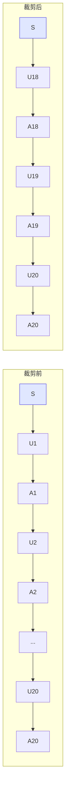
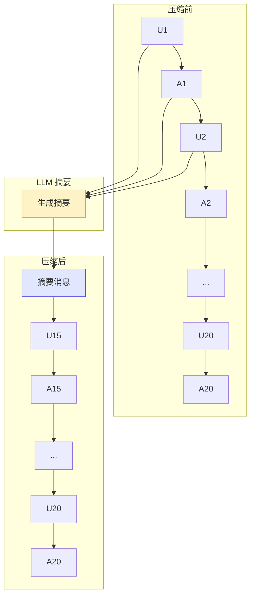
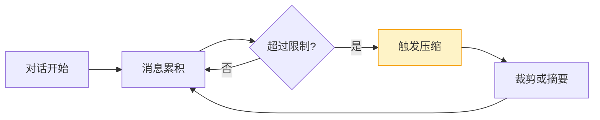
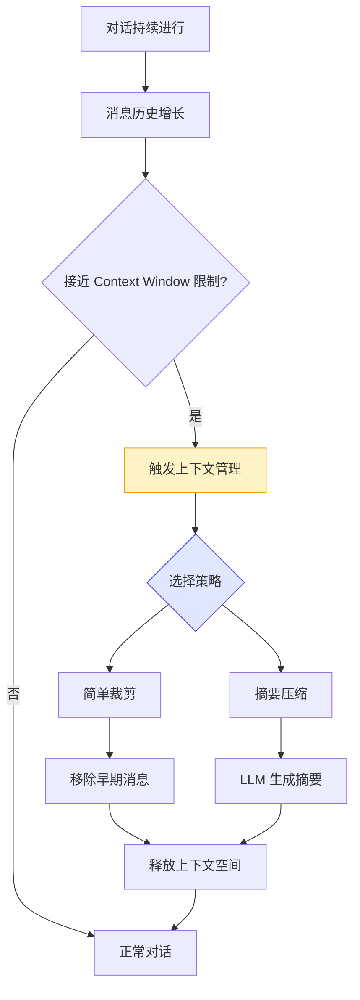

# Demo 8: 上下文管理

> 目标：展示 Agent 如何管理上下文窗口（Context Window）。

这是本章最后一个 Demo，也是最容易被忽视但**在实际项目中至关重要**的一个话题。

LLM 有固定的上下文长度限制（Context Window）。GPT-4 是 8K/32K/128K tokens，Claude 是 100K/200K tokens。无论多大，对话终究会填满上下文窗口。当窗口满了怎么办？这个 Demo 给出了两种解决方案。

## 运行结果

```bash
$ npm run demo:8

==================================================
Demo 8: 上下文管理
==================================================

📊 原始对话统计:
   消息数: 41
   估算 Token: 3794
   上下文限制: 4096 tokens

--- 策略 1: 简单裁剪 ---
   裁剪前: 41 条消息, 3794 tokens
   裁剪后: 25 条消息, 478 tokens
   保留的消息角色: system → user → assistant → ...

--- 策略 2: 摘要压缩 ---
   压缩前: 41 条消息, 3794 tokens
   压缩后: 22 条消息, 524 tokens
   摘要内容: [对话摘要]: 用户在第 1 轮提到了数字 100 和苹果...

--- 策略对比 ---
| 策略 | 消息数 | Token 数 | 信息完整性 |
|------|--------|----------|-----------|
| 原始 | 41 | 3794 | 完整 |
| 裁剪 | 25 | 478 | 丢失早期信息 |
| 摘要 | 22 | 524 | 保留关键信息 |
```

## 核心代码讲解

完整代码在 `demo/08-context/src/index.ts`。

### 1. Token 估算

```typescript
function estimateTokens(text: string): number {
  let tokens = 0
  for (const char of text) {
    if (/[一-鿿]/.test(char)) {
      tokens += 1.5       // 中文字符
    } else if (/\s/.test(char)) {
      tokens += 0.25      // 空白字符
    } else {
      tokens += 0.3       // 英文字符
    }
  }
  return Math.ceil(tokens)
}

function estimateMessagesTokens(messages: Message[]): number {
  return messages.reduce((sum, m) => sum + estimateTokens(m.content), 0)
}
```

> **Common Error**：不要在生产环境中使用这种估算方法。实际项目中应该使用 `tiktoken`（OpenAI）或 `@anthropic-ai/tokenizer`（Anthropic）等官方 tokenizer 库。这里的估算只是为了演示原理。

### 2. 策略一：简单裁剪（Trim）

```typescript
function trimContext(
  messages: Message[],
  maxTokens: number,
  keepRatio: number = 0.5,
): Message[] {
  const currentTokens = estimateMessagesTokens(messages)

  if (currentTokens <= maxTokens) {
    return messages  // 不需要裁剪
  }

  // 保留 system prompt
  const systemMessages = messages.filter(m => m.role === 'system')
  const otherMessages = messages.filter(m => m.role !== 'system')

  // 计算要保留的目标 token 数
  const targetTokens = maxTokens * keepRatio
  let keptTokens = 0
  const keptMessages: Message[] = []

  // 从后往前保留（保留最近的对话）
  for (const msg of otherMessages.toReversed()) {
    const msgTokens = estimateTokens(msg.content)
    if (keptTokens + msgTokens <= targetTokens || keptMessages.length < 3) {
      keptMessages.unshift(msg)
      keptTokens += msgTokens
    } else {
      break
    }
  }

  return [...systemMessages, ...keptMessages]
}
```



裁剪策略的核心思想：**保留最近的对话，丢弃最早的非关键消息**。因为最近的对话最有可能与当前问题相关。

### 3. 策略二：摘要压缩（Summarize）

```typescript
async function summarizeContext(
  messages: Message[],
  maxTokens: number,
  model: ReturnType<typeof createModel>,
): Promise<Message[]> {
  const currentTokens = estimateMessagesTokens(messages)

  if (currentTokens <= maxTokens) {
    return messages
  }

  // 找到需要压缩的部分（前 40% 的消息）
  const splitIndex = Math.floor(messages.length * 0.4)
  const toSummarize = messages.slice(0, splitIndex)
  const keepMessages = messages.slice(splitIndex)

  // 让 LLM 生成摘要
  const summaryPrompt = `请将以下对话压缩为一段简洁的摘要，保留关键信息：\n\n${
    toSummarize.map(m => `[${m.role}]: ${m.content}`).join('\n')
  }`

  const { content } = await model.complete([
    { role: 'user', content: summaryPrompt },
  ])

  const summaryMessage: Message = {
    role: 'system',
    content: `[对话摘要]: ${content}`,
  }

  return [summaryMessage, ...keepMessages]
}
```



### 4. 两种策略对比

| 维度 | 简单裁剪 | 摘要压缩 |
|------|---------|---------|
| 实现难度 | 低（纯逻辑） | 高（需要 LLM 调用） |
| 执行速度 | 快（毫秒级） | 慢（需要一次 LLM 调用） |
| 成本 | 零 | 消耗一次 LLM 调用 |
| 信息保留 | 丢失早期信息 | 保留关键信息 |
| 适用场景 | 对话早期的快速裁剪 | 重要对话的精细压缩 |
| 信息失真 | 无（只是删除） | 可能有（摘要不准确） |

> **Insight**：摘要压缩是一个"用 LLM 来解决 LLM 的问题"的典型案例。虽然额外消耗了一次 LLM 调用，但生成的摘要比简单裁剪保留了更多的关键信息。Pi Agent 的 `compaction` 机制就是基于这种思路，但更智能——它会根据消息的重要性决定哪些需要压缩、哪些需要保留。

### 5. 模拟长对话

```typescript
function generateLongConversation(): Message[] {
  const messages: Message[] = [
    { role: 'system', content: '你是一个有帮助的助手。' },
  ]

  // 生成 20 轮对话
  for (let i = 1; i <= 20; i++) {
    messages.push({
      role: 'user',
      content: `这是第 ${i} 轮的用户消息...`,
    })
    messages.push({
      role: 'assistant',
      content: `这是第 ${i} 轮的助手回复...`,
    })
  }

  return messages
}
```

## 为什么这么设计？

上下文管理的核心矛盾是：**LLM 的上下文窗口是有限的，但用户的对话可以是无限的**。



两种策略各有优劣，选择取决于具体场景：

- **实时聊天**：使用裁剪策略，快速响应
- **重要对话**：使用摘要策略，保留更多信息
- **混合策略**：先用裁剪快速降低 token 数，再用摘要精确保留关键信息

Pi Agent 的 `compaction` 机制采用的就是混合策略：先尝试裁剪，如果裁剪后仍然超过限制，再进行摘要压缩。

## 运行验证

```bash
cd demo
npm run demo:8
```

验证要点：
- 观察原始对话的 token 数（约 3794）和消息数（41）
- 对比裁剪后的 token 数（约 478）和原始 token 数
- 查看摘要压缩生成的摘要内容是否合理
- 调整 `maxTokens` 参数，观察不同阈值下的裁剪效果

## 原理总结

上下文管理是 Agent 系统中最容易被忽视但至关重要的环节：



关键要点：

1. **Token 估算是基础**：你需要知道当前上下文用了多少 token
2. **裁剪是兜底策略**：简单、快速、零成本，但会丢失信息
3. **摘要是优化策略**：保留关键信息，但需要额外 LLM 调用
4. **压缩时机很重要**：太早压缩浪费资源，太晚压缩可能已经超限

Pi Agent 的 `compaction` 机制是自动化的：它在每次 LLM 调用前检查上下文长度，如果超过阈值则自动触发压缩。开发者只需要配置 `maxTokens` 和 `compactionStrategy` 即可。

## 小结

- 上下文窗口是 LLM 的核心限制，Agent 必须主动管理
- 简单裁剪：移除最早的非关键消息，保留最近对话
- 摘要压缩：用 LLM 将早期对话压缩为摘要，保留关键信息
- 裁剪速度快但丢失信息，摘要保留信息但消耗 LLM 调用
- 实际项目中应使用 `tiktoken` 等库精确计算 token
- Pi Agent 的 `compaction` 机制自动管理上下文，开发者只需配置策略

## 小练习

1. 修改 `trimContext` 的 `keepRatio` 参数，观察不同比例下的裁剪效果
2. 实现一个"混合策略"：先用裁剪减少 50% 的 token，再用摘要压缩剩余消息
3. 在 `summarizeContext` 中给 LLM 的摘要提示词添加格式要求（比如"用列表形式输出"）
4. 思考：如果对话中有关键信息（比如用户的姓名、偏好），怎么确保这些信息在压缩后仍然保留？

---

**第四章完。** 你已经完成了全部 8 个 Demo，覆盖了从基础到进阶的 Agent 核心机制。接下来进入第五章的最终项目，将所学的知识综合运用，构建一个完整的 AI Agent 应用。

[下一章：第五章 — 最终项目 →](/05-final-project/index.md)
