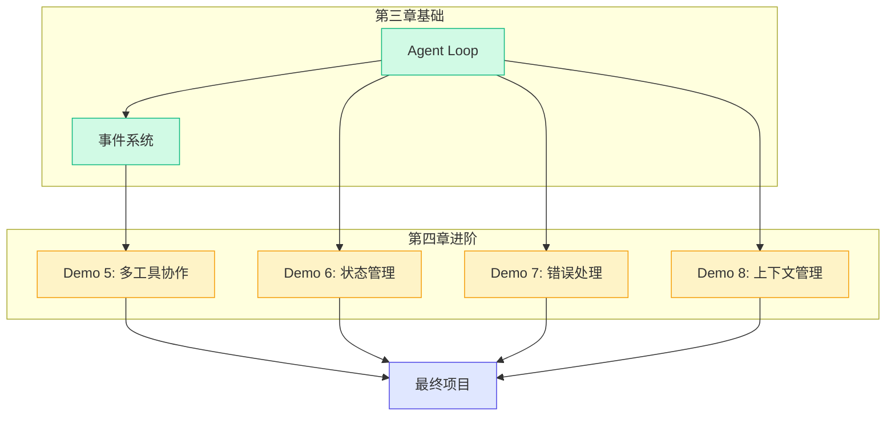

# 第四章：进阶 Demo 教程

> 基础篇教会你"如何让 Agent 跑起来"，进阶篇教会你"如何让 Agent 跑得好"。

第三章的四个 Demo 构建了一个完整的 Agent 基础框架：LLM 调用、工具系统、Agent Loop、事件分发。第四章在此基础上，深入四个生产级的关键话题：多工具协作、状态管理、错误处理、上下文管理。

## 本章内容概览

| Demo | 核心主题 | 关键文件 | 难度 |
|------|---------|---------|------|
| Demo 5: 多工具协作 | 并行执行、串行执行、结果聚合 | `demo/05-multi-tool/src/index.ts` | ⭐⭐ |
| Demo 6: 有状态 Agent | 消息历史管理、会话状态、多轮对话 | `demo/06-state-mgmt/src/index.ts` | ⭐⭐⭐ |
| Demo 7: 错误处理 | 指数退避重试、优雅降级、错误传播 | `demo/07-error-handling/src/index.ts` | ⭐⭐⭐ |
| Demo 8: 上下文管理 | Token 估算、消息裁剪、摘要压缩 | `demo/08-context/src/index.ts` | ⭐⭐⭐ |

## 学习路径

## 四个进阶话题的关系

如果说第三章解决的是"从无到有"的问题，第四章解决的是"从有到优"的问题：

1. **多工具协作**：真实场景中，一个 Agent 往往需要调用多个工具才能完成一个任务。比如"帮我查一下北京明天的天气，然后和今天对比"——这需要两次天气查询。
2. **状态管理**：用户不会只问一个问题就结束。Agent 需要记住之前的对话内容，才能在多轮对话中保持上下文连贯。
3. **错误处理**：真实环境中，网络会断、API 会限流、工具会报错。Agent 需要优雅地处理这些异常。
4. **上下文管理**：LLM 的上下文窗口是有限的。当对话太长时，Agent 需要裁剪或压缩历史消息。

> **核心观点**：基础 Demo 教你写"能跑"的代码，进阶 Demo 教你写"能上线"的代码。这四个话题是任何生产级 Agent 系统都必须解决的问题。

## 阅读建议

- **按顺序阅读**：虽然四个 Demo 相对独立，但建议按顺序阅读，因为后面的 Demo 会引用前面的概念
- **理解差异**：每个 Demo 都在 Demo 3 的基础上做了增强，注意对比差异
- **思考"为什么"**：进阶内容更注重设计决策，多思考"为什么这样设计"而不是"怎么实现"
- **联系 Pi Agent**：每个 Demo 末尾都会指出对应的 Pi Agent 机制，为第五章的最终项目做铺垫

准备好了吗？让我们从多工具协作开始。

[开始：Demo 5 — 多工具协作 →](./01-demo-multi-tool.md)
