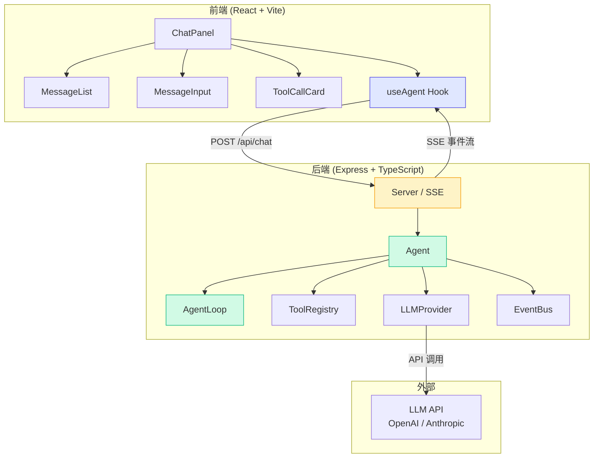
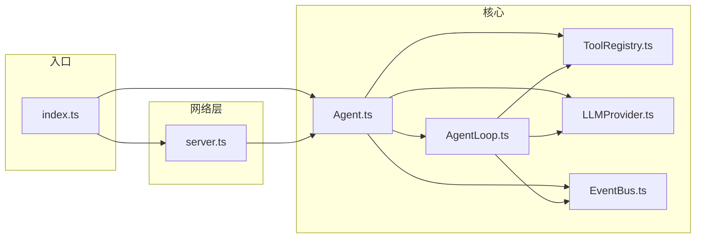

# 架构设计

## 整体架构

最终项目采用经典的前后端分离架构：后端负责 Agent 核心逻辑，前端负责用户界面和交互，通过 SSE（Server-Sent Events）实现流式通信。



## 后端模块

后端由 6 个模块组成，每个模块职责单一、可独立替换。

| 模块 | 文件 | 核心职责 |
|------|------|----------|
| **Agent** | `server/src/agent/Agent.ts` | 高层封装，组合各模块，对外提供简洁 API |
| **AgentLoop** | `server/src/agent/AgentLoop.ts` | 核心循环：思考 -> 行动 -> 观察 |
| **ToolRegistry** | `server/src/agent/ToolRegistry.ts` | 工具注册、查找、执行 |
| **LLMProvider** | `server/src/agent/LLMProvider.ts` | 统一 LLM 抽象（Mock / OpenAI / Anthropic） |
| **EventBus** | `server/src/agent/EventBus.ts` | 事件发布-订阅，支持异步监听 |
| **Server** | `server/src/server.ts` | Express 路由 + SSE 端点 |

### 模块依赖关系



## 前端组件

前端采用 React 函数组件 + 自定义 Hook 的架构，共 4 个组件和 1 个 Hook。

| 组件 | 文件 | 核心职责 |
|------|------|----------|
| **ChatPanel** | `client/src/components/ChatPanel.tsx` | 主容器，组合子组件，管理布局 |
| **MessageList** | `client/src/components/MessageList.tsx` | 消息列表，三种角色样式 |
| **MessageInput** | `client/src/components/MessageInput.tsx` | 输入框，Enter 发送 |
| **ToolCallCard** | `client/src/components/ToolCallCard.tsx` | 工具调用卡片（当前未在 ChatPanel 中使用，预留扩展） |
| **useAgent** | `client/src/hooks/useAgent.ts` | 核心 Hook，管理 SSE 连接与消息状态 |

## 通信方式：SSE 流式推送

前后端通过 SSE（Server-Sent Events）进行通信。相比 WebSocket，SSE 的优势在于：

| 特性 | SSE | WebSocket |
|------|-----|-----------|
| 通信方向 | 服务端 -> 客户端单向 | 双向 |
| 协议 | HTTP | 独立协议 |
| 自动重连 | 浏览器原生支持 | 需要手动实现 |
| 适用场景 | 流式推送、实时通知 | 实时双向通信 |

### 数据流时序

```mermaid
sequenceDiagram
    participant User as 用户
    participant UI as 前端界面
    participant Hook as useAgent Hook
    participant Server as Express Server
    participant Agent as Agent 核心
    participant LLM as LLM Provider

    User->>UI: 输入消息并发送
    UI->>Hook: sendMessage(text)
    Hook->>Server: POST /api/chat { message }
    Server->>Agent: agent.chat(message, onDelta)

    Note over Agent,LLM: Agent Loop 开始

    Agent->>Agent: emit(agent_start)
    Server-->>Hook: SSE: { type: "agent_start" }

    loop 每个 Turn
        Agent->>Agent: emit(turn_start)
        Server-->>Hook: SSE: { type: "turn_start", turn }

        Agent->>LLM: provider.stream(messages, tools)
        LLM-->>Agent: 流式文本块
        Agent-->>Server: onDelta(text)
        Server-->>Hook: SSE: { type: "delta", content }
        Hook-->>UI: 实时更新消息内容

        alt 有工具调用
            Agent->>Agent: emit(tool_calls)
            Server-->>Hook: SSE: { type: "tool_calls" }

            loop 每个工具
                Agent->>Agent: emit(tool_start)
                Server-->>Hook: SSE: { type: "tool_start" }
                Agent->>Agent: toolRegistry.execute()
                Agent->>Agent: emit(tool_end)
                Server-->>Hook: SSE: { type: "tool_end" }
            end

            Agent->>Agent: emit(turn_end, final: false)
        else 无工具调用
            Agent->>Agent: emit(turn_end, final: true)
            Server-->>Hook: SSE: { type: "done", content }
            Hook-->>UI: 显示最终回复
            break
        end
    end

    Agent->>Agent: emit(agent_end)
    Server-->>Hook: SSE 连接关闭
```

## 核心设计原则

1. **模块单一职责**：每个模块只做一件事，Agent 类负责组合，不负责具体逻辑
2. **依赖注入**：Agent 不直接创建 Provider，而是通过构造函数注入
3. **事件驱动**：通过 EventBus 解耦核心循环和外部通信
4. **统一抽象**：LLMProvider 提供统一接口，切换 Provider 只需改一行配置
5. **渐进式复杂**：先跑通 Mock 模式，再接入真实 LLM

## 小结

本章从宏观角度介绍了最终项目的整体架构。后端 6 个模块各司其职，前端 4 个组件 + 1 个 Hook 构成完整的用户界面，SSE 桥接前后端实现流式通信。这种架构设计兼顾了可读性、可扩展性和教学目的。

## 小练习

1. 为什么选择 SSE 而不是 WebSocket？如果换成 WebSocket，需要改动哪些部分？
2. 画出你自己的架构图，标注出数据流方向
3. 思考：如果要在现有架构中加入"记忆持久化"功能，应该放在哪个模块？
