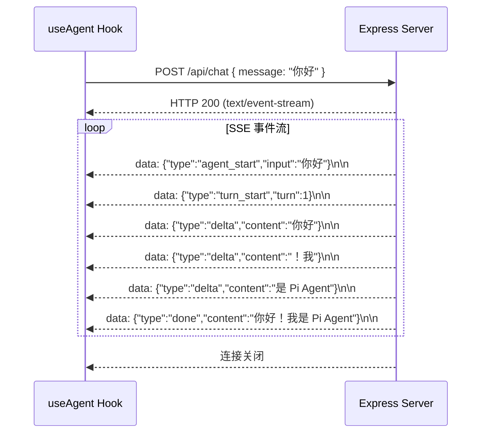

# 前端实现

前端代码位于 `final-project/client/src/` 目录下，使用 React 19 + TypeScript + Vite 构建，共约 200 行代码。下面逐一讲解每个组件和 Hook。

---

## 项目结构

```
client/src/
├── main.tsx                    # 入口
├── App.tsx                     # 根组件
├── App.css                     # 全局样式
├── types/
│   └── agent.ts                # 类型定义
├── hooks/
│   └── useAgent.ts             # 核心 Hook（SSE 连接管理）
└── components/
    ├── ChatPanel.tsx           # 主容器
    ├── MessageList.tsx         # 消息列表
    ├── MessageInput.tsx        # 消息输入框
    └── ToolCallCard.tsx        # 工具调用卡片（预留）
```

## 类型定义

**文件**：`final-project/client/src/types/agent.ts`

```typescript
/** 聊天消息 */
export interface ChatMessage {
  id: string
  role: 'user' | 'assistant' | 'tool'
  content: string
  toolName?: string
  isError?: boolean
  timestamp: number
}

/** SSE 事件 */
export interface SSEEvent {
  type: 'delta' | 'done' | 'error' | string
  content?: string
  message?: string
  [key: string]: unknown
}
```

`ChatMessage` 是贯穿前端的数据结构。`role` 字段区分三种消息角色，`toolName` 和 `isError` 用于工具调用消息的展示。

---

## ChatPanel：主容器

**文件**：`final-project/client/src/components/ChatPanel.tsx`

ChatPanel 是应用的根容器组件，负责组合所有子组件并管理整体布局。

```typescript
export function ChatPanel({ title = 'Pi Agent' }: ChatPanelProps) {
  const { messages, isLoading, error, sendMessage, clearMessages } = useAgent()

  return (
    <div className="chat-panel">
      <div className="chat-header">
        <h1>{title}</h1>
        <div className="chat-header-actions">
          <span className="status-dot" data-active={isLoading}>
            {isLoading ? '处理中' : '就绪'}
          </span>
          {messages.length > 0 && (
            <button className="clear-button" onClick={clearMessages}>
              清空对话
            </button>
          )}
        </div>
      </div>

      <div className="chat-messages">
        <MessageList messages={messages} isLoading={isLoading} />
      </div>

      {error && (
        <div className="chat-error">
          ❌ {error}
        </div>
      )}

      <div className="chat-input-area">
        <MessageInput onSend={sendMessage} isLoading={isLoading} />
      </div>
    </div>
  )
}
```

ChatPanel 的职责：

- 调用 `useAgent()` Hook 获取所有状态和方法
- 渲染顶部标题栏，包含状态指示器和清空按钮
- 渲染消息列表区域
- 渲染错误提示（条件显示）
- 渲染底部输入区域

组件结构示意图：

```
┌─────────────────────────────────┐
│  ChatPanel                      │
│  ┌───────────────────────────┐  │
│  │ Header                    │  │
│  │ Pi Agent        [就绪]    │  │
│  └───────────────────────────┘  │
│  ┌───────────────────────────┐  │
│  │ MessageList               │  │
│  │  ┌─────────────────────┐  │  │
│  │  │ user: 你好          │  │  │
│  │  │ assistant: 你好！   │  │  │
│  │  │ tool: 计算完成       │  │  │
│  │  └─────────────────────┘  │  │
│  └───────────────────────────┘  │
│  ┌───────────────────────────┐  │
│  │ MessageInput              │  │
│  │ [输入消息...]    [发送]   │  │
│  └───────────────────────────┘  │
└─────────────────────────────────┘
```

---

## MessageList：消息列表

**文件**：`final-project/client/src/components/MessageList.tsx`

MessageList 负责渲染消息列表，支持三种角色的消息样式。

```typescript
export function MessageList({ messages, isLoading }: MessageListProps) {
  // 空状态：显示引导提示
  if (messages.length === 0) {
    return (
      <div className="empty-state">
        <div className="empty-icon">🤖</div>
        <h3>Pi Agent 教学版</h3>
        <p>输入消息开始对话，Agent 可以使用工具来帮助你。</p>
        <div className="example-questions">
          <p>试试这些问题：</p>
          <ul>
            <li>"你好！"</li>
            <li>"请计算 25 * 4 等于多少？"</li>
            <li>"北京今天天气怎么样？"</li>
          </ul>
        </div>
      </div>
    )
  }

  return (
    <div className="message-list">
      {messages.map((msg) => (
        <div key={msg.id} className={`message message-${msg.role}`}>
          <div className="message-avatar">
            {msg.role === 'user' ? '👤' : msg.role === 'tool' ? '🔧' : '🤖'}
          </div>
          <div className="message-content">
            {msg.toolName && (
              <div className="message-tool-badge">
                {msg.isError ? '❌' : '🔧'} {msg.toolName}
              </div>
            )}
            <div className="message-text">
              {msg.content || (isLoading ? '思考中...' : '')}
            </div>
          </div>
        </div>
      ))}
      {/* 加载中动画 */}
      {isLoading && messages[messages.length - 1]?.content === '' && (
        <div className="message message-assistant">
          <div className="message-avatar">🤖</div>
          <div className="message-content">
            <div className="typing-indicator">
              <span></span><span></span><span></span>
            </div>
          </div>
        </div>
      )}
    </div>
  )
}
```

三种角色样式：

| 角色 | CSS 类 | 头像 | 用途 |
|------|--------|------|------|
| `user` | `message-user` | 👤 | 用户消息 |
| `assistant` | `message-assistant` | 🤖 | Agent 回复 |
| `tool` | `message-tool` | 🔧 | 工具执行结果 |

消息列表的状态处理：

| 状态 | 表现 |
|------|------|
| **空状态** | 显示引导提示和示例问题 |
| **正常消息** | 按角色显示不同样式 |
| **工具消息** | 显示工具名称徽标和结果 |
| **加载中** | 显示打字动画（三个跳动的小圆点） |

---

## MessageInput：输入框

**文件**：`final-project/client/src/components/MessageInput.tsx`

MessageInput 是文本输入组件，支持 Enter 发送、Shift+Enter 换行。

```typescript
export function MessageInput({ onSend, isLoading }: MessageInputProps) {
  const [text, setText] = useState('')
  const inputRef = useRef<HTMLTextAreaElement>(null)

  // 发送完成后自动聚焦
  useEffect(() => {
    if (!isLoading && inputRef.current) {
      inputRef.current.focus()
    }
  }, [isLoading])

  const handleSubmit = () => {
    const trimmed = text.trim()
    if (!trimmed || isLoading) return
    onSend(trimmed)
    setText('')
  }

  const handleKeyDown = (e: React.KeyboardEvent) => {
    if (e.key === 'Enter' && !e.shiftKey) {
      e.preventDefault()
      handleSubmit()
    }
  }

  return (
    <div className="message-input-container">
      <textarea
        ref={inputRef}
        className="message-input"
        placeholder="输入消息... (Enter 发送, Shift+Enter 换行)"
        value={text}
        onChange={(e) => setText(e.target.value)}
        onKeyDown={handleKeyDown}
        rows={2}
        disabled={isLoading}
      />
      <button
        className="send-button"
        onClick={handleSubmit}
        disabled={!text.trim() || isLoading}
      >
        {isLoading ? '⏳' : '发送'}
      </button>
    </div>
  )
}
```

关键交互细节：

- **Enter 发送**：`handleKeyDown` 检测 Enter 键，排除 Shift+Enter
- **发送后清空**：`handleSubmit` 中调用 `setText('')`
- **自动聚焦**：`useEffect` 在加载完成后自动聚焦输入框
- **加载时禁用**：`isLoading` 为 true 时禁用输入和发送按钮

---

## useAgent Hook：核心状态管理

**文件**：`final-project/client/src/hooks/useAgent.ts`

`useAgent` 是前端最核心的模块，负责管理 SSE 连接和消息状态。

```typescript
export function useAgent() {
  const [messages, setMessages] = useState<ChatMessage[]>([])
  const [isLoading, setIsLoading] = useState(false)
  const [error, setError] = useState<string | null>(null)

  const sendMessage = useCallback(async (text: string) => {
    setError(null)
    setIsLoading(true)

    // 1. 添加用户消息
    const userMsg: ChatMessage = {
      id: `user_${Date.now()}`,
      role: 'user',
      content: text,
      timestamp: Date.now(),
    }
    setMessages(prev => [...prev, userMsg])

    // 2. 添加占位的 assistant 消息（内容为空，等待流式填充）
    const assistantMsg: ChatMessage = {
      id: `assistant_${Date.now()}`,
      role: 'assistant',
      content: '',
      timestamp: Date.now(),
    }
    setMessages(prev => [...prev, assistantMsg])

    try {
      // 3. 发起 POST 请求
      const response = await fetch(`${API_BASE}/chat`, {
        method: 'POST',
        headers: { 'Content-Type': 'application/json' },
        body: JSON.stringify({ message: text }),
      })

      // 4. 读取 SSE 流
      const reader = response.body?.getReader()
      if (!reader) throw new Error('无法读取响应流')

      const decoder = new TextDecoder()
      let buffer = ''

      while (true) {
        const { done, value } = await reader.read()
        if (done) break

        buffer += decoder.decode(value, { stream: true })
        const lines = buffer.split('\n')
        buffer = lines.pop() || ''

        for (const line of lines) {
          if (!line.startsWith('data: ')) continue
          const data = JSON.parse(line.slice(6))

          // delta 事件：追加文本到最后一条 assistant 消息
          if (data.type === 'delta') {
            setMessages(prev => {
              const updated = [...prev]
              const last = updated[updated.length - 1]
              if (last?.role === 'assistant') {
                updated[updated.length - 1] = { ...last, content: last.content + data.content }
              }
              return updated
            })
          }

          // error 事件：显示错误
          if (data.type === 'error') {
            setError(data.message || '未知错误')
          }
        }
      }
    } catch (err) {
      if ((err as Error).name !== 'AbortError') {
        setError((err as Error).message)
      }
    } finally {
      setIsLoading(false)
    }
  }, [])

  // ...
}
```

SSE 读取流程：



SSE 解析的关键细节：

1. **流式解码**：使用 `TextDecoder` 的 `stream: true` 模式处理多字节字符可能被分到两个 chunk 的问题
2. **行缓冲**：`buffer` 变量缓存未完成的行，防止 JSON 被截断
3. **增量更新**：`delta` 事件逐段追加到消息内容中，实现打字机效果
4. **占位消息**：发送请求前先添加空内容的 assistant 消息，确保 SSE 事件到达时能正确更新

### 为什么用 `useCallback`？

`sendMessage` 使用 `useCallback` 包裹，空依赖数组 `[]` 意味着它在组件生命周期内不会重新创建。这样可以避免因函数引用变化导致子组件不必要的重渲染。

---

## App.tsx：根组件

**文件**：`final-project/client/src/App.tsx`

```typescript
import { ChatPanel } from './components/ChatPanel'
import './App.css'

export default function App() {
  return (
    <div className="app">
      <ChatPanel title="Pi Agent 教学版" />
    </div>
  )
}
```

根组件非常简单，只渲染一个 ChatPanel。这种设计使得未来如果要添加多对话、设置面板等功能，可以很方便地在 App 层面扩展。

---

## 小结

前端采用了 React 函数组件 + 自定义 Hook 的经典架构：

- **ChatPanel** 是主容器，负责布局和状态分发
- **MessageList** 处理三种角色的消息渲染和多种状态
- **MessageInput** 处理用户输入，支持 Enter 发送
- **useAgent** 是核心逻辑所在，管理 SSE 连接和消息状态

整个前端代码量约 200 行，但覆盖了 SSE 流式读取、增量状态更新、多种 UI 状态处理等关键能力。

## 小练习

1. 在 `MessageList.tsx` 中添加一个"滚动到底部"按钮，当消息列表滚动到顶部附近时显示
2. 修改 `MessageInput.tsx`，添加一个"发送"快捷键提示（如 Ctrl+Enter 也触发发送）
3. 在 `useAgent.ts` 中添加对 `tool_start` 和 `tool_end` 事件的监听，在消息列表中显示工具调用过程
