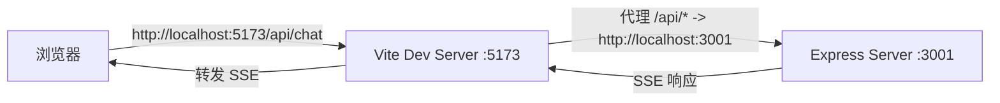
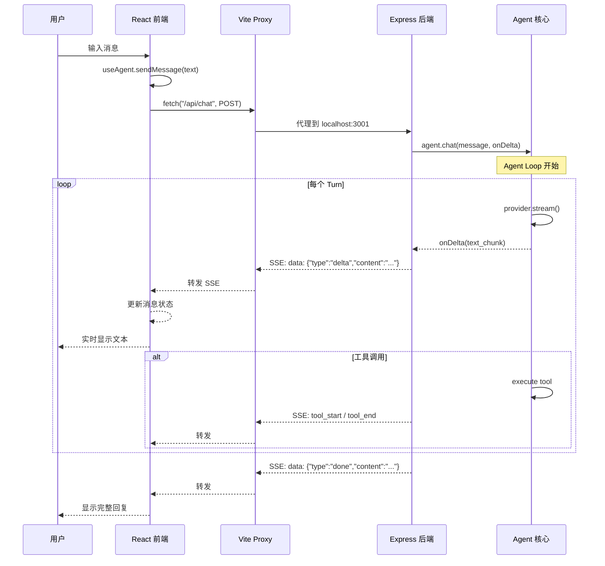

# 前后端联调

前两节分别讲解了后端和前端的实现，这一节把它们连接起来，看看前后端如何协同工作。

---

## Vite Proxy 配置

前端开发服务器（Vite）默认运行在 `http://localhost:5173`，后端 Express 服务器运行在 `http://localhost:3001`。由于浏览器同源策略的限制，前端直接请求后端 API 会触发 CORS 错误。

解决方案：在 Vite 配置中添加 proxy，将 `/api` 路径的请求代理到后端。

**文件**：`final-project/client/vite.config.ts`

```typescript
import { defineConfig } from 'vite'
import react from '@vitejs/plugin-react'

export default defineConfig({
  plugins: [react()],
  server: {
    port: 5173,
    proxy: {
      '/api': {
        target: 'http://localhost:3001',
        changeOrigin: true,
      },
    },
  },
})
```

代理的工作流程：



配置说明：

| 配置项 | 值 | 作用 |
|--------|-----|------|
| `server.port` | `5173` | 前端开发服务器端口 |
| `proxy['/api'].target` | `http://localhost:3001` | 后端地址 |
| `proxy['/api'].changeOrigin` | `true` | 修改请求的 Origin 头为目标地址 |

> **注意**：Vite Proxy 仅在开发模式下生效。生产部署时需要配置 Nginx 或其他反向代理来实现同样的功能。

---

## SSE 事件流格式

前后端通过 SSE 交换数据，每个事件都是一行 JSON 文本。下面是完整的 SSE 事件类型列表。

### 事件类型一览

| 事件类型 | 方向 | 触发时机 | 数据字段 |
|----------|------|----------|----------|
| `agent_start` | 后端 -> 前端 | Agent 开始处理 | `{ type, input }` |
| `turn_start` | 后端 -> 前端 | 每个循环轮次开始 | `{ type, turn }` |
| `llm_start` | 后端 -> 前端 | 调用 LLM 前 | `{ type, turn }` |
| `llm_end` | 后端 -> 前端 | LLM 返回结果 | `{ type, turn, content }` |
| `delta` | 后端 -> 前端 | LLM 流式输出文本块 | `{ type, content }` |
| `tool_calls` | 后端 -> 前端 | LLM 请求调用工具 | `{ type, toolCalls[] }` |
| `tool_start` | 后端 -> 前端 | 开始执行工具 | `{ type, toolName, args }` |
| `tool_end` | 后端 -> 前端 | 工具执行完成 | `{ type, toolName, result, isError }` |
| `message` | 后端 -> 前端 | Agent 生成消息 | `{ type, role, content }` |
| `turn_end` | 后端 -> 前端 | 循环轮次结束 | `{ type, turn, final }` |
| `done` | 后端 -> 前端 | 整个对话完成 | `{ type, content }` |
| `error` | 后端 -> 前端 | 发生错误 | `{ type, message }` |
| `agent_end` | 后端 -> 前端 | Agent 处理结束 | `{ type, response }` |
| `max_turns_reached` | 后端 -> 前端 | 达到最大轮次 | `{ type, maxTurns }` |

### 一次完整对话的 SSE 事件流

以用户输入"计算 25 * 4"为例，完整的 SSE 事件流如下：

```
data: {"type":"agent_start","input":"计算 25 * 4"}

data: {"type":"turn_start","turn":1}

data: {"type":"llm_start","turn":1}
data: {"type":"llm_end","turn":1,"content":"我需要使用 calculator 工具。"}

data: {"type":"tool_calls","toolCalls":[{"name":"calculator","args":{"a":25,"b":4,"operator":"*"}}]}

data: {"type":"tool_start","toolName":"calculator","args":{"a":25,"b":4,"operator":"*"}}
data: {"type":"tool_end","toolName":"calculator","result":"25 * 4 = 100","isError":false}

data: {"type":"turn_end","turn":1,"final":false}

data: {"type":"turn_start","turn":2}

data: {"type":"llm_start","turn":2}
data: {"type":"llm_end","turn":2,"content":"25 * 4 = 100"}

data: {"type":"delta","content":"25"}
data: {"type":"delta","content":" *"}
data: {"type":"delta","content":" 4"}
data: {"type":"delta","content":" ="}
data: {"type":"delta","content":" 100"}

data: {"type":"message","role":"assistant","content":"25 * 4 = 100"}

data: {"type":"turn_end","turn":2,"final":true}

data: {"type":"done","content":"25 * 4 = 100"}

data: {"type":"agent_end","response":"25 * 4 = 100"}
```

### 前端如何消费 SSE

前端通过 `fetch` API 的 `response.body.getReader()` 读取流式响应：

```typescript
const response = await fetch(`${API_BASE}/chat`, {
  method: 'POST',
  headers: { 'Content-Type': 'application/json' },
  body: JSON.stringify({ message: text }),
})

const reader = response.body?.getReader()
const decoder = new TextDecoder()
let buffer = ''

while (true) {
  const { done, value } = await reader.read()
  if (done) break

  buffer += decoder.decode(value, { stream: true })
  const lines = buffer.split('\n')
  buffer = lines.pop() || ''

  for (const line of lines) {
    if (!line.startsWith('data: ')) continue
    const data = JSON.parse(line.slice(6))

    if (data.type === 'delta') {
      // 追加文本到当前消息
    }
    if (data.type === 'error') {
      // 显示错误
    }
  }
}
```

---

## 前后端数据流全景



---

## 启动步骤

### 1. 安装依赖

```bash
# 在 final-project/ 目录下执行
cd final-project

# 安装根级依赖
npm install

# 安装后端依赖
cd server && npm install && cd ..

# 安装前端依赖
cd client && npm install && cd ..
```

### 2. 启动后端

```bash
cd final-project/server
npm run dev
```

输出：

```
  🚀 Pi Agent 服务器已启动
  📡 地址: http://localhost:3001
  🤖 Provider: mock
  🔧 工具数: 3
  📋 API 端点:
     POST http://localhost:3001/api/chat
     GET  http://localhost:3001/api/health
     GET  http://localhost:3001/api/tools
```

### 3. 启动前端

```bash
# 新终端
cd final-project/client
npm run dev
```

输出：

```
  VITE v6.0.0  ready in 200ms
  ➜  Local:   http://localhost:5173/
```

### 4. 一键启动

在 `final-project/` 根目录下执行：

```bash
npm run dev
```

这会通过 `concurrently` 同时启动后端和前端。

### 5. 验证

打开浏览器访问 `http://localhost:5173`，你应该看到：

- 页面显示"Pi Agent 教学版"标题
- 中间区域显示引导提示和示例问题
- 底部有输入框和发送按钮

输入"你好"试试——Mock 模式下不需要任何 API Key 即可看到回复。

---

## 常见联调问题

| 现象 | 原因 | 解决方案 |
|------|------|----------|
| 前端页面空白 | 后端未启动 | 先启动后端，再启动前端 |
| 请求 404 | Vite Proxy 未生效 | 检查 `vite.config.ts` 中 proxy 配置 |
| SSE 连接中断 | 后端报错 | 查看后端终端输出 |
| 消息不更新 | SSE 数据格式错误 | 检查浏览器 Network 面板中的 SSE 事件 |
| CORS 错误 | 直接访问后端端口 | 通过 Vite Proxy（5173 端口）访问 |

---

## 小结

前后端联调的核心是 Vite Proxy + SSE 事件流：

1. **Vite Proxy** 解决开发环境的跨域问题，将 `/api` 请求转发到后端
2. **SSE 事件流** 定义了 14 种事件类型，覆盖 Agent 运行的完整生命周期
3. **前端 SSE 解析** 使用 `ReadableStream` 逐行读取，增量更新消息状态

## 小练习

1. 打开浏览器开发者工具的 Network 面板，观察 SSE 事件的完整数据流
2. 尝试关闭后端，然后在前端发送消息，观察错误提示
3. 修改 `vite.config.ts`，将 proxy target 改为其他地址，观察请求 404 的效果
