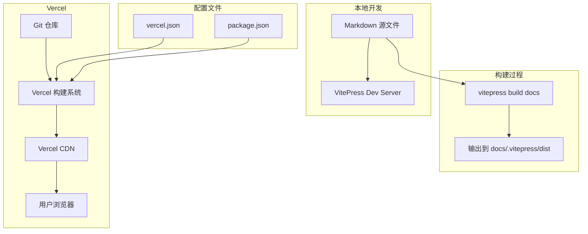

# 部署指南

本指南介绍如何将 VitePress 教程站点部署到 Vercel。

---

## 部署到 Vercel

### 前置条件

| 项目 | 说明 |
|------|------|
| Vercel 账号 | 注册 [vercel.com](https://vercel.com)（支持 GitHub 登录） |
| Git 仓库 | 教程代码已推送到 GitHub / GitLab |
| 项目根目录 | 包含 `docs/` 目录和 `package.json` |

### 步骤一：创建 vercel.json

在项目根目录（`pi-agent-tutorial/`）下创建 `vercel.json` 文件：

```json
{
  "buildCommand": "npm run docs:build",
  "outputDirectory": "docs/.vitepress/dist",
  "framework": "vitepress",
  "installCommand": "npm install"
}
```

配置说明：

| 配置项 | 值 | 说明 |
|--------|-----|------|
| `buildCommand` | `npm run docs:build` | 构建命令 |
| `outputDirectory` | `docs/.vitepress/dist` | VitePress 构建输出目录 |
| `framework` | `vitepress` | 框架标识，Vercel 会自动优化 |
| `installCommand` | `npm install` | 依赖安装命令 |

### 步骤二：在 package.json 中添加构建脚本

确保项目根目录的 `package.json` 中包含以下脚本：

```json
{
  "scripts": {
    "docs:dev": "vitepress dev docs",
    "docs:build": "vitepress build docs",
    "docs:preview": "vitepress preview docs"
  }
}
```

### 步骤三：在 Vercel 中导入项目

1. 登录 [Vercel Dashboard](https://vercel.com/dashboard)
2. 点击 **Add New -> Project**
3. 选择你的 Git 仓库
4. 在配置页面中，Vercel 会自动识别 `vitepress` 框架
5. 确认以下配置（通常会自动填写）：

| 配置项 | 值 |
|--------|-----|
| Framework Preset | VitePress |
| Root Directory | 留空（项目根目录） |
| Build Command | `npm run docs:build` |
| Output Directory | `docs/.vitepress/dist` |

6. 点击 **Deploy**

### 步骤四：等待部署完成

Vercel 会自动执行以下步骤：

1. 安装依赖：`npm install`
2. 构建站点：`npm run docs:build`
3. 发布到 CDN

部署完成后，Vercel 会提供一个 `*.vercel.app` 域名。你可以在 Project Settings 中配置自定义域名。

---

## 部署架构



---

## 验证部署

部署完成后，验证以下内容：

```bash
# 1. 访问首页
curl https://your-domain.vercel.app/

# 2. 访问各章节
curl https://your-domain.vercel.app/01-introduction/
curl https://your-domain.vercel.app/05-final-project/
curl https://your-domain.vercel.app/06-appendix/01-glossary

# 3. 确认资源加载正常（图片、CSS、JS）
```

---

## 常见部署问题

### Q: 构建失败：vitepress 命令未找到

**现象**：Vercel 构建日志显示 `command not found: vitepress`。

**原因**：VitePress 未安装或 `package.json` 中缺少依赖。

**解决方案**：

```json
{
  "devDependencies": {
    "vitepress": "^1.6.0"
  }
}
```

### Q: 构建失败：输出目录不存在

**现象**：Vercel 提示 `Output directory "docs/.vitepress/dist" not found`。

**原因**：构建命令执行失败或输出路径配置错误。

**解决方案**：

```bash
# 本地验证构建是否正常
npm run docs:build

# 确认输出目录存在
ls docs/.vitepress/dist
```

### Q: 页面 404

**现象**：部署成功但访问页面时显示 404。

**原因**：路由配置不正确，VitePress 的 `cleanUrls` 配置可能与 Vercel 路由冲突。

**解决方案**：

在 `vercel.json` 中添加 rewrites 配置：

```json
{
  "rewrites": [
    {
      "source": "/(.*)",
      "destination": "/index.html"
    }
  ]
}
```

### Q: 图片加载失败

**现象**：页面中的图片显示为 broken link。

**原因**：图片路径问题，在 VitePress 中图片应放在 `docs/public/` 目录下。

**解决方案**：

```bash
# 正确：放在 public 目录下
docs/public/images/pi-logo.svg

# 在 Markdown 中引用

```

---

## 其他部署方式

### VitePress 支持的部署平台

| 平台 | 配置要点 | 优势 |
|------|----------|------|
| Vercel | `vercel.json` + Git 集成 | 零配置，自动 HTTPS |
| Netlify | `netlify.toml` 配置 | 类似 Vercel，功能丰富 |
| GitHub Pages | GitHub Actions + `gh-pages` 分支 | 免费，与 GitHub 深度集成 |
| 自有服务器 | Nginx + 静态文件 | 完全控制 |

### GitHub Pages 部署示例

在项目根目录创建 `.github/workflows/deploy.yml`：

```yaml
name: Deploy VitePress site to Pages

on:
  push:
    branches: [main]

jobs:
  deploy:
    runs-on: ubuntu-latest
    steps:
      - uses: actions/checkout@v4
      - uses: actions/setup-node@v4
        with:
          node-version: 18
      - run: npm ci
      - run: npm run docs:build
      - uses: peaceiris/actions-gh-pages@v3
        with:
          github_token: ${{ secrets.GITHUB_TOKEN }}
          publish_dir: docs/.vitepress/dist
```

---

## 小结

部署 VitePress 站点到 Vercel 是最简单的方式：创建 `vercel.json`、配置构建脚本、导入 Git 仓库即可。Vercel 会自动处理 HTTPS、CDN 分发和持续部署。

## 小练习

1. 按照本指南将教程站点部署到 Vercel，体验完整的部署流程
2. 尝试配置一个自定义域名（如有）
3. 尝试使用 GitHub Pages 部署（参考上面的 Actions 配置）
